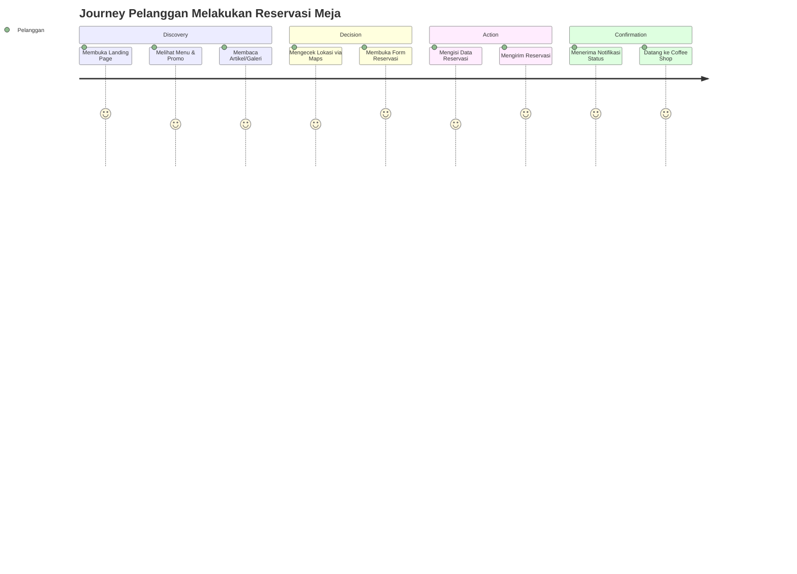
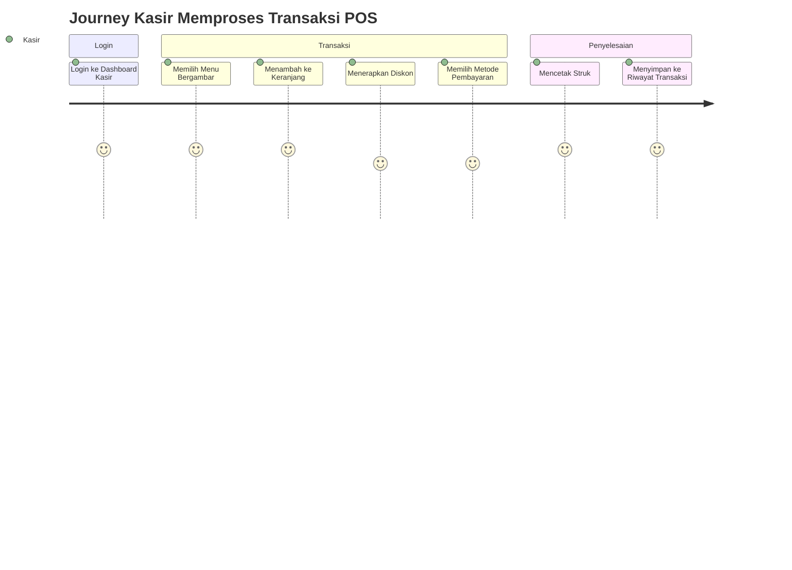
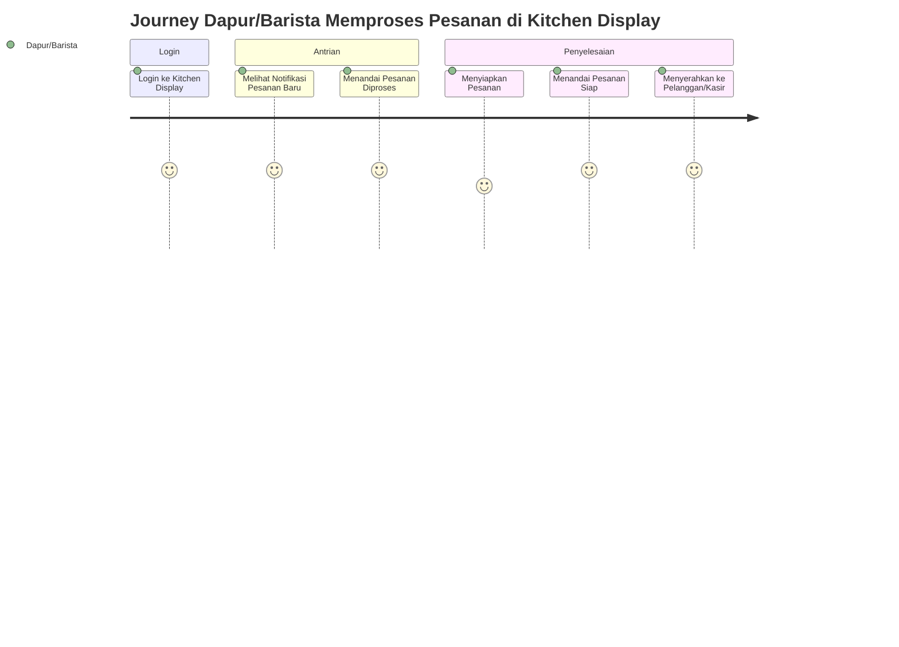
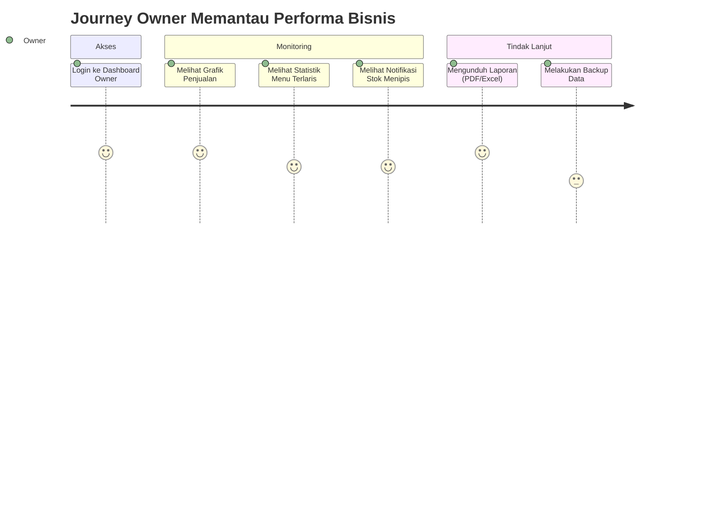

# 01. PENDAHULUAN & RUANG LINGKUP

## 1. PENDAHULUAN

**NEMU Space** adalah sebuah sistem digital terintegrasi untuk coffee shop berskala single branch (satu cabang), yang menggabungkan tiga fungsi utama dalam satu ekosistem:

1. **Website Company Profile** yang berfungsi sebagai citra digital (digital presence) coffee shop, menampilkan identitas merek, menu, promo, artikel, galeri, dan informasi kontak secara dinamis.
2. **Content Management System (CMS)** yang memungkinkan Admin dan Owner mengelola seluruh konten website tanpa perlu keterlibatan developer, sehingga seluruh perubahan konten (teks, gambar, harga, promo, dsb.) dapat dilakukan mandiri secara real-time.
3. **Sistem Operasional Internal** berupa Point of Sale (POS), manajemen reservasi meja, manajemen inventory sederhana, dan dashboard analitik bisnis untuk mendukung operasional harian coffee shop.

Dokumen ini disusun sebagai **Single Source of Truth (SSOT)** yang menjadi acuan utama seluruh tim pengembang dan pemangku kepentingan dalam merancang, membangun, menguji, dan menerima hasil akhir sistem NEMU Space. Dokumen ini mencakup aspek bisnis, fungsional, teknis, desain, keamanan, serta strategi pengujian secara menyeluruh dan rinci, sehingga dapat langsung digunakan sebagai dasar pengembangan aplikasi tingkat produksi (production-ready).

Seluruh konten pada website NEMU Space bersifat **dinamis dan dapat dikelola melalui CMS**. Tidak ada satupun konten yang bersifat hardcoded pada level frontend, seluruh data (teks, gambar, harga, jadwal, kontak, dsb.) diambil dari database melalui Internal REST API.

---

## 2. LATAR BELAKANG

Industri coffee shop di Indonesia berkembang sangat pesat, namun mayoritas coffee shop skala kecil–menengah (single branch) masih mengalami beberapa permasalahan operasional dan pemasaran berikut:

| No | Permasalahan | Dampak |
|---|---|---|
| 1 | Website statis, sulit diperbarui tanpa bantuan developer | Informasi menu, harga, dan promo menjadi tidak akurat/usang |
| 2 | Tidak memiliki sistem reservasi meja digital | Kehilangan calon pelanggan yang ingin memastikan ketersediaan meja |
| 3 | Pencatatan transaksi manual atau menggunakan aplikasi POS generik yang tidak terhubung dengan website | Data penjualan terfragmentasi, sulit dianalisis oleh Owner |
| 4 | Tidak ada manajemen stok bahan baku yang terintegrasi dengan penjualan | Risiko kehabisan stok tanpa peringatan dini |
| 5 | Owner tidak memiliki visibilitas data bisnis secara real-time | Pengambilan keputusan bisnis menjadi lambat dan berbasis asumsi |
| 6 | Tidak ada media promosi digital (artikel, galeri, promo) yang mudah dikelola | Minim engagement dengan pelanggan digital |

**NEMU Space** dirancang untuk menjawab seluruh permasalahan tersebut dengan menyediakan **satu sistem terpadu**: website modern yang menjadi etalase digital, digabungkan dengan backend operasional (POS, reservasi, inventory) dan dashboard bisnis yang informatif, seluruhnya dikelola melalui satu CMS terpusat.

Inspirasi visual landing page mengacu pada kualitas desain website kelas dunia seperti Starbucks (hero banner besar, storytelling merek, showcase menu, promo musiman), namun tetap dibangun dengan **identitas visual orisinal** milik NEMU Space — bukan tiruan/replika — dengan nuansa modern, minimalis, elegan, premium, hangat, dan profesional.

---

## 3. TUJUAN SISTEM

Tujuan utama pengembangan sistem NEMU Space adalah:

1. Menyediakan **Website Company Profile** yang modern, responsif, dan sepenuhnya dinamis sebagai representasi digital coffee shop.
2. Menyediakan **Digital Menu** yang informatif dan bergambar agar pelanggan dapat mengeksplorasi produk sebelum berkunjung.
3. Menyediakan **CMS** agar Admin/Owner dapat mengelola seluruh konten website tanpa keterlibatan teknis dari developer.
4. Menyediakan **Dashboard Admin** untuk mengelola operasional konten dan transaksi harian.
5. Menyediakan **Dashboard Owner** dengan visibilitas penuh terhadap performa bisnis (penjualan, statistik, laporan).
6. Menyediakan **POS (Point of Sale)** sederhana namun lengkap untuk mempercepat transaksi di kasir.
7. Menyediakan **Sistem Reservasi Meja** digital agar pelanggan dapat memesan tempat tanpa perlu menelepon.
8. Menyediakan **Inventory Sederhana** untuk memantau stok bahan baku dan mencegah kehabisan stok.
9. Menyediakan **Galeri, Artikel, dan Promo** sebagai media pemasaran digital yang mudah diperbarui.
10. Menyediakan **Laporan** (penjualan, reservasi, inventory, kasir) yang dapat diekspor dalam format PDF dan Excel.
11. Menyediakan **Pengaturan Website** terpusat agar identitas merek (logo, tema, kontak, SEO) dapat dikelola secara mandiri.
12. Memastikan sistem dapat diakses secara optimal di seluruh perangkat (mobile, tablet, laptop, desktop) dan mendukung mode **Progressive Web App (PWA)**.

---

## 4. RUANG LINGKUP

### 4.1 Ruang Lingkup Sistem (In-Scope)

| Kategori | Cakupan |
|---|---|
| Jenis Bisnis | Single Branch Coffee Shop (1 cabang, 1 lokasi fisik) |
| Platform | Website Responsif (Mobile First) + PWA |
| Modul Publik | Landing Page, Digital Menu, Promo, Galeri, Artikel, Reservasi, Kontak |
| Modul Internal | POS, Dashboard Kasir, Dashboard Admin, Dashboard Owner, Inventory, Laporan |
| Manajemen Konten | CMS penuh untuk seluruh konten website |
| Manajemen Pengguna | RBAC (Role Based Access Control) untuk 4 peran: Pelanggan, Kasir, Admin, Owner |
| Integrasi | WhatsApp (chat langsung), Google Maps (lokasi), Media Sosial (tautan) |

### 4.2 Di Luar Ruang Lingkup (Out-of-Scope)

Sistem **TIDAK** mencakup hal-hal berikut:

- Marketplace atau multi-tenant (banyak coffee shop dalam satu platform)
- Sistem Franchise atau Multi-Branch (banyak cabang dengan manajemen terpusat)
- Aplikasi Mobile Native (Android/iOS terpisah) — cukup PWA
- Payment Gateway online untuk pemesanan jarak jauh (pembayaran dilakukan langsung di kasir/POS)
- Sistem Delivery/Ojek Online terintegrasi
- Public API untuk pihak ketiga (integrasi eksternal)
- Fitur loyalty/membership point yang kompleks (di luar cakupan versi 1.0)
- Multi-currency dan multi-language (versi 1.0 hanya Bahasa Indonesia dan Rupiah)

---

## 5. STAKEHOLDER

| Stakeholder | Peran dalam Proyek | Kepentingan Utama |
|---|---|---|
| Owner Coffee Shop | Pemilik bisnis, pengambil keputusan akhir | Visibilitas bisnis, ROI, kontrol penuh sistem |
| Admin Operasional | Pengelola harian konten & operasional | Kemudahan mengelola menu, promo, reservasi |
| Kasir | Operator transaksi harian | Kecepatan & kemudahan transaksi POS |
| Pelanggan | Pengguna akhir (end user) website | Informasi akurat, kemudahan reservasi, kenyamanan |
| Product Manager | Mendefinisikan kebutuhan produk | Kesesuaian fitur dengan kebutuhan bisnis |
| UI/UX Designer | Merancang tampilan & pengalaman pengguna | Konsistensi desain, usability |
| Frontend Developer | Implementasi antarmuka pengguna | Kejelasan spesifikasi teknis UI |
| Backend Developer | Implementasi logika bisnis & API | Kejelasan struktur data & endpoint |
| QA Engineer | Pengujian kualitas sistem | Kejelasan acceptance criteria |
| Project Manager | Mengelola timeline & resource proyek | Kejelasan roadmap & deliverable |

---

## 6. TARGET PENGGUNA

### 6.1 Pelanggan (Tanpa Login)

Dapat mengakses seluruh konten publik: Landing Page, Menu lengkap beserta gambar, pencarian menu, promo, galeri, artikel, mengirim reservasi, menghubungi via WhatsApp, dan melihat lokasi coffee shop melalui peta.

### 6.2 Kasir (Login Wajib)

Berperan mengoperasikan POS: login, mengakses dashboard kasir, memproses transaksi, mengubah jumlah pesanan, mencetak struk, dan melihat daftar reservasi hari ini. Kasir **tidak memiliki akses** untuk mengubah konten website.

### 6.3 Admin (Login Wajib)

Mengelola seluruh konten operasional: Landing Page, Hero Banner, Tentang Kami, Menu, Kategori, Promo, Artikel, Galeri, Reservasi, Inventory, data Kasir, Media, Laporan, dan Pengaturan Website.

### 6.4 Owner (Login Wajib)

Memiliki seluruh hak akses Admin, ditambah akses eksklusif terhadap: Dashboard Bisnis, Grafik Penjualan, Statistik, Backup, Restore, Pengaturan Sistem, dan Manajemen User (termasuk membuat/menonaktifkan akun Admin, Kasir, dan Dapur/Barista).

### 6.5 Dapur/Barista (Login Wajib)

Role baru yang bertugas memproses pesanan (meracik minuman/menyiapkan makanan) berdasarkan pesanan yang masuk dari POS Kasir. Berperan mengoperasikan **Kitchen Display System (KDS)**: login, melihat antrian pesanan secara real-time, mengubah status pesanan (Diterima → Diproses → Siap), dan menandai pesanan telah diambil/diserahkan ke pelanggan. Dapur/Barista **tidak memiliki akses** untuk mengubah konten website, harga menu, ataupun laporan keuangan.

> **Catatan:** Dalam praktiknya, satu orang dapat merangkap peran Kasir sekaligus Dapur/Barista (login dengan satu akun yang memiliki kedua hak akses, diatur oleh Owner melalui Manajemen User), namun secara sistem kedua peran ini tetap dipisahkan sebagai role yang berbeda agar antrian dapur tetap terkelola rapi walau di kemudian hari coffee shop mempekerjakan staf dapur terpisah.

---

## 7. USER PERSONA

### Persona 1 — Pelanggan
| Atribut | Detail |
|---|---|
| Nama | Dina Ayu Pratiwi |
| Usia | 27 tahun |
| Pekerjaan | Karyawan swasta |
| Tujuan | Mencari tempat nongkrong nyaman bersama teman, ingin memastikan meja tersedia sebelum datang |
| Frustrasi | Website coffee shop lain sering menampilkan menu yang sudah tidak tersedia/harga tidak update |
| Kebutuhan dari NEMU Space | Informasi menu & harga akurat, kemudahan reservasi online, akses cepat ke WhatsApp |

### Persona 2 — Kasir
| Atribut | Detail |
|---|---|
| Nama | Rangga Saputra |
| Usia | 22 tahun |
| Pekerjaan | Barista merangkap kasir |
| Tujuan | Memproses pesanan secepat mungkin saat jam sibuk |
| Frustrasi | Website/Aplikasi kasir yang rumit dan lambat memuat gambar menu |
| Kebutuhan dari NEMU Space | POS ringan, cepat, menu bergambar jelas, cetak struk instan |

### Persona 3 — Admin
| Atribut | Detail |
|---|---|
| Nama | Sari Wulandari |
| Usia | 30 tahun |
| Pekerjaan | Staff Marketing/Operasional |
| Tujuan | Memperbarui promo mingguan dan menambah artikel blog tanpa bantuan IT |
| Frustrasi | Harus menghubungi developer setiap kali ingin ubah konten website |
| Kebutuhan dari NEMU Space | CMS yang intuitif, WYSIWYG editor, upload gambar mudah |

### Persona 4 — Dapur/Barista
| Atribut | Detail |
|---|---|
| Nama | Fajar Nugroho |
| Usia | 24 tahun |
| Pekerjaan | Barista/Staf Dapur |
| Tujuan | Mengetahui urutan pesanan yang harus dikerjakan tanpa harus bolak-balik bertanya ke kasir |
| Frustrasi | Pesanan tercecer/lupa saat jam ramai karena hanya mengandalkan struk kertas |
| Kebutuhan dari NEMU Space | Layar antrian pesanan (Kitchen Display) yang jelas, notifikasi pesanan baru, mudah menandai status selesai |

### Persona 5 — Owner
| Atribut | Detail |
|---|---|
| Nama | Bapak Hadi Kusuma |
| Usia | 42 tahun |
| Pekerjaan | Pemilik Coffee Shop |
| Tujuan | Memantau performa bisnis kapan saja, mengambil keputusan berbasis data |
| Frustrasi | Tidak tahu produk mana yang paling laku, stok sering habis tanpa peringatan |
| Kebutuhan dari NEMU Space | Dashboard bisnis real-time, laporan otomatis, notifikasi stok menipis |

---

## 8. USER JOURNEY

### 8.1 User Journey — Pelanggan Melakukan Reservasi

### 8.2 User Journey — Kasir Memproses Transaksi

### 8.3 User Journey — Dapur/Barista Memproses Pesanan

### 8.4 User Journey — Owner Memantau Bisnis

---

## 9. USER STORY

### 9.1 Pelanggan

| ID | Sebagai | Saya ingin | Agar |
|---|---|---|---|
| US-01 | Pelanggan | melihat menu lengkap beserta gambar dan harga | dapat memilih produk sebelum berkunjung |
| US-02 | Pelanggan | mencari menu berdasarkan kata kunci/kategori | menemukan produk yang saya inginkan dengan cepat |
| US-03 | Pelanggan | melihat promo yang sedang berlangsung | mendapatkan penawaran terbaik |
| US-04 | Pelanggan | mengisi form reservasi meja | memastikan tempat duduk saya tersedia |
| US-05 | Pelanggan | melihat status reservasi saya | mengetahui apakah reservasi dikonfirmasi |
| US-06 | Pelanggan | menghubungi coffee shop via WhatsApp | bertanya langsung dengan cepat |
| US-07 | Pelanggan | melihat lokasi coffee shop di Google Maps | mengetahui rute menuju lokasi |
| US-08 | Pelanggan | membaca artikel blog coffee shop | mendapatkan informasi & wawasan seputar kopi |

### 9.2 Kasir

| ID | Sebagai | Saya ingin | Agar |
|---|---|---|---|
| US-09 | Kasir | login ke sistem | mengakses dashboard kasir dengan aman |
| US-10 | Kasir | mencari menu dengan cepat di POS | mempercepat proses transaksi |
| US-11 | Kasir | menambah/mengubah jumlah pesanan dalam keranjang | menyesuaikan pesanan pelanggan |
| US-12 | Kasir | menerapkan diskon pada transaksi | memberikan promo yang berlaku |
| US-13 | Kasir | mencetak struk transaksi | memberikan bukti pembayaran ke pelanggan |
| US-14 | Kasir | melihat daftar reservasi hari ini | mempersiapkan meja untuk pelanggan yang reservasi |

### 9.3 Admin

| ID | Sebagai | Saya ingin | Agar |
|---|---|---|---|
| US-15 | Admin | mengubah konten Hero Banner & Tentang Kami | menjaga informasi landing page selalu terbaru |
| US-16 | Admin | menambah/mengubah/menghapus menu dan kategori | katalog produk selalu akurat |
| US-17 | Admin | membuat promo baru dengan periode berlaku | menjalankan kampanye pemasaran |
| US-18 | Admin | menulis dan mempublikasikan artikel | meningkatkan engagement digital |
| US-19 | Admin | mengelola galeri foto | menampilkan suasana coffee shop |
| US-20 | Admin | mengonfirmasi/menolak reservasi pelanggan | mengatur kapasitas meja secara akurat |
| US-21 | Admin | mengelola data inventory bahan baku | memantau ketersediaan stok |
| US-22 | Admin | melihat laporan penjualan & reservasi | mengevaluasi performa harian |

### 9.4 Dapur/Barista

| ID | Sebagai | Saya ingin | Agar |
|---|---|---|---|
| US-29 | Dapur/Barista | login ke Kitchen Display | mengakses antrian pesanan dengan aman |
| US-30 | Dapur/Barista | melihat pesanan baru secara real-time beserta notifikasi suara/visual | tidak ada pesanan yang terlewat saat jam ramai |
| US-31 | Dapur/Barista | melihat detail item pesanan (nama menu, jumlah, catatan khusus) | menyiapkan pesanan sesuai permintaan pelanggan |
| US-32 | Dapur/Barista | mengubah status pesanan dari Diterima → Diproses → Siap | kasir dan pelanggan tahu progres pesanan |
| US-33 | Dapur/Barista | melihat urutan pesanan berdasarkan waktu masuk (FIFO) | mendahulukan pesanan yang lebih dulu masuk |

### 9.5 Owner

| ID | Sebagai | Saya ingin | Agar |
|---|---|---|---|
| US-23 | Owner | melihat dashboard bisnis dengan grafik penjualan | memahami tren performa bisnis |
| US-24 | Owner | melihat statistik menu terlaris | menentukan strategi produk |
| US-25 | Owner | mengelola akun Admin, Kasir, dan Dapur/Barista | mengontrol akses pengguna sistem |
| US-26 | Owner | melakukan backup dan restore data | menjaga keamanan data bisnis |
| US-27 | Owner | mengekspor laporan dalam PDF/Excel | melakukan analisis lanjutan secara offline |
| US-28 | Owner | mengubah pengaturan sistem & tema website | menjaga identitas merek tetap relevan |
