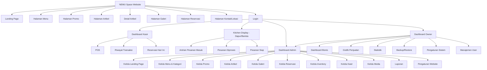
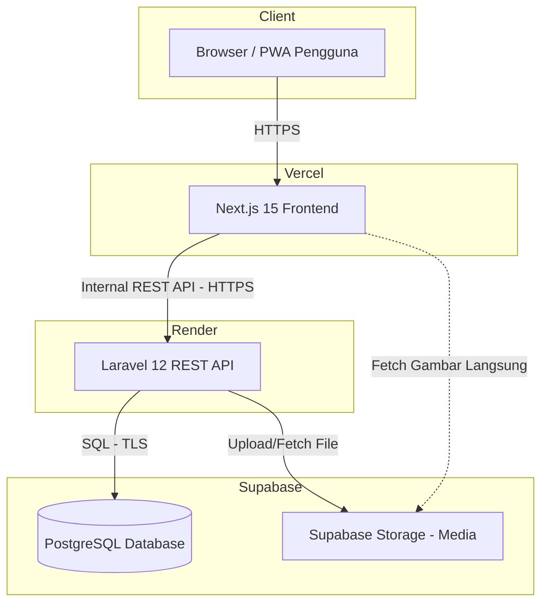

# 02. ARSITEKTUR SISTEM & NAVIGASI

## 10. SITEMAP



---

## 11. INFORMATION ARCHITECTURE

### 11.1 Struktur Navigasi Publik

| Level 1 | Level 2 | Level 3 |
|---|---|---|
| Beranda | Hero Banner, Tentang Kami, Menu Favorit, Promo, Testimoni, FAQ | — |
| Menu | Semua Menu, Kategori, Pencarian, Detail Menu | — |
| Promo | Daftar Promo Aktif | Detail Promo |
| Artikel | Daftar Artikel, Kategori Artikel | Detail Artikel |
| Galeri | Galeri Foto per Kategori | Preview Gambar |
| Reservasi | Form Reservasi | Status Reservasi |
| Kontak | Alamat, Jam Operasional, Peta, WhatsApp, Media Sosial | — |

### 11.2 Struktur Navigasi Internal (Setelah Login)

| Role | Struktur Menu Utama |
|---|---|
| Kasir | Dashboard → POS → Riwayat Transaksi → Reservasi Hari Ini |
| Dapur/Barista | Kitchen Display → Antrian Masuk → Diproses → Siap Diambil |
| Admin | Dashboard → CMS (Landing Page, Menu, Promo, Artikel, Galeri) → Reservasi → Inventory → Kasir & Dapur → Media → Laporan → Pengaturan |
| Owner | Seluruh menu Admin + Dashboard Bisnis → Grafik → Statistik → Backup/Restore → Pengaturan Sistem → Manajemen User |

### 11.3 Prinsip Arsitektur Informasi

1. **Maksimal 3 klik** dari beranda menuju informasi penting apapun (menu, reservasi, kontak).
2. Navigasi konsisten pada seluruh halaman publik (sticky navbar).
3. Dashboard internal menggunakan pola **Sidebar Navigation** dengan pengelompokan berdasarkan modul.
4. Breadcrumb wajib digunakan pada seluruh halaman dashboard internal untuk konteks lokasi pengguna.

---

## 29. FOLDER STRUCTURE (FRONTEND & BACKEND)

### 29.1 Struktur Frontend (Next.js 15 + TypeScript)

```
nemu-space-frontend/
├── public/
│   ├── icons/
│   └── manifest.json
├── src/
│   ├── app/
│   │   ├── (public)/
│   │   │   ├── page.tsx                 # Landing Page
│   │   │   ├── menu/
│   │   │   ├── promo/
│   │   │   ├── artikel/[slug]/
│   │   │   ├── galeri/
│   │   │   ├── reservasi/
│   │   │   └── kontak/
│   │   ├── (auth)/
│   │   │   └── login/
│   │   ├── (dashboard)/
│   │   │   ├── kasir/
│   │   │   │   ├── pos/
│   │   │   │   └── riwayat/
│   │   │   ├── dapur/
│   │   │   │   └── kitchen-display/
│   │   │   ├── admin/
│   │   │   │   ├── landing-page/
│   │   │   │   ├── menu/
│   │   │   │   ├── promo/
│   │   │   │   ├── artikel/
│   │   │   │   ├── galeri/
│   │   │   │   ├── reservasi/
│   │   │   │   ├── inventory/
│   │   │   │   ├── laporan/
│   │   │   │   └── pengaturan/
│   │   │   └── owner/
│   │   │       ├── dashboard-bisnis/
│   │   │       ├── manajemen-user/
│   │   │       └── backup-restore/
│   │   └── layout.tsx
│   ├── components/
│   │   ├── ui/                          # shadcn/ui components
│   │   ├── landing/
│   │   ├── pos/
│   │   ├── dashboard/
│   │   └── shared/
│   ├── lib/
│   │   ├── api.ts                       # Axios instance
│   │   ├── utils.ts
│   │   └── validators/                  # Zod schemas
│   ├── hooks/
│   ├── store/                           # State management (Zustand/Context)
│   ├── types/
│   └── styles/
│       └── globals.css
├── next.config.js
├── tailwind.config.ts
└── package.json
```

### 29.2 Struktur Backend (Laravel 12)

```
nemu-space-backend/
├── app/
│   ├── Http/
│   │   ├── Controllers/
│   │   │   ├── Api/
│   │   │   │   ├── Public/
│   │   │   │   │   ├── LandingPageController.php
│   │   │   │   │   ├── MenuController.php
│   │   │   │   │   ├── ReservationController.php
│   │   │   │   │   └── ArticleController.php
│   │   │   │   ├── Auth/
│   │   │   │   │   └── AuthController.php
│   │   │   │   ├── Pos/
│   │   │   │   │   └── TransactionController.php
│   │   │   │   ├── Kitchen/
│   │   │   │   │   └── OrderTicketController.php
│   │   │   │   ├── Admin/
│   │   │   │   │   ├── MenuManagementController.php
│   │   │   │   │   ├── InventoryController.php
│   │   │   │   │   ├── ReportController.php
│   │   │   │   │   └── SettingController.php
│   │   │   │   └── Owner/
│   │   │   │       ├── DashboardController.php
│   │   │   │       ├── UserManagementController.php
│   │   │   │       └── BackupController.php
│   │   │   └── Controller.php
│   │   ├── Middleware/
│   │   │   ├── RoleMiddleware.php
│   │   │   └── AuditLogMiddleware.php
│   │   ├── Requests/                    # Form Request Validation
│   │   └── Resources/                   # API Resource (JSON transformer)
│   ├── Models/
│   ├── Services/
│   │   ├── TransactionService.php
│   │   ├── InventoryService.php
│   │   ├── ReportExportService.php
│   │   └── BackupService.php
│   ├── Repositories/
│   └── Policies/
├── database/
│   ├── migrations/
│   ├── seeders/
│   └── factories/
├── routes/
│   └── api.php
├── config/
└── composer.json
```

---

## 37. DEPLOYMENT ARCHITECTURE

### 37.1 Diagram Arsitektur Deployment



### 37.2 Lingkungan (Environments)

| Environment | Frontend (Vercel) | Backend (Render) | Database (Supabase) |
|---|---|---|---|
| Development | Preview Deployment per branch | Service terpisah (staging) | Project Supabase terpisah (dev) |
| Staging | Branch `staging` | Service staging | Project Supabase staging |
| Production | Branch `main` | Service production | Project Supabase production |

### 37.3 CI/CD

1. Setiap push ke branch `main` memicu build & deploy otomatis pada Vercel (frontend) dan Render (backend) melalui integrasi Git.
2. Migrasi database (`php artisan migrate`) dijalankan otomatis sebagai bagian dari deployment pipeline backend, dengan strategi migrasi yang aman (backward-compatible).
3. Environment variable (kredensial database, storage key, app key) dikelola melalui secret manager masing-masing platform (Vercel Environment Variables, Render Environment Variables), tidak pernah disimpan dalam kode sumber.

### 37.4 Monitoring & Backup

| Aspek | Implementasi |
|---|---|
| Monitoring Aplikasi | Log error backend melalui Render Logs, monitoring uptime melalui layanan pemantauan (contoh: UptimeRobot) |
| Backup Database | Backup otomatis harian oleh Supabase, ditambah fitur backup manual melalui Dashboard Owner |
| Restore | Restore dilakukan melalui Dashboard Owner dengan konfirmasi berlapis (double confirmation) sebelum proses restore dijalankan |
