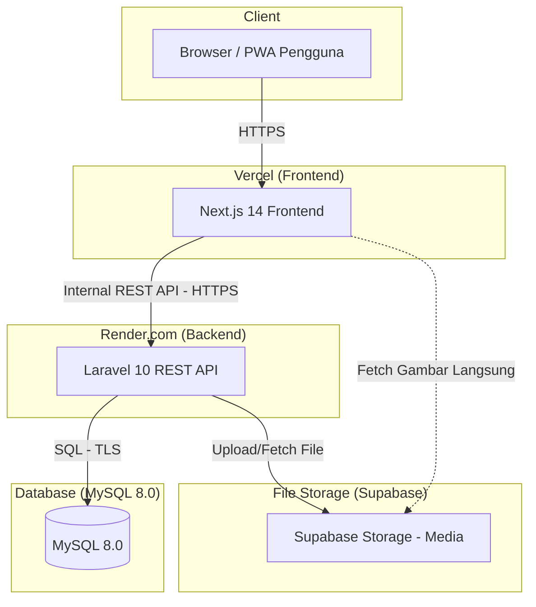

# 02. ARSITEKTUR SISTEM & NAVIGASI

| Metadata | Nilai |
|---|---|
| Versi | 1.1 |
| Tanggal | 2026-08-03 |
| Status | **Normatif** — spesifikasi mengikat, kode wajib menyesuaikan |
| Bab tercakup | 10, 11, 29, 37 |

> **Sifat dokumen:** Dokumen ini bersifat **preskriptif**, bukan deskriptif. Isi bab ini mendefinisikan struktur yang **harus** dipenuhi implementasi. Bila kode menyimpang, **kode yang salah** — bukan dokumen ini. Penyimpangan yang disadari & disepakati dicatat terpisah di `03_requirements.md` Lampiran A (Deviasi Diketahui) dengan owner dan target penutupan.

## 10. SITEMAP

> **Ketentuan path:** URL publik & dashboard **wajib** memakai slug English. Label UI tetap Bahasa Indonesia.


```mermaid
graph TD
    A[NEMU Space Website] --> B[Landing Page /]
    A --> C[Menu /menu]
    A --> D[Promo /promotion]
    A --> E[Artikel /article]
    A --> F[Detail Artikel /article/slug]
    A --> G[Galeri /gallery]
    A --> H[Reservasi /reservation]
    A --> H2[Status Reservasi /reservation/status]
    A --> I[Kontak /contact]
    A --> EV[Events /events]
    A --> CR[Careers /careers]
    A --> J[Login /login]
    J --> K[POS Kasir /dashboard/pos]
    J --> N[KDS /dashboard/admin/kds]
    J --> L[Dashboard Admin /dashboard/admin/*]
    J --> M[Dashboard Owner /dashboard/owner/*]

    K --> K1[POS Transaksi]
    K --> K2[Riwayat via POS API]
    K --> K3[Reservasi Hari Ini]

    N --> N1[Antrian Masuk]
    N --> N2[Diproses]
    N --> N3[Siap]

    L --> L1[CMS /admin/cms]
    L --> L2[Menu & Kategori]
    L --> L3[Promotions]
    L --> L4[Inventory]
    L --> L5[Procurement PO/Supplier]
    L --> L6[Reservations]
    L --> L7[Orders POS history]
    L --> L8[Reports / Analytics]
    L --> L9[Users / Employees]
    L --> L10[Settings / Audit / Backup]
    L --> L11[Unit Conversions]

    M --> M1[Overview / Sales / Analytics]
    M --> M2[Inventory view]
    M --> M3[Reports]
    M --> M4[Settings]
```

> **Out of scope (jangan di sitemap produk):** `/order`, `/qr/[tableCode]`, admin CRM, admin memberships/loyalty.

---

## 11. INFORMATION ARCHITECTURE

### 11.1 Struktur Navigasi Publik

| Level 1 (UI) | Path | Level 2 |
|---|---|---|
| Beranda | `/` | Hero, Tentang, Menu favorit, Promo, Testimoni, FAQ |
| Menu | `/menu` | Filter kategori, pencarian |
| Promo | `/promotion` | Promo aktif |
| Artikel | `/article`, `/article/[slug]` | List + detail |
| Galeri | `/gallery` | Grid foto |
| Reservasi | `/reservation`, `/reservation/status` | Form + cek status |
| Kontak | `/contact` | Alamat, jam, peta, WA, sosmed |
| Events / Careers | `/events`, `/careers` | Konten pendukung (opsional) |
| Accessibility | `/accessibility` | Info a11y |

**Bukan navigasi produk:** `/order`, `/qr/*`, `/account` (order online / membership — out of scope).

### 11.2 Struktur Navigasi Internal (Setelah Login)

| Role | Path utama | Menu |
|---|---|---|
| Kasir | `/dashboard/pos` | POS, ringkasan shift, reservasi hari ini (via API) |
| Dapur/Barista | `/dashboard/admin/kds` | Kitchen Display (antrian → proses → siap) |
| Admin | `/dashboard/admin/*` | CMS, menu, kategori, promo, inventory, procurement, reservasi, riwayat orders POS, reports, users, settings, audit, backup, unit-conversions, KDS — **tanpa** CRM/membership |
| Owner | `/dashboard/owner/*` + akses admin | Overview, sales, analytics, inventory, reports, settings; backup/user juga lewat admin UI + API `/owner/*` |

> **Ketentuan path dashboard:** KDS harus di `/dashboard/kds` (akses role Dapur/Barista + Admin + Owner), bukan di tree `admin/`. User management Owner harus di `/dashboard/owner/users`. Backup di `/dashboard/owner/backup`. API sudah benar (`/api/v1/owner/*`, `/api/v1/kds/*`). Path FE yang menyimpang dari struktur ini dicatat sebagai deviasi di Lampiran A `03_requirements.md`.

### 11.3 Prinsip Arsitektur Informasi

1. **Maksimal 3 klik** dari beranda ke menu, reservasi, kontak.
2. Navbar publik sticky & konsisten.
3. Dashboard internal: **sidebar** per modul.
4. Breadcrumb pada halaman dashboard.
5. **Slug URL English**, copy UI **Bahasa Indonesia** (NFR-13).

---

## 29. FOLDER STRUCTURE (FRONTEND & BACKEND)

### 29.1 Struktur Frontend (Next.js 14 + TypeScript)

```
frontend/
├── public/
├── src/
│   ├── app/
│   │   ├── (public)/
│   │   │   ├── page.tsx                 # Landing
│   │   │   ├── menu/
│   │   │   ├── promotion/
│   │   │   ├── article/[slug]/
│   │   │   ├── gallery/
│   │   │   ├── reservation/
│   │   │   │   └── status/
│   │   │   ├── contact/
│   │   │   ├── events/
│   │   │   ├── careers/
│   │   │   └── accessibility/
│   │   │   # out-of-scope (abaikan/hapus): order/, qr/, account/
│   │   ├── (auth)/
│   │   │   ├── login/
│   │   │   └── forgot-password/
│   │   ├── dashboard/
│   │   │   ├── page.tsx
│   │   │   ├── layout.tsx
│   │   │   ├── pos/                     # Kasir POS
│   │   │   ├── kds/                     # Kitchen Display (Dapur/Barista + Admin + Owner)
│   │   │   ├── admin/
│   │   │   │   ├── cms/
│   │   │   │   ├── menu/
│   │   │   │   ├── categories/
│   │   │   │   ├── promotions/
│   │   │   │   ├── inventory/
│   │   │   │   ├── suppliers/
│   │   │   │   ├── procurement/
│   │   │   │   ├── unit-conversions/
│   │   │   │   ├── reservations/
│   │   │   │   ├── orders/              # riwayat transaksi POS (bukan order online)
│   │   │   │   ├── employees/
│   │   │   │   # out-of-scope: crm/, memberships/
│   │   │   │   ├── reports/
│   │   │   │   ├── analytics/
│   │   │   │   ├── audit/
│   │   │   │   └── settings/
│   │   │   └── owner/
│   │   │       ├── overview/
│   │   │       ├── sales/
│   │   │       ├── analytics/
│   │   │       ├── inventory/
│   │   │       ├── reports/
│   │   │       ├── users/               # manajemen user — eksklusif Owner
│   │   │       ├── backup/              # backup/restore — eksklusif Owner
│   │   │       └── settings/
│   │   ├── layout.tsx
│   │   └── middleware.ts
│   ├── features/                        # Domain modules
│   │   ├── authentication/
│   │   ├── landing/
│   │   ├── menu/
│   │   ├── reservation/
│   │   ├── cashier/                     # POS hooks offline/realtime
│   │   ├── inventory/
│   │   ├── cms/
│   │   ├── gallery/
│   │   ├── article/
│   │   ├── promotion/
│   │   ├── report/
│   │   ├── settings/
│   │   ├── users/
│   │   └── dashboard/
│   ├── shared/                          # lib, services, providers, ui
│   │   ├── lib/                         # offline-queue, auth, supabase, …
│   │   ├── services/                    # pos.service, api client, …
│   │   └── providers/
│   ├── store/                           # Zustand
│   │   ├── auth.store.ts
│   │   ├── cart.store.ts
│   │   ├── branch.store.ts
│   │   ├── reservation.store.ts
│   │   ├── theme.store.ts
│   │   ├── sidebar.store.ts
│   │   └── user.store.ts
│   ├── assets/
│   └── styles/
├── tests/                               # Vitest
├── vitest.config.ts
├── package.json
└── tsconfig.json                        # paths: @/*, @shared/*, @features/*, @store/*
```

### 29.2 Struktur Backend (Laravel 10 + Sanctum)

```
backend/
├── app/
│   ├── Http/
│   │   ├── Controllers/Api/
│   │   │   ├── AuthController.php
│   │   │   ├── LandingPageController.php
│   │   │   ├── PublicMenuController.php
│   │   │   ├── PublicReservationController.php
│   │   │   ├── PublicArticleController.php
│   │   │   ├── PublicGalleryController.php
│   │   │   ├── PosController.php
│   │   │   ├── KdsController.php
│   │   │   ├── InventoryController.php
│   │   │   ├── SupplierController.php
│   │   │   ├── PurchaseOrderController.php
│   │   │   ├── UnitConversionController.php
│   │   │   ├── AdminMenuController.php
│   │   │   ├── AdminCategoryController.php
│   │   │   ├── AdminVariantController.php
│   │   │   ├── Admin* (banner, promo, article, gallery, faq, reservation, setting)
│   │   │   ├── MediaController.php
│   │   │   ├── ReportController.php
│   │   │   ├── UserController.php
│   │   │   ├── AuditController.php
│   │   │   └── OwnerController.php
│   │   ├── Middleware/
│   │   │   ├── RoleMiddleware.php
│   │   │   ├── AuditLogMiddleware.php
│   │   │   ├── Authenticate.php
│   │   │   └── HandleCorsManual.php
│   │   └── Kernel.php
│   ├── Models/                          # lihat daftar tabel Bab 26
│   └── Providers/
├── database/
│   ├── migrations/
│   ├── seeders/
│   └── factories/
├── routes/
│   └── api.php                          # prefix v1 → /api/v1/*
├── tests/Feature/
├── phpunit.xml                          # sqlite :memory: untuk test
└── composer.json
```

---

## 37. DEPLOYMENT ARCHITECTURE

### 37.1 Diagram Arsitektur Deployment


```mermaid
graph TB
    subgraph client_sg["Client"]
        U[Browser / PWA Pengguna]
    end

    subgraph vercel_sg["Vercel (Frontend)"]
        FE[Next.js 14 Frontend]
    end

    subgraph render_sg["Render.com (Backend)"]
        BE[Laravel 10 REST API]
    end

    subgraph db_sg["Database (MySQL 8.0)"]
        DB[(MySQL 8.0)]
    end
    
    subgraph storage_sg["File Storage (Supabase)"]
        ST[Supabase Storage - Media]
    end

    U -->|HTTPS| FE
    FE -->|Internal REST API - HTTPS| BE
    BE -->|SQL - TLS| DB
    BE -->|Upload/Fetch File| ST
    FE -.->|Fetch Gambar Langsung| ST
```

> **Keputusan deployment:** Backend Laravel di **Render.com** (Docker, MySQL managed service). Frontend Next.js di **Vercel**. File `backend/vercel.json` + `api/index.php` diabaikan/dihapus — bukan target deployment produksi.

### 37.2 Lingkungan (Environments)

| Environment | Frontend (Vercel) | Backend (Render) | Database (MySQL Service) |
|---|---|---|---|
| Development | Preview Deployment per branch | Service terpisah (staging) | Database dev/staging |
| Staging | Branch `staging` | Service staging | Database staging |
| Production | Branch `main` | Service production | Database production |

### 37.3 CI/CD

1. **Trigger:** Setiap push ke `main` atau `develop`, dan PR ke branch tersebut.
2. **Platform:** GitHub Actions.
3. **Environment:** Menggunakan **Docker & Docker Compose** untuk memastikan konsistensi lingkungan tes dengan development.
4. **Jobs:**
   - **`backend-tests`**: Membangun image Docker, menjalankan service `mysql`, melakukan migrasi, dan menjalankan `phpunit`.
   - **`frontend-tests`**: Membangun image Docker, dan menjalankan `npm test` (Vitest).
5. **Secrets:** Kredensial database, storage key, dll. dikelola melalui GitHub Secrets, bukan di kode.
6. **Deployment:** Setelah tes lolos di `main`, deploy otomatis ke Vercel (frontend) dan Render (backend) via integrasi Git.

### 37.4 Monitoring & Backup

| Aspek | Implementasi |
|---|---|
| Monitoring Aplikasi | Log error backend via Render Logs, monitoring uptime (contoh: UptimeRobot) |
| Backup Database | Backup otomatis harian oleh penyedia layanan database, ditambah backup manual dari Dashboard Owner |
| Restore | Restore manual oleh Owner dengan konfirmasi berlapis |
