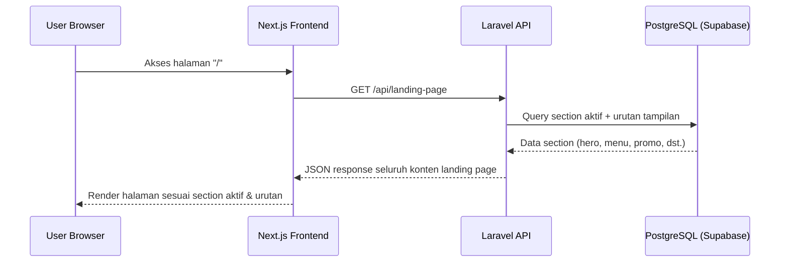
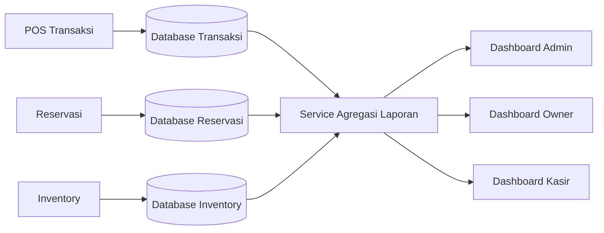
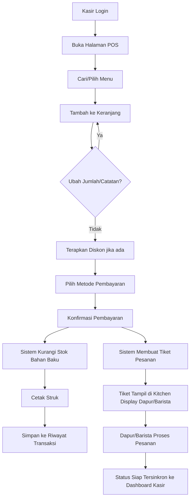
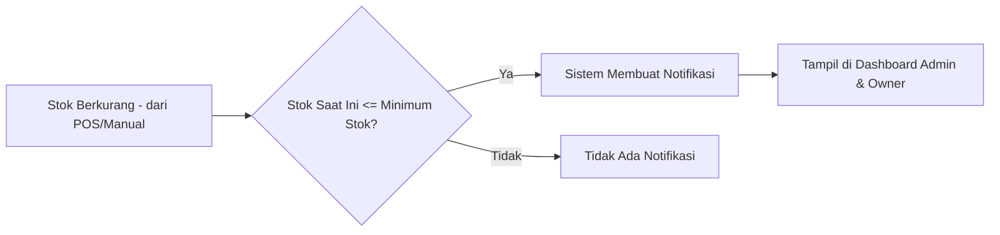
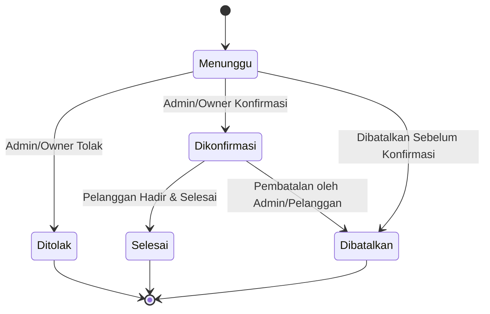
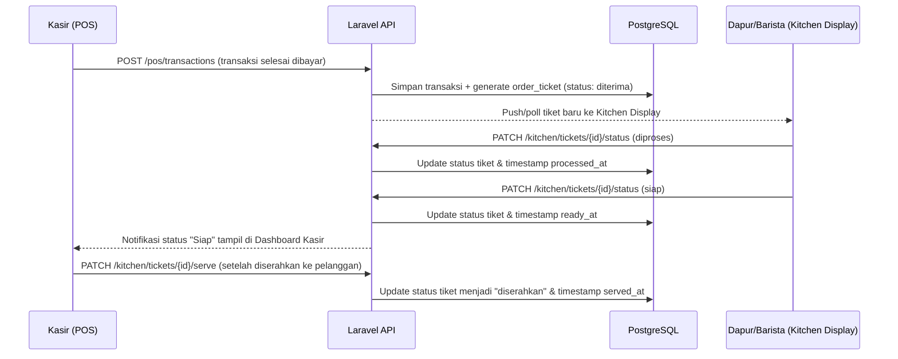
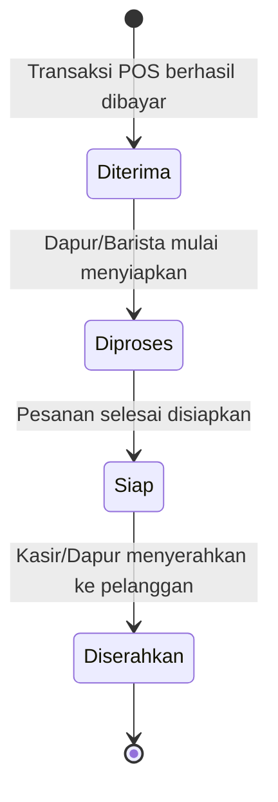

# 04. SPESIFIKASI MODUL OPERASIONAL

## 14. LANDING PAGE SPECIFICATION

> **Referensi Gaya Visual:** Struktur & gaya visual Landing Page wajib mengacu secara presisi pada layout mockup visual di file gambar [Nemu Space.jfif](./Nemu Space.jfif) — hero banner besar dengan foto suasana kopi & headline besar (contoh gaya: "HANDCRAFTED"), section kategori dengan ikon foto berbentuk organik di atas latar bertekstur biji kopi gelap ("Handcrafted Curations"), grid menu favorit dengan kartu produk bersih di atas latar terang ("Barista Recommends"), section artikel/cerita dengan latar foto gelap & overlay, serta footer solid berwarna gelap. Palet warna mengikuti Bab 30.2 (hijau tua + krem) — lihat Bab 30 untuk detail token warna.

Landing Page terdiri dari section-section berikut. Setiap section wajib memiliki toggle **Aktif/Nonaktif** yang dikontrol dari CMS, serta urutan tampilan (`display_order`) yang dapat diatur melalui drag-and-drop di CMS.

| Section | Deskripsi | Sumber Data | Dapat Dinonaktifkan |
|---|---|---|---|
| Navbar | Logo, menu navigasi, tombol reservasi, toggle dark/light mode | `settings`, `menu_navigasi` | Tidak (selalu tampil) |
| Hero Banner | Banner utama dengan gambar/slider (foto suasana kopi close-up), headline besar bergaya bold (contoh: "Handcrafted"/"Racikan Autentik"), sub-headline, tombol CTA solid ("Order Now"/"Pesan Sekarang") | `hero_banners` | Ya |
| Tentang Kami | Cerita singkat coffee shop, foto, keunggulan (value proposition) | `about_us` | Ya |
| Menu Favorit | Grid kartu menu bersih di atas latar terang, gambar produk besar, nama, harga, badge "Best Seller" (gaya "Barista Recommends") | `menus` (filter `is_best_seller`) | Ya |
| Kategori Menu | Grid kategori menu berbentuk ikon bulat/organik berisi foto produk, ditampilkan di atas latar bertekstur gelap (gaya "Handcrafted Curations") | `categories` | Ya |
| Promo | Banner promo aktif berdasarkan `start_date` & `end_date` | `promotions` | Ya |
| Artikel | 3 artikel terbaru yang dipublikasikan | `articles` | Ya |
| Galeri | Grid foto galeri (masonry layout) | `galleries` | Ya |
| Testimoni | Slider ulasan pelanggan (dikelola manual oleh Admin) | `testimonials` | Ya |
| FAQ | Accordion pertanyaan umum | `faqs` | Ya |
| Reservasi | Form reservasi ringkas dengan CTA menuju halaman reservasi lengkap | `reservations` | Ya |
| Lokasi | Embed Google Maps, alamat, jam operasional | `settings` | Ya |
| Kontak | Nomor telepon, WhatsApp, email, media sosial | `settings`, `social_media` | Ya |
| Footer | Logo, deskripsi singkat, tautan cepat, media sosial, copyright | `settings`, `social_media` | Tidak (selalu tampil) |

### 14.1 Alur Rendering Landing Page (Dinamis)

### 14.2 Aturan Validasi Hero Banner

- Maksimal 5 banner aktif dalam satu waktu (ditampilkan sebagai slider/carousel).
- Setiap banner wajib memiliki: gambar (rasio 16:9, ukuran maksimal 2MB, format JPG/PNG/WebP), judul, sub-judul (opsional), teks tombol CTA, dan tautan tujuan CTA.
- Admin dapat mengatur urutan tampil banner melalui drag-and-drop.

---

## 15. CMS SPECIFICATION

CMS merupakan panel administratif yang memungkinkan Admin dan Owner mengelola seluruh konten dinamis website.

### 15.1 Modul yang Dikelola CMS

| Modul | Field yang Dapat Diedit |
|---|---|
| Logo & Favicon | Upload gambar logo (header & footer), upload favicon (.ico/.png) |
| Hero Banner | Gambar, judul, sub-judul, CTA, urutan, status aktif |
| Tentang Kami | Judul, deskripsi (rich text), gambar, daftar keunggulan (poin) |
| Menu | Nama, deskripsi, harga, kategori, gambar, status, best seller, promo, ketersediaan |
| Kategori | Nama kategori, ikon/gambar, urutan tampil |
| Promo | Judul, banner, jenis (voucher/diskon), nilai diskon, periode, status |
| Artikel | Judul, thumbnail, kategori, konten (WYSIWYG), meta SEO, status publish |
| FAQ | Pertanyaan, jawaban, urutan tampil |
| Footer | Deskripsi singkat, tautan cepat, copyright text |
| Jam Operasional | Hari, jam buka, jam tutup, status buka/tutup per hari |
| Kontak | Nomor telepon, WhatsApp, email |
| Google Maps | Embed link/koordinat lokasi |
| Media Sosial | Instagram, Facebook, TikTok, X (Twitter), YouTube (URL) |
| Metadata SEO | Meta title, meta description, OG image, keyword |
| Galeri | Upload gambar, kategori, caption |

### 15.2 Aturan Umum CMS

1. Seluruh perubahan konten CMS **tidak memerlukan deployment ulang** — perubahan langsung tersimpan di database dan tampil real-time pada frontend.
2. Setiap perubahan konten dicatat dalam **Audit Log** (siapa mengubah, kapan, apa yang diubah).
3. Upload gambar wajib melalui validasi: format (JPG, PNG, WebP), ukuran maksimal 5MB, dan otomatis dikompresi/resize sebelum disimpan ke Supabase Storage.
4. Setiap konten memiliki status `draft` and `published` (kecuali pengaturan umum yang bersifat langsung aktif).
5. Terdapat fitur **preview** sebelum konten dipublikasikan (khusus Artikel dan Hero Banner).

---

## 16. DASHBOARD SPECIFICATION

### 16.1 Dashboard Kasir

| Widget | Deskripsi |
|---|---|
| Ringkasan Transaksi Hari Ini | Jumlah transaksi & total pendapatan shift berjalan |
| Reservasi Hari Ini | Daftar reservasi terkonfirmasi untuk hari berjalan |
| Akses Cepat POS | Tombol langsung menuju halaman POS |

### 16.2 Dashboard Admin

| Widget | Deskripsi |
|---|---|
| Penjualan Hari Ini | Total pendapatan & jumlah transaksi hari ini |
| Reservasi Hari Ini | Daftar & status reservasi hari ini |
| Menu Terlaris | Top 5 menu terlaris minggu berjalan |
| Stok Menipis | Daftar bahan baku dengan stok di bawah minimum |
| Artikel & Promo Terbaru | Status publikasi konten terbaru |

### 16.3 Dashboard Owner

Seluruh widget Dashboard Admin, ditambah:

| Widget | Deskripsi |
|---|---|
| Grafik Penjualan | Grafik garis/batang penjualan harian, mingguan, bulanan |
| Total Pendapatan | Akumulasi pendapatan berdasarkan filter periode |
| Statistik Menu | Analisis kategori menu terlaris & tren pertumbuhan |
| Perbandingan Periode | Perbandingan pendapatan periode berjalan vs periode sebelumnya |
| Ringkasan Inventory | Nilai stok saat ini & barang yang perlu di-restock |

### 16.4 Diagram Alur Data Dashboard

---

## 17. POS SPECIFICATION

### 17.1 Alur Transaksi POS

> Setiap transaksi yang berhasil dibayar secara otomatis membuat **tiket pesanan** (order ticket) yang dikirim ke Kitchen Display milik Dapur/Barista, berjalan paralel dengan proses pencetakan struk (lihat Bab 41 untuk detail spesifikasi Kitchen Display System).

### 17.2 Fitur Detail POS

| Fitur | Deskripsi |
|---|---|
| Cari Menu | Pencarian real-time berdasarkan nama menu, dapat difilter per kategori |
| Menu Bergambar | Tampilan grid menu dengan thumbnail gambar, harga, dan status ketersediaan |
| Keranjang | Menampilkan daftar item, jumlah, subtotal per item, dan total keseluruhan |
| Catatan Pesanan | Kolom catatan per item (contoh: "less sugar", "no ice") |
| Diskon | Diskon nominal atau persentase, dapat diterapkan per transaksi atau per item |
| Pembayaran | Metode: Tunai, QRIS, Kartu Debit/Kredit (dicatat manual oleh kasir, tanpa integrasi payment gateway) |
| Cetak Struk | Cetak melalui printer thermal (browser print / integrasi driver printer thermal ESC/POS) |
| Riwayat Transaksi | Daftar transaksi dengan filter tanggal, dapat dilihat detail per transaksi |

### 17.3 Aturan Bisnis POS

1. Menu dengan status **"Tidak Tersedia"** tidak dapat ditambahkan ke keranjang (tombol nonaktif otomatis).
2. Setiap transaksi wajib menghasilkan **nomor invoice unik** dengan format `INV-YYYYMMDD-XXXX`.
3. Stok bahan baku otomatis berkurang berdasarkan resep/komposisi menu (jika data komposisi tersedia); jika tidak tersedia data komposisi, pengurangan stok bahan dilakukan manual oleh Admin.
4. Transaksi yang telah dicetak struknya tidak dapat dihapus, hanya dapat dibatalkan (status `void`) oleh Admin/Owner dengan alasan wajib diisi.
5. Kasir hanya dapat melihat riwayat transaksi miliknya sendiri pada shift berjalan; Admin/Owner dapat melihat seluruh riwayat transaksi.

### 17.4 Struktur Struk

Struk mencantumkan: nama coffee shop & logo, alamat, nomor invoice, tanggal & waktu transaksi, nama kasir, daftar item (nama, jumlah, harga satuan, subtotal), diskon, total pembayaran, metode pembayaran, dan catatan kaki (contoh: "Terima kasih telah berkunjung").

---

## 18. INVENTORY SPECIFICATION

### 18.1 Entitas Inventory

| Field | Deskripsi |
|---|---|
| Nama Bahan | Nama bahan baku (contoh: Biji Kopi Arabica) |
| Kategori | Kategori bahan (Kopi, Susu, Sirup, Kemasan, dll.) |
| Jumlah Stok | Jumlah stok saat ini |
| Satuan | Kg, Liter, Pcs, Gram, dll. |
| Supplier | Nama pemasok bahan baku |
| Minimum Stok | Ambang batas untuk memicu notifikasi stok menipis |
| Barang Masuk | Pencatatan penambahan stok (tanggal, jumlah, supplier, harga beli) |
| Barang Keluar | Pencatatan pengurangan stok (otomatis dari POS atau manual oleh Admin) |
| Riwayat | Log seluruh mutasi stok (masuk/keluar) dengan timestamp dan user yang melakukan |

### 18.2 Alur Notifikasi Stok Menipis

### 18.3 Aturan Bisnis Inventory

1. Stok tidak dapat bernilai negatif; jika stok tidak mencukupi, sistem menampilkan peringatan namun tetap mengizinkan transaksi (dengan catatan stok defisit) agar operasional kasir tidak terhambat, disertai notifikasi ke Admin.
2. Setiap mutasi stok wajib tercatat pada tabel riwayat (`inventory_logs`) dengan referensi ke sumber (transaksi POS / input manual Admin).
3. Notifikasi stok menipis dikirimkan pada Dashboard Admin dan Owner secara real-time (badge notifikasi) begitu ambang batas tercapai.

---

## 19. RESERVATION SPECIFICATION

### 19.1 Field Form Reservasi (Pelanggan)

| Field | Tipe | Validasi |
|---|---|---|
| Nama | Text | Wajib, maksimal 100 karakter |
| Nomor HP | Text | Wajib, format nomor telepon Indonesia (contoh: 08xxxxxxxxxx) |
| Tanggal | Date | Wajib, tidak boleh tanggal lampau |
| Jam | Time | Wajib, sesuai jam operasional coffee shop |
| Jumlah Orang | Number | Wajib, minimal 1, maksimal sesuai kapasitas maksimum meja |
| Keperluan | Select | Opsional (Nongkrong, Meeting, Ulang Tahun, Lainnya) |
| Catatan | Textarea | Opsional, maksimal 300 karakter |

### 19.2 Status Reservasi & Alur Perubahan Status

### 19.3 Aturan Bisnis Reservasi

1. Admin/Owner yang menentukan penetapan meja spesifik untuk setiap reservasi yang dikonfirmasi (tidak ada pemilihan meja mandiri oleh pelanggan).
2. Reservasi berstatus "Menunggu" wajib direspons (dikonfirmasi/ditolak) oleh Admin dalam batas waktu operasional yang berlaku (dikonfigurasi di Pengaturan).
3. Pelanggan dapat memantau status reservasinya melalui nomor HP yang didaftarkan (halaman cek status reservasi tanpa login, menggunakan nomor HP + tanggal reservasi sebagai kunci pencarian).
4. Sistem mengirimkan notifikasi (WhatsApp/manual follow-up oleh Admin) ketika status reservasi berubah — pengiriman notifikasi WhatsApp otomatis merupakan fitur *Should Have* menggunakan WhatsApp Business API/Deep Link.

---

## 20. MENU MANAGEMENT SPECIFICATION

### 20.1 Field Data Menu

| Field | Tipe | Keterangan |
|---|---|---|
| Foto | Image | Wajib, rasio 1:1 disarankan, disimpan di Supabase Storage |
| Nama | Text | Wajib, unik per kategori |
| Harga | Decimal | Wajib, format Rupiah |
| Kategori | Relasi | Wajib, relasi ke tabel `categories` |
| Deskripsi | Textarea | Opsional, maksimal 500 karakter |
| Status | Enum | `Tersedia` / `Tidak Tersedia` |
| Best Seller | Boolean | Menandai menu sebagai favorit di Landing Page |
| Promo | Relasi | Opsional, relasi ke `promotions` jika menu sedang promo |
| Ketersediaan | Boolean/Enum | Menampilkan stok real-time jika terhubung ke inventory bahan baku |

### 20.2 Aturan Bisnis Menu

1. Menu tidak dapat dihapus permanen jika sudah pernah digunakan dalam transaksi (menggunakan **soft delete**) untuk menjaga integritas data laporan historis.
2. Perubahan harga menu tidak mempengaruhi transaksi yang sudah tercatat sebelumnya (harga transaksi disimpan sebagai snapshot).
3. Kategori menu dapat diatur urutannya untuk tampilan pada halaman publik dan POS.

---

## 21. GALLERY SPECIFICATION

| Field | Keterangan |
|---|---|
| Gambar | Upload ke Supabase Storage, format JPG/PNG/WebP, maksimal 5MB |
| Kategori | Contoh: Interior, Menu, Event, Suasana |
| Caption | Teks singkat penjelas gambar, maksimal 150 karakter |
| Urutan Tampil | Dapat diatur manual oleh Admin |
| Preview | Modal lightbox saat gambar diklik pada halaman publik |

---

## 22. PROMOTION SPECIFICATION

| Field | Keterangan |
|---|---|
| Banner | Gambar promo, rasio 16:9 |
| Jenis | Voucher (kode unik) atau Diskon Langsung (otomatis diterapkan pada menu terkait) |
| Nilai | Nominal (Rp) atau Persentase (%) |
| Periode Berlaku | Tanggal mulai & tanggal berakhir |
| Status | Aktif / Nonaktif / Kedaluwarsa (dihitung otomatis berdasarkan periode) |

**Aturan Bisnis:** Promo yang telah melewati `end_date` otomatis berubah status menjadi "Kedaluwarsa" dan tidak lagi tampil pada Landing Page maupun dapat diterapkan pada POS, namun data tetap tersimpan untuk keperluan laporan historis.

---

## 23. ARTICLE SPECIFICATION

| Field | Keterangan |
|---|---|
| Thumbnail | Gambar sampul artikel |
| Kategori | Contoh: Tips Kopi, Event, Berita, Promo |
| Editor | WYSIWYG rich text editor (mendukung heading, bold, italic, gambar, link, list) |
| SEO | Meta title, meta description, slug URL otomatis (dapat diedit manual) |
| Publish | Status Draft/Published, dengan penjadwalan tanggal publikasi (opsional) |

---

## 24. SETTINGS SPECIFICATION

| Kategori Pengaturan | Field |
|---|---|
| Identitas | Nama Coffee Shop, Tagline, Logo (header/footer), Favicon |
| Kontak & Lokasi | Alamat lengkap, Nomor Telepon, WhatsApp, Email, Embed Google Maps |
| Media Sosial | Instagram, Facebook, TikTok, X, YouTube |
| Jam Operasional | Jam buka/tutup per hari (Senin–Minggu), status libur khusus (tanggal merah) |
| Tema | Pilihan skema warna (tetap dalam batas Design System), Dark/Light Mode default |
| SEO | Meta title & description default, OG Image default, Google Search Console verification tag |
| Backup & Restore | Backup manual/terjadwal (database + media), restore dari file backup |

---

## 41. KITCHEN DISPLAY SYSTEM (KDS) SPECIFICATION

### 41.1 Tujuan

Kitchen Display System (KDS) adalah antarmuka khusus untuk role **Dapur/Barista** yang menampilkan antrian pesanan secara real-time begitu transaksi berhasil dibuat di POS, menggantikan penggunaan struk kertas sebagai satu-satunya acuan dapur. Tujuannya adalah memastikan tidak ada pesanan yang terlewat, mempercepat proses penyajian, dan memberikan visibilitas status pesanan kepada Kasir maupun Admin/Owner.

### 41.2 Alur Sistem End-to-End

### 41.3 Status Tiket Pesanan

### 41.4 Tampilan Kitchen Display

| Kolom Layar | Deskripsi |
|---|---|
| Diterima | Menampilkan tiket pesanan baru yang belum mulai dikerjakan, diurutkan FIFO (paling lama di atas) |
| Diproses | Menampilkan tiket yang sedang dikerjakan, dengan penanda durasi berjalan sejak status diubah |
| Siap | Menampilkan tiket yang telah selesai dan menunggu diserahkan ke pelanggan |

Setiap kartu tiket menampilkan: nomor tiket, waktu masuk pesanan, daftar item beserta jumlah dan catatan khusus (contoh: "less sugar", "no ice"), serta indikator warna yang berubah (hijau → kuning → merah) apabila pesanan melewati ambang waktu wajar (dikonfigurasi di Pengaturan, default 10 menit) sebagai peringatan visual keterlambatan.

### 41.5 Fitur Detail

| Fitur | Deskripsi |
|---|---|
| Real-time Update | Tiket baru langsung muncul tanpa perlu refresh manual, menggunakan polling singkat atau WebSocket/SSE |
| Notifikasi Suara/Visual | Bunyi notifikasi singkat dan highlight kartu saat tiket baru masuk |
| Multi-Item Status | Untuk pesanan dengan banyak item, setiap item dapat ditandai selesai secara individual sebelum keseluruhan tiket berstatus "Siap" |
| Penugasan Tiket (Opsional) | Pada dapur dengan lebih dari satu staf, Admin dapat menugaskan tiket ke Dapur/Barista tertentu (`assigned_to`) |
| Riwayat Tiket | Tiket yang sudah "Diserahkan" berpindah ke tab Riwayat untuk keperluan audit, tidak lagi tampil di antrian aktif |
| Sinkronisasi ke Kasir | Status "Siap" tersinkron to Dashboard Kasir sehingga kasir tahu kapan harus memanggil pelanggan |

### 41.6 Aturan Bisnis

1. Tiket pesanan dibuat otomatis oleh sistem sesaat setelah transaksi POS berhasil dibayar (status transaksi = "selesai"), tidak dapat dibuat manual oleh Dapur/Barista.
2. Perubahan status tiket bersifat linear/berurutan (tidak dapat melompat, contoh: dari "Diterima" langsung ke "Diserahkan" tanpa melalui "Diproses" dan "Siap"), kecuali dilakukan override oleh Admin/Owner untuk kasus koreksi kesalahan.
3. Jika transaksi di-void oleh Admin/Owner (lihat Bab 17.3), tiket pesanan terkait otomatis dibatalkan dan dihapus dari antrian Kitchen Display.
4. Satu transaksi menghasilkan **tepat satu tiket pesanan** (relasi one-to-one), namun tiket tersebut dapat berisi banyak item pesanan (relasi one-to-many ke `order_ticket_items`).
5. Dapur/Barista hanya dapat mengubah status tiket, tidak dapat mengubah isi pesanan (jumlah/menu) — perubahan isi pesanan harus dilakukan melalui pembatalan/void oleh Admin/Owner dan pembuatan transaksi baru oleh Kasir.

### 41.7 Functional Requirements Terkait

Lihat **Bab 12.3 (FR-36 s.d. FR-42)** untuk kebutuhan fungsional lengkap modul Kitchen Display.

### 41.8 Acceptance Criteria Modul Kitchen Display

| Kriteria | Detail |
|---|---|
| Kemunculan Tiket Real-time | Tiket baru tampil di Kitchen Display dalam waktu < 5 detik setelah transaksi POS selesai dibayar |
| Perubahan Status | Dapur/Barista dapat mengubah status tiket dengan satu kali klik/tap, dan perubahan tersinkron ke Dashboard Kasir dalam waktu < 5 detik |
| Peringatan Keterlambatan | Tiket yang melewati ambang waktu wajar menampilkan indikator visual (warna berubah) secara otomatis tanpa perlu aksi manual |
| Akses Terbatas | Dapur/Barista tidak dapat mengakses menu CMS, laporan keuangan, maupun pengaturan website (`403 Forbidden` jika dicoba) |
| Multi-Role Login | Akun yang memiliki peran ganda (Kasir + Dapur/Barista) dapat berpindah antara tampilan POS dan Kitchen Display tanpa perlu logout/login ulang |
