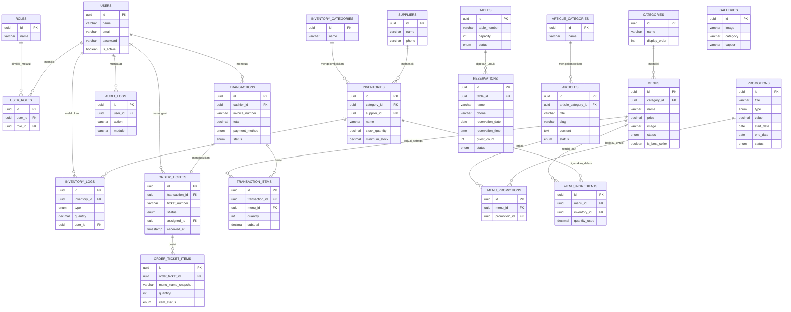

# 05. SPESIFIKASI DATABASE & API INTERNAL

## 26. DATABASE DESIGN

### 26.1 Daftar Tabel

| No | Nama Tabel | Deskripsi |
|---|---|---|
| 1 | `users` | Data pengguna internal (Kasir, Admin, Owner) |
| 2 | `roles` | Daftar peran (Kasir, Admin, Owner) |
| 3 | `settings` | Pengaturan umum website (identitas, kontak, SEO, jam operasional) |
| 4 | `social_media` | Tautan media sosial |
| 5 | `hero_banners` | Data banner utama Landing Page |
| 6 | `about_us` | Konten section Tentang Kami |
| 7 | `categories` | Kategori menu |
| 8 | `menus` | Data menu produk |
| 9 | `promotions` | Data promo/voucher |
| 10 | `menu_promotions` | Tabel pivot relasi menu ↔ promo |
| 11 | `articles` | Data artikel |
| 12 | `article_categories` | Kategori artikel |
| 13 | `galleries` | Data galeri foto |
| 14 | `testimonials` | Data testimoni pelanggan |
| 15 | `faqs` | Data FAQ |
| 16 | `reservations` | Data reservasi pelanggan |
| 17 | `tables` | Data meja fisik coffee shop |
| 18 | `transactions` | Data transaksi POS (header) |
| 19 | `transaction_items` | Detail item per transaksi (detail) |
| 19a | `order_tickets` | Tiket pesanan untuk Kitchen Display (header, 1 tiket per transaksi) |
| 19b | `order_ticket_items` | Detail item per tiket pesanan beserta status masing-masing item |
| 20 | `inventories` | Data bahan baku |
| 21 | `inventory_categories` | Kategori bahan baku |
| 22 | `suppliers` | Data pemasok |
| 23 | `inventory_logs` | Riwayat mutasi stok |
| 24 | `menu_ingredients` | Komposisi bahan baku per menu (pivot resep) |
| 25 | `audit_logs` | Log aktivitas pengguna internal |
| 26 | `media` | Metadata file media yang diupload ke Supabase Storage |

### 26.2 Struktur Rinci Tabel Utama

#### Tabel `users`
| Kolom | Tipe | Constraint |
|---|---|---|
| id | UUID | Primary Key |
| name | VARCHAR(100) | NOT NULL |
| email | VARCHAR(150) | UNIQUE, NOT NULL |
| password | VARCHAR(255) | NOT NULL (hashed) |
| phone | VARCHAR(20) | NULLABLE |
| avatar | VARCHAR(255) | NULLABLE |
| is_active | BOOLEAN | DEFAULT true |
| created_at | TIMESTAMP | NOT NULL |
| updated_at | TIMESTAMP | NOT NULL |

#### Tabel `roles`
| Kolom | Tipe | Constraint |
|---|---|---|
| id | UUID | Primary Key |
| name | VARCHAR(50) | UNIQUE, NOT NULL (Kasir/Dapur_Barista/Admin/Owner) |

> Catatan: Relasi user ↔ role bersifat **many-to-many** melalui tabel pivot `user_roles` untuk mengakomodasi staf yang merangkap peran Kasir sekaligus Dapur/Barista dalam satu akun.

#### Tabel `user_roles` (Pivot)
| Kolom | Tipe | Constraint |
|---|---|---|
| id | UUID | Primary Key |
| user_id | UUID | Foreign Key → users.id |
| role_id | UUID | Foreign Key → roles.id |

Unique constraint: (`user_id`, `role_id`).

#### Tabel `menus`
| Kolom | Tipe | Constraint |
|---|---|---|
| id | UUID | Primary Key |
| category_id | UUID | Foreign Key → categories.id |
| name | VARCHAR(150) | NOT NULL |
| slug | VARCHAR(180) | UNIQUE, NOT NULL |
| description | TEXT | NULLABLE |
| price | DECIMAL(12,2) | NOT NULL |
| image | VARCHAR(255) | NOT NULL |
| status | ENUM('tersedia','tidak_tersedia') | DEFAULT 'tersedia' |
| is_best_seller | BOOLEAN | DEFAULT false |
| deleted_at | TIMESTAMP | NULLABLE (soft delete) |
| created_at | TIMESTAMP | NOT NULL |
| updated_at | TIMESTAMP | NOT NULL |

Index: `idx_menus_category_id`, `idx_menus_status`. Constraint: `price > 0`.

#### Tabel `reservations`
| Kolom | Tipe | Constraint |
|---|---|---|
| id | UUID | Primary Key |
| table_id | UUID | Foreign Key → tables.id, NULLABLE (diisi saat konfirmasi) |
| name | VARCHAR(100) | NOT NULL |
| phone | VARCHAR(20) | NOT NULL |
| reservation_date | DATE | NOT NULL |
| reservation_time | TIME | NOT NULL |
| guest_count | INTEGER | NOT NULL, CHECK (guest_count > 0) |
| purpose | VARCHAR(50) | NULLABLE |
| notes | TEXT | NULLABLE |
| status | ENUM('menunggu','dikonfirmasi','ditolak','selesai','dibatalkan') | DEFAULT 'menunggu' |
| created_at | TIMESTAMP | NOT NULL |
| updated_at | TIMESTAMP | NOT NULL |

Index: `idx_reservations_date_status`.

#### Tabel `transactions`
| Kolom | Tipe | Constraint |
|---|---|---|
| id | UUID | Primary Key |
| invoice_number | VARCHAR(30) | UNIQUE, NOT NULL |
| cashier_id | UUID | Foreign Key → users.id |
| subtotal | DECIMAL(12,2) | NOT NULL |
| discount | DECIMAL(12,2) | DEFAULT 0 |
| total | DECIMAL(12,2) | NOT NULL |
| payment_method | ENUM('tunai','qris','kartu') | NOT NULL |
| status | ENUM('selesai','void') | DEFAULT 'selesai' |
| void_reason | TEXT | NULLABLE |
| created_at | TIMESTAMP | NOT NULL |

Index: `idx_transactions_created_at`, `idx_transactions_cashier_id`.

#### Tabel `transaction_items`
| Kolom | Tipe | Constraint |
|---|---|---|
| id | UUID | Primary Key |
| transaction_id | UUID | Foreign Key → transactions.id |
| menu_id | UUID | Foreign Key → menus.id |
| menu_name_snapshot | VARCHAR(150) | NOT NULL |
| price_snapshot | DECIMAL(12,2) | NOT NULL |
| quantity | INTEGER | NOT NULL, CHECK (quantity > 0) |
| note | VARCHAR(200) | NULLABLE |
| subtotal | DECIMAL(12,2) | NOT NULL |

Index: `idx_transaction_items_transaction_id`.

#### Tabel `order_tickets`
| Kolom | Tipe | Constraint |
|---|---|---|
| id | UUID | Primary Key |
| transaction_id | UUID | Foreign Key → transactions.id, UNIQUE |
| ticket_number | VARCHAR(30) | UNIQUE, NOT NULL |
| status | ENUM('diterima','diproses','siap','diserahkan') | DEFAULT 'diterima' |
| assigned_to | UUID | Foreign Key → users.id, NULLABLE (Dapur/Barista yang menangani) |
| received_at | TIMESTAMP | NOT NULL |
| processed_at | TIMESTAMP | NULLABLE |
| ready_at | TIMESTAMP | NULLABLE |
| served_at | TIMESTAMP | NULLABLE |

Index: `idx_order_tickets_status`, `idx_order_tickets_received_at`.

#### Tabel `order_ticket_items`
| Kolom | Tipe | Constraint |
|---|---|---|
| id | UUID | Primary Key |
| order_ticket_id | UUID | Foreign Key → order_tickets.id |
| menu_name_snapshot | VARCHAR(150) | NOT NULL |
| quantity | INTEGER | NOT NULL, CHECK (quantity > 0) |
| note | VARCHAR(200) | NULLABLE |
| item_status | ENUM('diterima','diproses','siap') | DEFAULT 'diterima' |

Index: `idx_order_ticket_items_order_ticket_id`.

#### Tabel `inventories`
| Kolom | Tipe | Constraint |
|---|---|---|
| id | UUID | Primary Key |
| category_id | UUID | Foreign Key → inventory_categories.id |
| supplier_id | UUID | Foreign Key → suppliers.id, NULLABLE |
| name | VARCHAR(150) | NOT NULL |
| stock_quantity | DECIMAL(12,2) | DEFAULT 0, CHECK (stock_quantity >= 0) |
| unit | VARCHAR(20) | NOT NULL |
| minimum_stock | DECIMAL(12,2) | DEFAULT 0 |
| created_at | TIMESTAMP | NOT NULL |
| updated_at | TIMESTAMP | NOT NULL |

Index: `idx_inventories_stock_quantity`.

#### Tabel `inventory_logs`
| Kolom | Tipe | Constraint |
|---|---|---|
| id | UUID | Primary Key |
| inventory_id | UUID | Foreign Key → inventories.id |
| type | ENUM('masuk','keluar') | NOT NULL |
| quantity | DECIMAL(12,2) | NOT NULL |
| reference_type | VARCHAR(50) | NULLABLE ('transaction','manual') |
| reference_id | UUID | NULLABLE |
| user_id | UUID | Foreign Key → users.id |
| created_at | TIMESTAMP | NOT NULL |

#### Tabel `audit_logs`
| Kolom | Tipe | Constraint |
|---|---|---|
| id | UUID | Primary Key |
| user_id | UUID | Foreign Key → users.id |
| action | VARCHAR(100) | NOT NULL |
| module | VARCHAR(50) | NOT NULL |
| description | TEXT | NULLABLE |
| ip_address | VARCHAR(45) | NULLABLE |
| created_at | TIMESTAMP | NOT NULL |

---

## 27. ERD



---

## 28. API SPECIFICATION (INTERNAL API)

Seluruh API bersifat **internal** (tidak dipublikasikan untuk pihak ketiga), menggunakan format **REST JSON**, autentikasi menggunakan **Laravel Sanctum (Token-based)** untuk endpoint yang memerlukan login.

### 28.1 Konvensi Umum

| Aspek | Ketentuan |
|---|---|
| Base URL | `https://api.nemuspace.id/api/v1` |
| Format Response | JSON, struktur baku: `{ "success": bool, "message": string, "data": object/array, "meta": object }` |
| Autentikasi | Header `Authorization: Bearer {token}` untuk endpoint privat |
| Versioning | Menggunakan prefix `/v1` |
| Pagination | Query param `page` & `per_page`, response menyertakan `meta.total`, `meta.current_page` |
| Error Handling | HTTP status code standar (400, 401, 403, 404, 422, 500) dengan pesan error deskriptif |

### 28.2 Endpoint Publik (Tanpa Autentikasi)

| Method | Endpoint | Deskripsi |
|---|---|---|
| GET | `/landing-page` | Mengambil seluruh konten landing page aktif |
| GET | `/menus` | Daftar menu (filter: kategori, pencarian, status) |
| GET | `/menus/{slug}` | Detail menu |
| GET | `/categories` | Daftar kategori menu |
| GET | `/promotions` | Daftar promo aktif |
| GET | `/articles` | Daftar artikel (dengan pagination & filter kategori) |
| GET | `/articles/{slug}` | Detail artikel |
| GET | `/galleries` | Daftar galeri foto |
| GET | `/faqs` | Daftar FAQ |
| GET | `/testimonials` | Daftar testimoni |
| GET | `/settings` | Pengaturan umum (kontak, jam operasional, sosial media) |
| POST | `/reservations` | Mengirim reservasi baru |
| GET | `/reservations/check` | Cek status reservasi (query: `phone`, `date`) |

### 28.3 Endpoint Autentikasi

| Method | Endpoint | Deskripsi |
|---|---|---|
| POST | `/auth/login` | Login pengguna internal (email/password) |
| POST | `/auth/logout` | Logout & invalidasi token |
| GET | `/auth/me` | Mengambil data profil pengguna yang sedang login |

### 28.4 Endpoint Dapur/Barista (Role: Dapur/Barista, Admin, Owner)

| Method | Endpoint | Deskripsi |
|---|---|---|
| GET | `/kitchen/tickets` | Daftar tiket pesanan aktif (filter status: diterima/diproses/siap), diurutkan FIFO |
| GET | `/kitchen/tickets/{id}` | Detail tiket pesanan beserta item & catatan |
| PATCH | `/kitchen/tickets/{id}/status` | Mengubah status tiket (diterima → diproses → siap) |
| PATCH | `/kitchen/tickets/{id}/items/{itemId}/status` | Mengubah status per item pesanan (untuk pesanan multi-item) |
| PATCH | `/kitchen/tickets/{id}/serve` | Menandai tiket telah diserahkan ke pelanggan (status "diserahkan") |

> Endpoint ini menggunakan **polling singkat (contoh: 3–5 detik) atau WebSocket/Server-Sent Events** agar antrian pesanan pada Kitchen Display selalu real-time tanpa perlu me-refresh halaman secara manual.

### 28.5 Endpoint Kasir (Role: Kasir, Admin, Owner)

| Method | Endpoint | Deskripsi |
|---|---|---|
| GET | `/pos/menus` | Daftar menu untuk POS (termasuk status ketersediaan) |
| POST | `/pos/transactions` | Membuat transaksi baru |
| GET | `/pos/transactions` | Riwayat transaksi (filter tanggal, kasir) |
| GET | `/pos/transactions/{id}` | Detail transaksi |
| PATCH | `/pos/transactions/{id}/void` | Membatalkan transaksi (khusus Admin/Owner) |
| GET | `/pos/reservations/today` | Daftar reservasi hari ini |

### 28.6 Endpoint Admin (Role: Admin, Owner)

| Method | Endpoint | Deskripsi |
|---|---|---|
| POST/PUT/DELETE | `/admin/hero-banners` | CRUD Hero Banner |
| POST/PUT/DELETE | `/admin/about-us` | Update konten Tentang Kami |
| POST/PUT/DELETE | `/admin/menus` | CRUD Menu |
| POST/PUT/DELETE | `/admin/categories` | CRUD Kategori Menu |
| POST/PUT/DELETE | `/admin/promotions` | CRUD Promo |
| POST/PUT/DELETE | `/admin/articles` | CRUD Artikel |
| POST/PUT/DELETE | `/admin/galleries` | CRUD Galeri |
| POST/PUT/DELETE | `/admin/faqs` | CRUD FAQ |
| GET/PATCH | `/admin/reservations` | Kelola status reservasi |
| POST/PUT/DELETE | `/admin/inventories` | CRUD Inventory |
| POST | `/admin/inventories/{id}/stock-in` | Pencatatan barang masuk |
| POST | `/admin/inventories/{id}/stock-out` | Pencatatan barang keluar manual |
| GET | `/admin/inventories/logs` | Riwayat mutasi stok |
| GET | `/admin/reports/sales` | Laporan penjualan (filter tanggal) |
| GET | `/admin/reports/reservations` | Laporan reservasi |
| GET | `/admin/reports/inventory` | Laporan inventory |
| GET | `/admin/reports/export?type=pdf|excel` | Ekspor laporan |
| PUT | `/admin/settings` | Update pengaturan website |
| POST | `/admin/media/upload` | Upload media ke Supabase Storage |

### 28.7 Endpoint Owner (Role: Owner)

| Method | Endpoint | Deskripsi |
|---|---|---|
| GET | `/owner/dashboard/summary` | Ringkasan bisnis (pendapatan, transaksi, reservasi) |
| GET | `/owner/dashboard/sales-chart` | Data grafik penjualan (harian/mingguan/bulanan) |
| GET | `/owner/dashboard/top-menus` | Statistik menu terlaris |
| POST | `/owner/backup` | Membuat backup data |
| POST | `/owner/restore` | Restore data dari file backup |
| GET/POST/PUT/DELETE | `/owner/users` | Manajemen user (Admin & Kasir) |
| GET | `/owner/audit-logs` | Melihat seluruh audit log sistem |

### 28.8 Contoh Struktur Request/Response

**Contoh Request — Membuat Reservasi**
```json
POST /api/v1/reservations
{
  "name": "Dina Ayu Pratiwi",
  "phone": "081234567890",
  "reservation_date": "2026-07-20",
  "reservation_time": "18:00",
  "guest_count": 4,
  "purpose": "Nongkrong",
  "notes": "Dekat jendela jika memungkinkan"
}
```

**Contoh Response Sukses**
```json
{
  "success": true,
  "message": "Reservasi berhasil dikirim, menunggu konfirmasi.",
  "data": {
    "id": "b7e2f1a0-...",
    "status": "menunggu"
  },
  "meta": null
}
```

**Contoh Response Error Validasi**
```json
{
  "success": false,
  "message": "Data yang dikirim tidak valid.",
  "data": null,
  "meta": {
    "errors": {
      "phone": ["Nomor HP wajib diisi dan berformat valid."]
    }
  }
}
```
