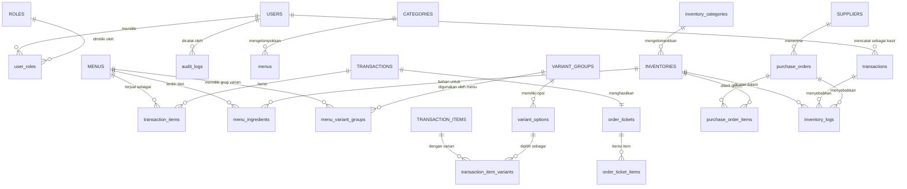

# 05. SPESIFIKASI DATABASE & API

Dokumen ini adalah blueprint final untuk struktur database MySQL dan spesifikasi API internal.

---

## 26. DATABASE DESIGN (MySQL 8.0)

Database dirancang untuk mendukung semua fitur inti. Tipe data disesuaikan untuk MySQL. Seluruh tabel menggunakan engine `InnoDB` dan `charset=utf8mb4`.

### 26.1 Daftar Tabel Final

| No. | Nama Tabel | Deskripsi | Seeder |
|---|---|---|---|
| 1 | `users` | Pengguna internal sistem | ✓ |
| 2 | `roles` | Daftar peran (Owner, Admin, Kasir, Dapur/Barista) | ✓ |
| 3 | `user_roles` | Pivot many-to-many untuk user dan role | ✓ |
| 4 | `settings` | Pengaturan umum (nama toko, alamat, pajak) | ✓ |
| 5 | `categories` | Kategori menu (Kopi, Non-Kopi, Makanan) | ✓ |
| 6 | `menus` | Detail produk menu | ✓ |
| 7 | `variant_groups` | Grup varian (Ukuran, Jenis Susu) | ✓ |
| 8 | `variant_options` | Opsi dalam grup (Regular, Large, Oat Milk) | ✓ |
| 9 | `menu_variant_groups` | Pivot menu ↔ grup varian | ✓ |
| 10 | `inventories` | Master bahan baku | ✓ |
| 11 | `inventory_categories` | Kategori bahan baku | ✓ |
| 12 | `menu_ingredients` | Resep: bahan baku per menu | ✓ |
| 13 | `suppliers` | Pemasok bahan baku | ✓ |
| 14 | `unit_conversions` | Konversi satuan (kg -> gram) | ✓ |
| 15 | `purchase_orders` | Header pembelian bahan baku | ✓ |
| 16 | `purchase_order_items` | Detail item per PO | ✓ |
| 17 | `transactions` | Header transaksi POS | (dibuat via testing/penggunaan) |
| 18 | `transaction_items` | Item per transaksi | (dibuat via testing/penggunaan) |
| 19 | `transaction_item_variants` | Snapshot varian terpilih per item | (dibuat via testing/penggunaan) |
| 20 | `order_tickets` | Tiket pesanan untuk KDS | (dibuat via testing/penggunaan) |
| 21 | `order_ticket_items` | Detail item per tiket KDS | (dibuat via testing/penggunaan) |
| 22 | `inventory_logs` | Riwayat mutasi stok | (dibuat via testing/penggunaan) |
| 23 | `tables` | Data meja fisik | Opsional |
| 24 | `reservations` | Data reservasi pelanggan | Opsional |
| 25 | `promotions` | Data promo/diskon | Opsional |
| 26 | `menu_promotions` | Pivot menu ↔ promo | Opsional |
| 27 | `articles` & `article_categories`| Konten blog/jurnal | Opsional |
| 28 | `galleries` | Galeri foto | Opsional |
| 29 | `testimonials` | Testimoni pelanggan | Opsional |
| 30 | `faqs` | Frequently Asked Questions | Opsional |
| 31 | `about_us` | Konten halaman Tentang Kami | Opsional |
| 32 | `hero_banners` | Banner di Landing Page | Opsional |
| 33 | `social_media` | Tautan media sosial | Opsional |
| 34 | `audit_logs` | Log aktivitas penting pengguna | (dibuat otomatis) |
| 35 | `media` | Metadata file yang di-upload | (dibuat otomatis) |
| 36 | `personal_access_tokens` | Laravel Sanctum | (dibuat otomatis) |

### 26.2 Struktur Rinci Tabel Inti

Definisi kolom ini adalah panduan untuk file migrasi `create_*`.

#### Tabel `users` & `roles`
| users | roles | user_roles (pivot) |
|---|---|---|
| `id` CHAR(36) PK | `id` CHAR(36) PK | `id` CHAR(36) PK |
| `name` VARCHAR(255) | `name` VARCHAR(50) UNIQUE | `user_id` CHAR(36) FK |
| `email` VARCHAR(255) UNIQUE | `timestamps` | `role_id` CHAR(36) FK |
| `password` VARCHAR(255) | | `UNIQUE(user_id, role_id)`|
| `is_active` BOOLEAN D:true | | |
| `timestamps` | | |

#### Tabel `menus`, `categories`, `variants`
| menus | categories | variant_groups | variant_options | menu_variant_groups (pivot)|
|---|---|---|---|---|
| `id` CHAR(36) PK |`id` CHAR(36) PK |`id` CHAR(36) PK|`id` CHAR(36) PK | `id` CHAR(36) PK |
| `category_id` CHAR(36) FK|`name` VARCHAR |`name` VARCHAR |`variant_group_id` CHAR(36) FK |`menu_id` CHAR(36) FK |
| `name` VARCHAR |`display_order` INT|`type` ENUM('single','multiple')|`name` VARCHAR|`variant_group_id` CHAR(36) FK|
| `slug` VARCHAR UNIQUE | | |`additional_price` DECIMAL|`is_required` BOOLEAN |
| `price` DECIMAL | | |`inventory_item_id` CHAR(36) FK NULL| |
| `status` ENUM('tersedia', 'tidak_tersedia')| | |`inventory_action` ENUM(...) | |
| `softDeletes` | | |`inventory_action_value` DECIMAL| |

#### Tabel Transaksional
| transactions | transaction_items | transaction_item_variants | order_tickets | order_ticket_items |
|---|---|---|---|---|
| `id` CHAR(36) PK |`id` CHAR(36) PK|`id` CHAR(36) PK|`id` CHAR(36) PK|`id` CHAR(36) PK|
| `invoice_number` VARCHAR UNIQUE|`transaction_id` FK|`transaction_item_id` FK|`transaction_id` FK UNIQUE|`order_ticket_id` FK|
| `cashier_id` FK |`menu_id` FK NULL |`variant_option_id` FK NULL|`ticket_number` VARCHAR UNIQUE|`menu_name_snapshot` VARCHAR|
| `subtotal` DECIMAL|`menu_name_snapshot` VARCHAR|`option_name_snapshot` VARCHAR|`status` ENUM(...) |`quantity` INT|
| `discount` DECIMAL|`price_snapshot` DECIMAL|`additional_price_snapshot` DECIMAL| `received_at` TIMESTAMP | `note` VARCHAR NULL |
| `tax_amount` DECIMAL|`quantity` INT| |`processed_at` TIMESTAMP NULL|`item_status` ENUM(...)|
| `total` DECIMAL | `note` VARCHAR NULL | |`ready_at` TIMESTAMP NULL| |
| `payment_method` ENUM| | | | |
| `status` ENUM('selesai','void')| | | | |
| `order_type` ENUM('dine_in','takeaway')| | | | |

#### Tabel `inventories` & `purchase_orders`
| inventories | suppliers | purchase_orders | purchase_order_items | menu_ingredients | unit_conversions |
|---|---|---|---|---|---|
|`id` CHAR(36) PK|`id` CHAR(36) PK|`id` CHAR(36) PK|`id` CHAR(36) PK|`id` CHAR(36) PK|`id` CHAR(36) PK|
|`name` VARCHAR|`name` VARCHAR|`po_number` UNIQUE|`purchase_order_id` FK|`menu_id` FK|`from_unit` VARCHAR|
|`stock_quantity` DECIMAL|`phone` VARCHAR NULL|`supplier_id` FK|`inventory_id` FK|`inventory_id` FK|`to_unit` VARCHAR|
|`unit` VARCHAR|`address` TEXT NULL|`status` ENUM(...)|`quantity` DECIMAL|`quantity_used` DECIMAL|`multiplier` DECIMAL|
|`minimum_stock` DECIMAL| |`total_cents` BIGINT|`price_per_unit_cents` BIGINT| |`UNIQUE(from,to)`|
|`unit_price` DECIMAL| |`order_date` DATE|`conversion_multiplier` DECIMAL| | |

---

### 26.3 Spesifikasi Data Seeder (Blueprint)

File `DatabaseSeeder.php` harus memanggil seeder individual dengan urutan berikut untuk menjaga integritas data:

1.  **`RolesSeeder`**:
    -   **Tugas**: Membuat 4 role: `Owner`, `Admin`, `Kasir`, `Dapur/Barista`.
2.  **`UsersSeeder`**:
    -   **Tugas**: Membuat minimal 4 user, satu untuk setiap role.
    -   **Data Contoh**: `owner@nemuspace.test`, `admin@nemuspace.test`, `kasir@nemuspace.test`, `dapur@nemuspace.test`. Semua dengan password default `'password'`.
3.  **`SettingsSeeder`**:
    -   **Tugas**: Mengisi 1 baris di tabel `settings`.
    -   **Data**: Nama toko, alamat, no. telp, `tax_rate` = 11, `tax_enabled` = true.
4.  **`InventorySeeder`**:
    -   **Tugas**: Membuat 5-10 bahan baku dasar.
    -   **Data**: 'Biji Kopi Gayo' (gram), 'Susu Sapi' (ml), 'Sirup Gula Aren' (ml), 'Paper Cup' (pcs).
5.  **`MenuSeeder`**:
    -   **Tugas**: Membuat 10-15 menu untuk testing.
    -   **Data Kompleks**:
        -   **Menu Sederhana**: 'Espresso' (hanya resep biji kopi).
        -   **Menu dengan Resep**: 'Kopi Susu Gula Aren' (resep: biji kopi, susu, gula aren).
        -   **Menu dengan Varian**: 'Manual Brew' dengan grup varian "Pilih Biji Kopi" (opsi: Gayo, Kintamani, Toraja) di mana setiap opsi memiliki `inventory_action` = `swap`.
        -   **Menu dengan Varian Harga**: 'Latte' dengan grup varian "Ukuran" (opsi: Regular, Large `additional_price` 3000).
6.  **`FullMenuSeeder` (Opsional, untuk Demo)**:
    -   **Tugas**: Membuat 30+ menu realistis yang mencakup semua kategori dan jenis varian untuk membuat aplikasi terlihat "hidup".
7.  **`ProcurementSeeder` & `UnitConversionSeeder`**:
    -   **Tugas**: Membuat data master untuk supplier dan konversi satuan dasar (misal: 1 Liter = 1000 ml, 1 Kg = 1000 gram).

---

## 27. ERD (Entity-Relationship Diagram) FINAL

```mermaid
erDiagram
    USERS ||--o{ user_roles : "memiliki"
    ROLES ||--o{ user_roles : "dimiliki oleh"
    USERS ||--o{ transactions : "mencatat sebagai kasir"
    USERS ||--o{ audit_logs : "dicatat oleh"
    
    CATEGORIES ||--o{ menus : "mengelompokkan"
    MENUS ||--o{ transaction_items : "terjual sebagai"
    MENUS ||--o{ menu_ingredients : "terdiri dari"
    MENUS ||--o{ menu_variant_groups : "memiliki grup varian"
    
    VARIANT_GROUPS ||--o{ menu_variant_groups : "digunakan oleh menu"
    VARIANT_GROUPS ||--o{ variant_options : "memiliki opsi"
    
    TRANSACTIONS ||--o{ transaction_items : "berisi"
    TRANSACTION_ITEMS ||--o{ transaction_item_variants : "dengan varian"
    variant_options ||--o{ transaction_item_variants : "dipilih sebagai"

    TRANSACTIONS ||--|| order_tickets : "menghasilkan"
    order_tickets ||--o{ order_ticket_items : "berisi item"
    
    INVENTORIES ||--o{ menu_ingredients : "bahan untuk"
    inventory_categories ||--o{ INVENTORIES : "mengelompokkan"
    
    SUPPLIERS ||--o{ purchase_orders : "menerima"
    purchase_orders ||--o{ purchase_order_items : "berisi"
    INVENTORIES ||--o{ purchase_order_items : "dibeli dalam"
    
    INVENTORIES ||--o{ inventory_logs : "dicatat dalam"
    transactions ||--o{ inventory_logs : "menyebabkan"
    purchase_orders ||--o{ inventory_logs : "menyebabkan"
```
