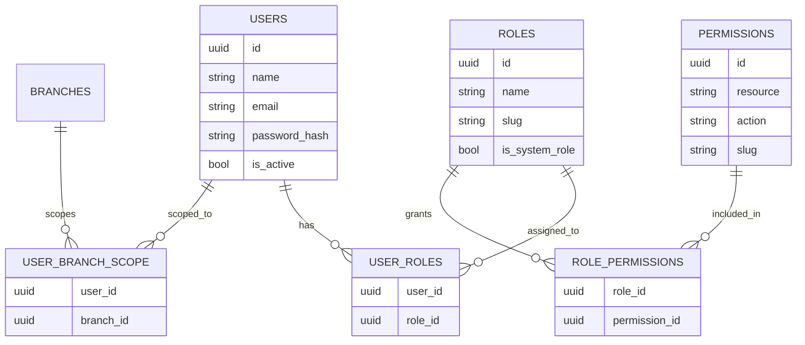

# 7. Roles & Permissions (RBAC)

**Dokumen:** Role-Based Access Control Specification  
**Versi:** 1.0.0 (Synchronized with Canonical Baseline PRD)  
**Status:** Baseline  
**Referensi:** PRD Section 8 - Roles, Permissions & RBAC  

---

## 7.1 Overview & Arsitektur RBAC

Velvra mengimplementasikan **Attribute-Aware Role-Based Access Control (RBAC)**. Dalam model ini:
1. **Role** adalah kumpulan **Permissions** yang diberikan kepada pengguna (*user*).
2. Setiap **Permission** dikelompokkan berdasarkan **Resource** dan **Action** yang diizinkan (misalnya `inventory.stock.update` atau `orders.cancel`).
3. Setiap pemeriksaan otorisasi (*authorization check*) tidak hanya memvalidasi apakah user memiliki permission, tetapi juga memvalidasi **Branch Scope (`user_branch_scope`)**. Pengguna dapat dialokasikan akses global (seluruh cabang/sistem) atau dibatasi khusus pada satu atau beberapa cabang tertentu (*branch-scoped*).

Semua data role, permission, dan pemetaan scope disimpan secara dinamis di dalam database relasional (`roles`, `permissions`, `role_permissions`, `user_roles`, `user_branch_scope`), dan dapat dikelola secara penuh melalui modul **Settings (`/admin/settings/roles-permissions`)** tanpa hardcoding pada kode aplikasi.

---

## 7.2 Entity Relationship Diagram (ERD RBAC)



---

## 7.3 Daftar 13 System Roles (Baseline Seed Data)

Sesuai dengan **Canonical PRD Bab 8.2**, sistem dilengkapi dengan 13 role standar (*system roles*) sebagai berikut:

| Role | Scope Akses | Deskripsi & Tanggung Jawab Operasional |
|---|---|---|
| **1. Super Admin** | Global | Akses tidak terbatas ke seluruh sistem, modul, cabang, konfigurasi, audit trail, serta manajemen RBAC itu sendiri. |
| **2. Regional / Executive Analyst** | Global (Read-Only Analytics) | Akses eksekutif untuk melihat dasbor perbandingan antar cabang (*cross-branch dashboard*), tren penjualan, COGS, dan laporan konsolidasi regional. |
| **3. Branch Manager** | Single / Multiple Branch | Kontrol penuh atas operasional di cabang yang ditugaskan (*assigned branches*), termasuk approval PO cabang, adjustment stok, jadwal shift, dan laporan penjualan cabang. |
| **4. Shift Supervisor** | Single Branch | Mengelola operasional POS, KDS, reservasi, manajemen meja, dan pembatalan order dalam shift aktif di cabangnya. |
| **5. Barista / Cashier** | Single Branch | Mengoperasikan terminal POS, memproses transaksi walk-in, pencarian profil member/poin loyalty, dan pembukaan/penutupan shift kasir. |
| **6. Kitchen Staff** | Single Branch | Mengoperasikan layar Kitchen Display System (KDS), melihat antrean tiket pesanan, dan mengubah status prep item (*In Progress, Ready*). |
| **7. Inventory Officer** | Single / Multiple Branch & Warehouse | Bertanggung jawab atas pengelolaan stok barang (*inventory*), siklus hitung stok (*stock opname*), pembuatan Purchase Order (PO), dan penerimaan barang dari supplier. |
| **8. HR Manager** | Global / Branch | Mengelola data karyawan (*employee records*), penugasan role, penjadwalan shift, dan rekapitulasi kehadiran (*attendance*). |
| **9. Marketing / Content Manager** | Global | Mengelola seluruh permukaan content management (CMS): halaman statis, artikel blog, acara (*events*), lowongan kerja (*careers*), galeri, media library, dan promosi/diskon. |
| **10. CRM / Support Officer** | Global / Branch | Mengakses profil terpadu pelanggan (*Customer 360*), riwayat pesanan/reservasi, loyalty tier, serta mencatat catatan interaksi/keluhan pelanggan (*support notes*). |
| **11. Customer (Member)** | Self Only | Akses ke Customer Portal (`/account`) dan pemesanan online/QR, dibatasi ketat hanya untuk riwayat pesanan, reservasi, alamat, dan poin loyalty milik akunnya sendiri. |
| **12. Guest** | Public | Akses publik tanpa autentikasi untuk menjelajahi landing page, melihat katalog menu cabang, mencari lokasi cabang, dan melakukan checkout pesanan (*guest checkout*). |
| **13. API Integration Partner** | Scoped via API Key / OAuth2 | Akses terprogram untuk integrasi pihak ketiga (misalnya agregator delivery masa depan atau ERP), dibatasi sesuai dengan *granted scopes* API key. |

---

## 7.4 Matriks Izin Akses Lengkap (Permission Matrix)

Tabel berikut menunjukkan pemetaan akses standar terhadap **18 resource utama** untuk setiap role (dikurasi langsung dari PRD §8.3):

| Resource & Domain | Super Admin | Branch Manager | Shift Supervisor | Barista / Cashier | Kitchen Staff | Inventory Officer | HR Manager | Marketing Mgr | CRM Officer | Customer (Member) |
|---|:---:|:---:|:---:|:---:|:---:|:---:|:---:|:---:|:---:|:---:|
| **1. Menu & Recipes** (`menu.*`, `recipes.*`) | CRUD | Read | Read | Read | Read | Read | — | CRUD | — | Read |
| **2. Orders (POS/Online/QR)** (`orders.*`) | CRUD | CRUD *(branch)* | CRUD *(branch)* | Create/Read/Update | Read/Update *(status)* | — | — | — | Read | Own Only |
| **3. KDS Tickets** (`kds.*`) | CRUD | Read/Update | Read/Update | Read | Read/Update | — | — | — | — | — |
| **4. Inventory & Stock** (`inventory.*`) | CRUD | Read/Update *(branch)* | Read | — | — | CRUD | — | — | — | — |
| **5. Purchase Orders** (`purchasing.*`) | CRUD | Approve *(branch)* | — | — | — | CRUD | — | — | — | — |
| **6. Suppliers** (`suppliers.*`) | CRUD | Read | — | — | — | CRUD | — | — | — | — |
| **7. Reservations & Tables** (`reservations.*`, `tables.*`) | CRUD | CRUD *(branch)* | CRUD *(branch)* | Read/Update | — | — | — | — | Read | Own Only |
| **8. Promotions** (`promotions.*`) | CRUD | Read | — | — | — | — | — | CRUD | Read | Read *(public)* |
| **9. Membership & Loyalty** (`loyalty.*`) | CRUD | Read *(branch)* | — | — | — | — | — | — | CRUD | Own Only |
| **10. CRM / Customer Profiles** (`crm.*`) | CRUD | Read *(branch)* | — | — | — | — | — | — | CRUD | Own Only |
| **11. Employees & HR** (`hr.*`) | CRUD | Read/Update *(branch)* | Read *(branch)* | — | — | — | CRUD | — | — | — |
| **12. Branches** (`branches.*`) | CRUD | Read *(own)* | Read *(own)* | — | — | — | — | — | — | — |
| **13. CMS (Pages/Blog/Events/Careers)** (`cms.*`) | CRUD | — | — | — | — | — | — | CRUD | — | Read *(public)* |
| **14. Media Library** (`media.*`) | CRUD | — | — | — | — | — | — | CRUD | — | — |
| **15. Analytics & Reports** (`analytics.*`) | CRUD *(config)* | Read *(branch)* | Read *(branch, limit)* | — | — | Read *(inv reports)* | Read *(HR reports)* | Read *(mkt reports)* | Read *(CRM reports)* | — |
| **16. Audit Logs** (`audit.*`) | Read | Read *(branch)* | — | — | — | — | — | — | — | — |
| **17. Settings, RBAC & Integrations** (`settings.*`) | CRUD | — | — | — | — | — | — | — | — | — |
| **18. Notification Center** (`notifications.*`) | CRUD | Read/Send *(branch)* | — | — | — | — | — | Send *(mkt)* | Send *(support)* | Receive |

> **Keterangan:**
> - **CRUD:** Create, Read, Update, Delete.
> - **— (Dash):** Tidak memiliki akses (*Forbidden*).
> - ***(branch)*:** Akses secara ketat dibatasi hanya pada record dengan `branch_id` yang sesuai dengan `user_branch_scope` pengguna.
> - **Own Only:** Akses dibatasi pada record milik ID pengguna itu sendiri (`user_id` / `member_id`).

---

## 7.5 Aturan Penegakan Otorisasi (Authorization Enforcement Rules)

Sesuai dengan spesifikasi teknis PRD §8.4, penegakan otorisasi diimplementasikan pada lapisan API Gateway dan Application Layer dengan aturan wajib berikut:

1. **Endpoint Permission Gateway:**
   Setiap endpoint API di dalam rute `/api/v1/...` wajib mendeklarasikan *permission slug* (contoh: `middleware('permission:inventory.stock.update')`). Tidak diperbolehkan ada endpoint yang hanya sekadar `auth:api` tanpa pengecekan permission spesifik, kecuali endpoint info profil pribadi (`/api/v1/profile`).

2. **Branch Scope Isolation Middleware:**
   Saat pengguna melakukan request pada endpoint operasional (seperti pesanan, KDS, atau inventaris), *middleware* memvalidasi *claim `branch_id`* yang aktif pada token JWT terhadap tabel `user_branch_scope`. Jika pengguna mencoba mengakses data atau mengirim mutasi ke cabang di luar scopenya, API langsung mengembalikan respons `403 Forbidden` dengan format standar error (`SCOPE_VIOLATION`).

3. **Global Eloquent Query Scoping:**
   Untuk memastikan tidak ada kebocoran data antar cabang (*data leak regression*), operasi pembacaan (list/read query) secara otomatis menerapkan filter kondisi pada Query Builder:
   ```php
   $builder->whereIn('branch_id', auth()->user()->getScopedBranchIds());
   ```
   Scoping ini diterapkan secara sentral melalui *Global Eloquent Scope* pada *Base Operation Model*, bukan diimplementasikan ulang secara manual per Controller.

4. **Staleness Window & Refresh Token:**
   Perubahan permission atau scope cabang oleh Super Admin akan efektif pada saat perbaruan akses berikutnya (*next token refresh*). Access Token JWT dirancang berdurasi pendek (e.g., 60 menit) untuk membatasi *staleness window*.

5. **Auditability of RBAC Mutations:**
   Setiap tindakan penambahan, pengubahan, atau pencabutan role, permission, dan `user_branch_scope` wajib dicatat ke dalam modul **Audit Log (`AUD-001`)** yang mencakup aktor, resource target, serta snapshot sebelum (`before_state`) dan sesudah (`after_state`).

---

**Document Status:** ✅ Synchronized & Complete  
**Next Document:** [08-modul-fungsional.md](./08-modul-fungsional.md)  
**Related:** [prd.md Section 8](./prd.md), [04-database-design.md](./04-database-design.md)
