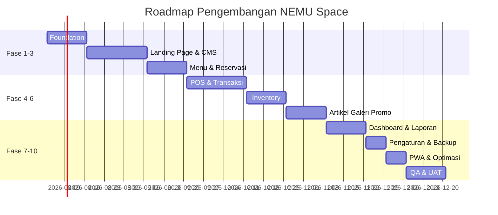

# 07. ROADMAP PENGEMBANGAN & STRATEGI TESTING

## 38. DEVELOPMENT ROADMAP

| Fase | Durasi Estimasi | Cakupan |
|---|---|---|
| **Fase 1 — Foundation** | 2 Minggu | Setup arsitektur Frontend & Backend, Database schema, Autentikasi & RBAC, Design System dasar |
| **Fase 2 — Landing Page & CMS** | 3 Minggu | Landing Page dinamis seluruh section, CMS untuk seluruh konten publik, Upload media |
| **Fase 3 — Menu & Reservasi** | 2 Minggu | Modul Menu, Kategori, Digital Menu publik, Modul Reservasi (form & manajemen status) |
| **Fase 4 — POS, Transaksi & Kitchen Display** | 3 Minggu | Modul POS lengkap, cetak struk, riwayat transaksi, dashboard kasir, Kitchen Display System (KDS) untuk Dapur/Barista |
| **Fase 5 — Inventory** | 2 Minggu | Modul inventory, mutasi stok otomatis dari POS, notifikasi stok menipis |
| **Fase 6 — Artikel, Galeri, Promo** | 2 Minggu | CMS Artikel dengan WYSIWYG & SEO, Galeri, Promo |
| **Fase 7 — Dashboard & Laporan** | 2 Minggu | Dashboard Admin & Owner, Grafik penjualan, Ekspor laporan PDF/Excel |
| **Fase 8 — Pengaturan, Backup, Manajemen User** | 1 Minggu | Pengaturan website, Backup/Restore, Manajemen User & Audit Log |
| **Fase 9 — PWA & Optimasi** | 1 Minggu | Implementasi PWA (offline mode, cache), optimasi performa & SEO |
| **Fase 10 — QA & UAT** | 2 Minggu | Pengujian menyeluruh (fungsional, non-fungsional), User Acceptance Test bersama Owner |

**Total Estimasi Waktu Pengembangan: ± 20 Minggu (5 Bulan)**

---

## 39. TESTING STRATEGY

### 39.1 Jenis Pengujian

| Jenis Pengujian | Cakupan | Tools |
|---|---|---|
| Unit Testing | Fungsi/logic bisnis backend (perhitungan transaksi, validasi stok) | PHPUnit (Laravel) |
| Integration Testing | Alur antar modul (contoh: transaksi POS memicu pengurangan stok) | PHPUnit + Database Testing |
| API Testing | Validasi seluruh endpoint (request/response, status code, autentikasi) | Postman/Newman |
| Component Testing | Komponen UI React (rendering, interaksi state) | Jest + React Testing Library |
| End-to-End Testing | Skenario penuh pengguna (reservasi, transaksi POS, publikasi CMS) | Playwright/Cypress |
| Responsive Testing | Pengujian tampilan di berbagai breakpoint & perangkat | Chrome DevTools, BrowserStack |
| Accessibility Testing | Kontras warna, navigasi keyboard, screen reader | Lighthouse, axe DevTools |
| Performance Testing | Waktu muat halaman, Core Web Vitals | Lighthouse, WebPageTest |
| Security Testing | Uji validasi input, RBAC, proteksi XSS/SQL Injection | OWASP ZAP, manual penetration testing |
| User Acceptance Testing (UAT) | Validasi akhir oleh Owner & tim operasional coffee shop | Skenario UAT terstruktur (Bab 40) |

### 39.2 Strategi Regresi

Setiap penambahan fitur baru wajib disertai regression testing terhadap modul yang saling terintegrasi, khususnya pada alur **POS → Inventory → Laporan**, karena ketiga modul ini saling bergantung secara data.

---

## 40. ACCEPTANCE CRITERIA

### 40.1 Kriteria Umum

1. Seluruh konten pada website (teks, gambar, harga, promo, dsb.) berhasil ditampilkan secara dinamis dari database — **tidak ditemukan satupun konten hardcoded** pada frontend.
2. Seluruh role (Pelanggan, Kasir, Admin, Owner) hanya dapat mengakses fitur sesuai matriks permission pada Bab 25 — pengujian mencoba akses lintas role harus menghasilkan `403 Forbidden`.
3. Website dapat diakses tanpa horizontal scrolling pada seluruh breakpoint (mobile, tablet, laptop, desktop).
4. Website berhasil diinstal sebagai PWA dan dapat menampilkan Landing Page, Menu, dan Gambar dalam kondisi offline.
5. Dark Mode dan Light Mode berfungsi konsisten di seluruh halaman tanpa elemen yang "pecah" secara visual.

### 40.2 Kriteria per Modul

| Modul | Kriteria Diterima |
|---|---|
| Landing Page | Seluruh section dapat diaktifkan/nonaktifkan dari CMS dan perubahan langsung tampil tanpa deploy ulang |
| Menu | Admin dapat menambah menu baru lengkap dengan gambar, dan menu langsung tampil di halaman publik dan POS dalam waktu < 5 detik setelah disimpan |
| Reservasi | Pelanggan dapat mengirim reservasi tanpa login, dan Admin dapat mengubah status reservasi dengan notifikasi status yang dapat dicek pelanggan |
| POS | Kasir dapat menyelesaikan satu transaksi penuh (pilih menu → keranjang → diskon → bayar → cetak struk) dalam waktu kurang dari 1 menit untuk transaksi sederhana |
| Kitchen Display | Tiket pesanan otomatis muncul di Kitchen Display maksimal 5 detik setelah transaksi POS selesai dibayar, dan status "Siap" tersinkron ke Dashboard Kasir tanpa refresh manual (lihat Bab 41.8) |
| Inventory | Stok otomatis berkurang setelah transaksi POS (jika data resep tersedia), dan notifikasi stok menipis muncul di Dashboard Admin/Owner ketika stok ≤ minimum |
| Dashboard Owner | Grafik penjualan menampilkan data akurat sesuai filter periode yang dipilih (harian/mingguan/bulanan) |
| Laporan | Laporan dapat diekspor dalam format PDF dan Excel dengan data yang sesuai dengan filter tanggal yang dipilih |
| Pengaturan | Perubahan pada Pengaturan Website (logo, kontak, jam operasional) langsung tercermin di Landing Page dan Footer |
| Backup/Restore | Owner dapat melakukan backup data dan memulihkan (restore) data dari file backup tanpa kehilangan integritas data |
| Keamanan | Seluruh endpoint privat menolak akses tanpa token valid (`401 Unauthorized`), dan seluruh input tervalidasi (`422` untuk data tidak valid) |

### 40.3 Definisi "Selesai" (Definition of Done)

Sebuah fitur dinyatakan **selesai** apabila memenuhi seluruh kriteria berikut:

- [ ] Kode telah melalui code review dan sesuai standar penulisan (ESLint/PSR-12)
- [ ] Unit test dan/atau integration test terkait telah dibuat dan lulus
- [ ] Fitur telah diuji pada seluruh breakpoint responsif
- [ ] Fitur telah diuji sesuai matriks Role & Permission
- [ ] Dokumentasi API (jika ada endpoint baru) telah diperbarui
- [ ] Fitur telah disetujui melalui User Acceptance Testing oleh Owner/perwakilan tim operasional
