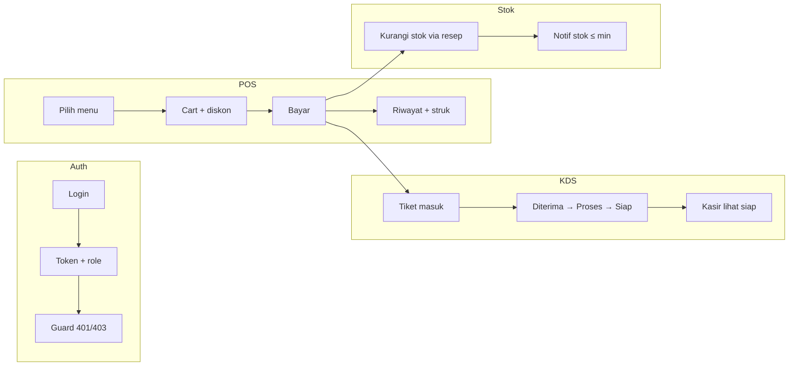
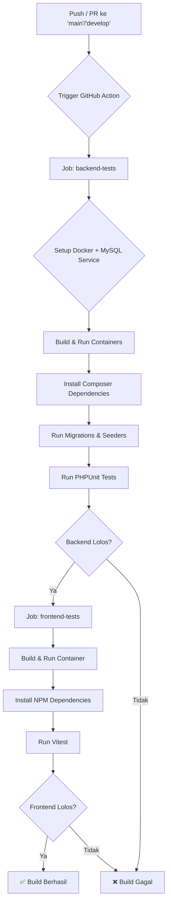

# 08. SPESIFIKASI TESTING

> Dokumen ini merinci **ketentuan testing**, **apa yang diuji**, **alur wajib diuji**, dan **otomatisasi**.  
> Referensi: FR/NFR (`03_requirements.md`), modul (`04_modules_specification.md`), API (`05_database_and_api.md`), acceptance (`07_roadmap_and_testing.md` Bab 40).

---

## 1. TUJUAN & PRINSIP

| Prinsip | Arti |
|---|---|
| **Risk-based** | Prioritas alur yang merugikan bisnis jika gagal: Auth/RBAC, POS, KDS, stok, pembayaran, reservasi |
| **Pyramid** | Banyak unit → sedang integration/API → sedikit E2E mahal |
| **DoD** | Fitur belum “selesai” tanpa tes terkait lulus (lihat Bab 40.3 di `07`) |
| **No flaky** | Tes deterministik; mock waktu/jaringan; jangan andalkan urutan UI yang rapuh |
| **No secret in CI** | Kredensial testing lewat env CI, bukan di repo |

---

## 2. KETENTUAN TESTING (WAJIB)

### 2.1 Kapan harus ada tes

| Perubahan | Tes minimum |
|---|---|
| Logic bisnis baru (hitung total, diskon, stok, poin) | Unit test |
| Endpoint API baru/ubah | Feature/API test (status, body, auth) |
| Store/state FE (cart, auth, offline queue) | Unit store |
| Komponen UI interaktif kritis (POS cart, form reservasi) | Component test |
| Alur lintas modul (POS → KDS → stok) | Integration + 1 E2E happy path |
| Bug production | Regression test yang mereproduksi bug dulu, baru fix |

### 2.2 Aturan teknis

1. **Frontend:** Vitest + React Testing Library (`npm test` di `frontend/`).
2. **Backend:** PHPUnit Feature/Unit (`php vendor/bin/phpunit` di `backend/`). DB testing: **MySQL 8.0 via Docker** (keputusan GAP-DOC-01). Migration harus tetap kompatibel SQLite untuk fleksibilitas lokal, tapi suite utama berjalan di MySQL. Hindari raw `MODIFY ENUM` MySQL tanpa guard driver.
3. **Naming:**  
   - FE: `*.test.ts` / `*.test.tsx` di `frontend/tests/`  
   - BE: `*Test.php` di `backend/tests/Feature` atau `Unit`
4. **Isolasi:** setiap tes mereset state (store, localStorage, DB `RefreshDatabase`).
5. **Assert yang bermakna:** status HTTP + field kritis + side effect DB (stok berkurang, tiket KDS dibuat). Jangan hanya “tidak error”.
6. **RBAC:** setiap endpoint privat diuji minimal: tanpa token → `401`; role salah → `403`; role benar → `2xx`.
7. **Idempotensi POS offline:** double-submit dengan `idempotency_key` sama tidak boleh double charge / double stok.
8. **CI gate (target):** unit + feature API wajib hijau sebelum merge main. E2E boleh nightly / pre-release jika lambat.

### 2.3 Yang tidak diotomasi penuh

- Visual pixel-perfect (cukup smoke + checklist responsif)
- Printer fisik struk (mock print API + UAT manual di toko)
- Payment gateway eksternal (out of scope; tunai/QRIS/kartu dicatat di POS saja)
- Penetrasi keamanan penuh (OWASP ZAP periodik + checklist manual)

---

## 3. JENIS PENGUJIAN & TOOLS

| Jenis | Otomatis? | Tools | Cakupan |
|---|---|---|---|
| **Unit** | Ya | PHPUnit, Vitest | Hitung total/diskon/pajak, cart merge, offline queue, COGS/resep, validasi pure function |
| **Component** | Ya | Vitest + RTL | Render, klik, form, a11y label dasar |
| **Integration / Feature API** | Ya | PHPUnit + HTTP | Endpoint + DB + event (KDS broadcast, mutasi stok) |
| **API contract (opsional)** | Ya | Newman/Postman | Smoke collection staging |
| **E2E** | Ya (subset) | Playwright | Happy path role nyata di browser |
| **Regresi** | Ya | Suite di atas | POS ↔ Inventory ↔ Laporan wajib di-retest tiap rilis fitur terkait |
| **Responsive** | Semi | DevTools + checklist | Mobile / tablet / desktop, tanpa horizontal scroll |
| **A11y** | Semi | axe / Lighthouse | Kontras, keyboard nav publik + POS |
| **Performance** | Semi | Lighthouse | LP ≤ 2.5s (NFR-01), POS interaksi ≤ 300ms (NFR-02) |
| **Security** | Semi | Manual + ZAP | XSS, SQLi, token, RBAC |
| **UAT** | Manual | Checklist Bab 9 | Owner + kasir + barista di lingkungan mirip produksi |

**Ya — automated testing wajib** untuk Unit, Component kritis, Feature API, dan E2E alur inti. Sisanya semi/manual sesuai risiko.

---

## 4. APA YANG DIUJI (PER MODUL)

### 4.1 Matriks modul × jenis tes

| Modul | Unit | Component | API Feature | E2E | Manual/UAT |
|---|:---:|:---:|:---:|:---:|:---:|
| Auth & session | ✓ | ✓ login form | ✓ | ✓ login/logout | — |
| RBAC / permission | ✓ helper | — | ✓ **wajib** | ✓ akses terlarang | ✓ matriks role |
| Landing / CMS konten | — | section key | ✓ public GET | ✓ section tampil | ✓ toggle CMS |
| Menu & kategori | — | list/filter | ✓ CRUD + public | ✓ menu publik | ✓ gambar/harga |
| Reservasi | ✓ store | ✓ form | ✓ create + status | ✓ submit + cek status | ✓ notifikasi |
| POS / cart / bayar | ✓ **cart store** | ✓ POS UI | ✓ transaksi | ✓ full checkout | ✓ cetak struk |
| Offline POS queue | ✓ **queue** | — | ✓ batch sync + idempotency | ✓ offline→online | ✓ putus jaringan |
| KDS | — | ✓ ticket UI | ✓ status workflow | ✓ POS→KDS | ✓ suara/visual |
| Inventory / stok | ✓ FEFO/COGS bila pure | ✓ opname UI | ✓ mutasi + PO | ✓ POS kurangi stok | ✓ notif minimum |
| Supplier / PO | — | ✓ | ✓ receive stock | — | ✓ |
| Artikel / galeri / promo | — | — | ✓ CRUD + validasi periode | smoke | ✓ SEO/publish |
| Order online / QR order | — | — | — | — | **Out of scope — jangan tes sebagai fitur** |
| Membership / CRM loyalty | — | — | — | — | **Out of scope — jangan tes sebagai fitur** |
| Dashboard / laporan | chart data pure jika ada | — | ✓ filter periode | smoke | ✓ PDF/Excel |
| Settings / user / audit | — | — | ✓ | — | ✓ backup/restore |
| PWA | — | — | — | smoke install | ✓ offline LP/menu |
| Theme dark/light | ✓ store | ✓ | — | smoke | ✓ |

### 4.2 Status implementasi saat ini

| Area | Lokasi | Status |
|---|---|---|
| FE store + offline queue + auth hook + StatCard | `frontend/tests/*.test.ts(x)` | **25 tes, lulus** (`npm test`) |
| BE Feature (Auth, POS/KDS, Inventory, CMS, RBAC, …) | `backend/tests/Feature/*` | Perlu rewrite ke model aktual; **abaikan/hapus** tes CRM/loyalty/order-online jika ada |
| E2E Playwright | — | **Belum** |
| Newman/Postman | — | **Belum** |

---

## 5. ALUR YANG WAJIB DIUJI (CRITICAL PATHS)

Prioritas **P0** = rilis diblokir jika gagal. **P1** = harus ada sebelum UAT. **P2** = nice/regresi periodik.

### 5.1 P0 — Alur bisnis kritis



| ID | Alur | Actor | Langkah assert utama | Jenis tes |
|---|---|---|---|---|
| **CP-01** | Login valid / invalid / nonaktif | Semua role | 200+token; 422; 403 inactive | API + E2E |
| **CP-02** | Akses lintas role | Kasir vs Admin vs Owner vs Dapur | 403 ke modul terlarang; route FE redirect | API + E2E |
| **CP-03** | Transaksi POS penuh | Kasir | item → qty → diskon → bayar → total benar → row `transactions` + items | Unit cart + API + E2E |
| **CP-04** | POS → KDS ≤ 5 dtk | Kasir + Dapur | tiket muncul; status Siap sync kasir | API event + E2E |
| **CP-05** | POS → stok (ada resep) | Kasir | `inventories` / batch FEFO berkurang; log mutasi | Integration API |
| **CP-06** | Idempotency offline sync | Kasir | 2x payload key sama → 1 transaksi | Unit queue + API |
| **CP-07** | Reservasi publik | Pelanggan | submit tanpa login; kode/status; admin ubah status | API + E2E |
| **CP-08** | Endpoint privat tanpa token | — | 401 | API |

### 5.2 P1 — Alur penting operasional

| ID | Alur | Assert |
|---|---|---|
| **CP-09** | CRUD menu → tampil publik & POS | data dinamis, tanpa hardcode; latency target < 5 dtk (UAT) |
| **CP-10** | Promo periode | di luar tanggal tidak aktif; validasi server |
| **CP-11** | Purchase order receive | stok + weighted avg cost |
| **CP-12** | Laporan filter tanggal + export | angka cocok transaksi; file PDF/Excel terunduh (UAT/API) |
| **CP-13** | CMS publish section | toggle off → section hilang di LP |
| **CP-14** | Audit log | aksi CMS/user tercatat immutable |

> **Dihapus dari critical path:** loyalty/membership, order online publik, QR order.

### 5.3 P2 — Alur pendukung

| ID | Alur |
|---|---|
| **CP-16** | Dark/light mode konsisten |
| **CP-17** | PWA install + offline LP/menu/gambar |
| **CP-18** | Backup / restore Owner |
| **CP-19** | Multi-branch scope (jika aktif) header/payload branch |
| **CP-20** | Responsive breakpoints + a11y smoke |

### 5.4 User journey → ID tes (mapping)

| Journey (docs intro) | Critical path |
|---|---|
| Pelanggan reservasi | CP-07 |
| Kasir transaksi POS | CP-03, CP-05, CP-06 |
| Dapur proses pesanan | CP-04 |
| Owner pantau bisnis | CP-13, CP-02 |
| Admin kelola konten/menu | CP-09, CP-14, CP-15 |

---

## 6. AUTOMATED TESTING — DETAIL

### 6.1 Frontend (Vitest)

**Perintah:** `cd frontend && npm test`  
**Config:** `vitest.config.ts`, `vitest.setup.ts` (localStorage mock)

| Suite | File | Isi |
|---|---|---|
| Core stores & queue | `tests/core.store.test.ts` | cart merge/qty/diskon/total, branch, auth store, offline queue, reservation, theme, sidebar |
| Auth hook | `tests/auth.test.ts` | `useAuth`, session, super admin, logout |
| Components | `tests/components.test.tsx` | StatCard (+ perluas: POS, form reservasi, KDS ticket) |

**Wajib ditambah ( backlog FE otomatis ):**

1. Component POS: buka shift (jika ada), add to cart, subtotal update  
2. Component form reservasi: validasi field kosong / sukses mock API  
3. Component KDS: tombol status memanggil handler  
4. Mock `axios`/service untuk error 401/422 UI  

**Belum otomatis FE:** page-level Next.js full (lebih cocok E2E).

### 6.2 Backend (PHPUnit)

**Perintah:** `cd backend && php vendor/bin/phpunit`  
**Env test:** MySQL 8.0 via Docker (keputusan GAP-DOC-01 — konsisten produksi, skema §26 bergantung ENUM/DECIMAL/FK MySQL, CI sudah pakai Docker).

**Konfigurasi:**

| File Feature (existing) | Cakupan yang dimaksud | Catatan |
|---|---|---|
| `AuthTest.php` | login, register, profile, logout, refresh, 401 | Pertahankan / sesuaikan field user |
| `HealthCheckTest.php` | health endpoint | Ringan |
| `ProductTest.php` / catalog | list public, CRUD admin | **Rename/rewrite → Menu** jika model `Product` hilang |
| `OrderTest.php` / `Phase3PosKdsTest.php` | order/POS, KDS, offline batch | **Rewrite → Transaction + OrderTicket** |
| `Phase2CatalogInventoryTest.php` | resep, FEFO, PO | Sesuaikan model Inventory |
| `Phase4CustomerCrmTest.php` | member/loyalty | **Out of scope — deprecate/hapus suite** |
| `Phase5And6CmsAnalyticsAuditTest.php` | CMS, media, promo, audit | |
| `RBACBranchScopeTest.php` | permission + branch scope | Fix dependency model |

**Ketentuan rewrite BE:**

- Factory/seeder test hanya pakai model yang **ada** di `app/Models`
- Jangan raw MySQL di migration tanpa `Schema::getConnection()->getDriverName() !== 'sqlite'`
- Tiap CP-0x P0 punya minimal 1 method test bernama jelas, mis. `test_pos_checkout_creates_kds_ticket_and_deducts_stock`

### 6.3 E2E (Playwright) — target otomatis

**Belum terpasang.** Target folder: `e2e/` (root atau `frontend/e2e`).

| Spec | Alur | Env |
|---|---|---|
| `auth.spec.ts` | login kasir, logout, tolak admin URL | staging |
| `pos-checkout.spec.ts` | CP-03 | user kasir seed |
| `kds-flow.spec.ts` | CP-04 (2 context: kasir + dapur) | |
| `reservation.spec.ts` | CP-07 publik | no auth |
| `rbac.spec.ts` | kasir buka `/dashboard/admin` → ditolak | |

**Ketentuan E2E:**

- Data seed idempotent; cleanup atau DB disposable.
- Selector stabil: `data-testid`, bukan teks yang sering ganti.
- Timeout real-time KDS longgar tapi bounded (mis. 10s).
- Jangan full regression UI di PR jika > ~10 menit — potong ke smoke P0.

### 6.4 Alur CI/CD dengan Docker (GitHub Actions)

Untuk menjamin konsistensi antara lingkungan development lokal dan lingkungan testing, sistem Continuous Integration / Continuous Deployment (CI/CD) akan menggunakan Docker.

##### Diagram Alur Kerja CI



##### Deskripsi Services di Docker (`docker-compose.ci.yml`)

File `docker-compose.ci.yml` akan mendefinisikan tiga service utama untuk testing:

1.  **`app`**:
    -   **Image**: Dibangun dari `backend/Dockerfile`.
    -   **Peran**: Menjalankan aplikasi Laravel dengan PHP-FPM. Ini adalah service utama tempat `composer install` dan `phpunit` dieksekusi.
2.  **`node`**:
    -   **Image**: Dibangun dari `frontend/Dockerfile` atau image `node:20-alpine`.
    -   **Peran**: Menjalankan semua perintah terkait Node.js, terutama `npm install` dan `npm test`.
3.  **`mysql`**:
    -   **Image**: `mysql:8.0`.
    -   **Peran**: Menyediakan database MySQL yang bersih untuk setiap run CI. `DB_HOST` di service `app` akan menunjuk ke service ini.

##### Langkah-langkah Workflow (`.github/workflows/ci.yml`)

1.  **Checkout Code**: Mengunduh kode dari repository.
2.  **Setup .env untuk Backend**: Menyalin `.env.example` ke `.env` di dalam direktori `backend`, lalu secara otomatis mengubah variabel `DB_*` untuk menunjuk ke service `mysql` Docker.
3.  **Build & Run Containers**: Menjalankan `docker-compose -f docker-compose.ci.yml up -d` untuk membangun dan menyalakan semua service di background.
4.  **Install Dependencies**:
    -   Menjalankan `docker-compose exec app composer install`.
    -   Menjalankan `docker-compose exec node npm install` di dalam direktori `frontend`.
5.  **Run Migrations & Tests**:
    -   Menjalankan `php artisan migrate --seed` di dalam kontainer `app` untuk menyiapkan database MySQL.
    -   Menjalankan `phpunit` di dalam kontainer `app`.
    -   Menjalankan `npm test` di dalam kontainer `node`.
6.  **Hasil**: Jika semua tes berhasil, workflow akan ditandai sukses. Jika salah satu gagal, workflow akan gagal dan memberitahu developer di Pull Request.

##### Menjalankan Tes Lokal (Mirip CI)

Untuk mereplikasi lingkungan CI di mesin lokal, developer dapat menggunakan perintah:
```bash
# Nyalakan semua service
docker-compose -f docker-compose.ci.yml up -d --build

# Jalankan tes backend
docker-compose -f docker-compose.ci.yml exec app php vendor/bin/phpunit

# Jalankan tes frontend
docker-compose -f docker-compose.ci.yml exec node npm test

# Matikan service setelah selesai
docker-compose -f docker-compose.ci.yml down
```

### 6.5 CI pipeline (rekomendasi)

```text
PR → lint FE + BE
   → frontend npm test
   → backend phpunit
   → (optional) playwright smoke P0 @ staging
main/release → + Lighthouse CI LP
             → + UAT checklist sign-off
```

---

## 7. TEST CASE RINGKAS PER ROLE

### 7.1 Pelanggan (tanpa login)

| # | Kasus | Hasil diharapkan |
|---|---|---|
| PUB-01 | Buka landing | Section aktif dari API, tidak hardcode kritis |
| PUB-02 | Lihat menu + filter kategori | Hanya menu available |
| PUB-03 | Submit reservasi valid | 201, kode reservasi |
| PUB-04 | Submit reservasi invalid | 422 field error |
| PUB-05 | Cek status reservasi | Status sesuai admin |
| PUB-06 | Promo di luar periode | Tidak ditawarkan |

### 7.2 Kasir

| # | Kasus | Hasil diharapkan |
|---|---|---|
| KAS-01 | Login | Masuk dashboard/POS |
| KAS-02 | Akses CMS/user admin | 403 / redirect |
| KAS-03 | Add/remove cart, diskon | Total = max(0, subtotal − diskon) |
| KAS-04 | Checkout tunai/qris/kartu | Transaksi tersimpan |
| KAS-05 | Struk | Data cocok transaksi (UAT printer) |
| KAS-06 | Offline enqueue + sync | Tidak duplikat |
| KAS-07 | Lihat status Siap dari KDS | Sync tanpa full reload manual |

### 7.3 Dapur/Barista

| # | Kasus | Hasil diharapkan |
|---|---|---|
| KDS-01 | Login KDS only | Tidak bisa ubah harga/CMS |
| KDS-02 | Tiket baru dari POS | Muncul antrean |
| KDS-03 | Ubah status alur | Hanya transisi valid |
| KDS-04 | Item + note tampil | Sesuai order |

### 7.4 Admin

| # | Kasus | Hasil diharapkan |
|---|---|---|
| ADM-01 | CRUD menu/kategori/promo | Public & POS update |
| ADM-02 | Status reservasi | Pelanggan lihat update |
| ADM-03 | Inventory opname / PO | Stok & log benar |
| ADM-04 | Laporan filter | Angka cocok |

### 7.5 Owner

| # | Kasus | Hasil diharapkan |
|---|---|---|
| OWN-01 | Dashboard grafik periode | Akurat vs transaksi |
| OWN-02 | Manajemen user + role | Kasir tidak naik privilege sendiri |
| OWN-03 | Backup/restore | Integritas (UAT) |
| OWN-04 | Audit log | Entri tidak terhapus sembarangan |

---

## 8. NON-FUNCTIONAL CHECKS

| ID NFR | Cara uji | Otomatis? |
|---|---|---|
| NFR-01 LP ≤ 2.5s | Lighthouse mobile 4G throttle | Semi (CI Lighthouse) |
| NFR-02 POS < 300ms interaksi | Performance profiler / measure click→paint | Manual + sample |
| NFR-03 concurrent | k6/Artillery smoke API (opsional) | Semi |
| NFR keamanan input | Payload XSS/SQLi pada form & API | Semi + API negative tests |
| Responsif | Checklist breakpoint | Manual |
| PWA | Install + offline | Manual / E2E smoke |

---

## 9. DEFINITION OF DONE — TESTING

Fitur **siap merge** jika:

- [ ] Unit/component/API terkait ada dan **hijau** di lokal + CI  
- [ ] Critical path terdampak (tabel §5) di-regresi  
- [ ] Kasus negatif: 401, 403, 422 ditutup untuk endpoint baru  
- [ ] Tidak ada skip tes “sementara” di main tanpa ticket  
- [ ] UAT modul (jika user-facing) ditandai di checklist Bab 40  

Fitur **siap production** jika tambahan:

- [ ] E2E P0 hijau di staging  
- [ ] Sign-off UAT Owner/ops  
- [ ] Backup teruji (jika menyentuh data sensitif)  

---

## 10. BACKLOG TESTING (URUTAN KERJA)

| Prioritas | Item | Alasan |
|---|---|---|
| 1 | Perbaiki/rewrite PHPUnit ke model & route aktual | Suite BE sekarang error class/migration |
| 2 | Pastikan semua CP-01…CP-08 punya API test | P0 bisnis |
| 3 | Perluas component POS/KDS/reservasi | UI regresi cepat |
| 4 | Pasang Playwright + 4 spec P0 | Kepercayaan rilis |
| 5 | CI: lint + vitest + phpunit on PR | Cegah regresi |
| 6 | Newman smoke staging | Opsional |
| 7 | Lighthouse + a11y periodik | NFR |

---

## 11. CARA MENJALANKAN

```bash
# Frontend unit/component
cd frontend
npm test

# Backend feature/unit
cd backend
php vendor/bin/phpunit
# atau filter:
php vendor/bin/phpunit --filter AuthTest

# E2E (setelah dipasang)
npx playwright test
```

---

## 12. REFERENSI SILANG

| Topik | Dokumen |
|---|---|
| FR / NFR / matriks role | `03_requirements.md` (+ §25.1 gap middleware) |
| Arsitektur path FE/BE (normatif) | `02_system_architecture.md` |
| Spesifikasi modul & alur | `04_modules_specification.md` |
| Tabel & API (+ GAP-RBAC) | `05_database_and_api.md` |
| Roadmap + acceptance | `07_roadmap_and_testing.md` |
| Dokumen ini | `08_testing_specification.md` |

### 12.1 Tes wajib untuk gap RBAC

Setelah perbaikan middleware, wajib ada Feature test:

1. Kasir **tidak** bisa `PATCH /api/v1/pos/transactions/{id}/void` → 403  
2. Admin/Owner **bisa** void → 2xx  
3. Kasir **bisa** `GET` tiket KDS, **tidak** bisa `PATCH …/status` → 403  
4. Dapur_Barista **bisa** PATCH status → 2xx  

---

**Ringkas:**  
- **Ketentuan:** risk-based, DoD ber-tes, RBAC & idempotensi wajib, CI gate unit+API.  
- **Diuji:** auth, RBAC, menu, reservasi, POS, KDS, stok, CMS, laporan, settings.  
- **Tidak diuji / out of scope:** order online, QR order, membership/CRM loyalty.  
- **Alur wajib:** CP-01…CP-08 (P0).  
- **Automated:** ya — Vitest, PHPUnit, Playwright (target).  
- **Docs = spesifikasi normatif**; kode wajib menyesuaikan. Deviasi tercatat di `03` Lampiran A, bukan disembunyikan atau dinormalisasi ke docs.
