# Product Requirements Document (PRD)
# Velvra — Premium Coffee Shop & Kitchen Management Platform

**Document Type:** Enterprise Product Requirements Document
**Document Status:** Approved for Implementation — Baseline v1.0
**Classification:** Internal / Confidential — Engineering & Product Distribution Only

---

## 0. Document Control

| Field | Value |
|---|---|
| Document Title | Velvra Coffee Shop & Kitchen Management Platform — PRD |
| Version | 1.0.0 |
| Status | Baseline (Ready for Sprint 0) |
| Owner | Product Management Office (PMO) |
| Primary Author | Senior Product Manager (Platform) |
| Contributing Roles | Product Management, Software Architecture, System Analysis, UI/UX Design, Technical Writing, Backend Engineering, Frontend Engineering, Enterprise Solution Architecture |
| Distribution | Product, UI/UX, Frontend, Backend, QA, DevOps, Project Management, Executive Stakeholders |
| Review Cycle | Every sprint boundary (bi-weekly) during build phase; quarterly post-GA |
| Change Control | All changes tracked via version history table below; no verbal or out-of-band scope changes permitted |

### 0.1 Version History

| Version | Date | Author | Summary of Changes |
|---|---|---|---|
| 0.1.0 | Draft | PMO | Initial draft skeleton |
| 0.5.0 | Draft | PMO + Architecture | Added technical architecture, module inventory |
| 1.0.0 | Baseline | PMO | Full baseline: all modules, RBAC, data model, API, design system, NFRs approved for Sprint 0 kickoff |

### 0.2 Naming Convention

The product is internally codenamed **"Velvra"** throughout this document for concreteness (branding is a CMS-managed, white-label-capable configuration, not a hardcoded value — see §7.4 Brand Configuration). Any brand name, logo, color palette, or copy referenced in examples throughout this PRD is illustrative content that MUST be fully editable via the CMS at runtime, not compiled into the application.

---

## Table of Contents

1. Executive Summary
2. Product Vision, Goals & Success Metrics
3. Scope Definition
4. Stakeholders & User Personas
5. Glossary & Definitions
6. System Architecture
7. Information Architecture & Sitemap
8. Roles, Permissions & RBAC
9. Core Modules — Functional Specifications
10. Key User & System Flows
11. Database Design
12. API Design
13. Design System
14. Responsive Design Rules
15. Accessibility (WCAG 2.2 AA)
16. Security Architecture
17. Performance Engineering
18. Testing Strategy
19. Deployment Architecture & DevOps
20. Non-Functional Requirements Summary
21. Future Scalability & Roadmap
22. Implementation Notes & Engineering Handoff
23. Appendices

---

## 1. Executive Summary

Velvra is an enterprise-grade, API-first digital ecosystem for a multi-branch, premium coffee brand. It unifies the entire operational surface of a modern coffee & kitchen business — from the public-facing marketing website and customer ordering experience, through in-store point of sale and kitchen production, to back-office inventory, procurement, workforce, membership, and analytics — into a single coherent platform with one source of truth for data and one design language for experience.

The platform is explicitly **not** a brochure website. It is a operational system of record. Every customer-visible surface (landing pages, menu, blog, gallery, careers, events) and every internal operational surface (POS, KDS, inventory, HR, CRM, purchasing) is powered by the same backend, the same RBAC engine, the same audit trail, and the same content model, exposed through a versioned REST API consumed by fully decoupled frontends (web, and — per the scalability mandate — future native mobile apps, kiosks, and digital signage).

The system must be architected from day one to support national multi-branch operation and international expansion, meaning: multi-branch data partitioning, multi-currency and multi-timezone support, localizable content, and a modular monolith-to-services-ready backend that can be decomposed as scale demands.

This document is the single source of truth for all engineering, design, QA, and delivery decisions on this program. It supersedes any verbal specification, chat conversation, or prior informal brief.

### 1.1 Problem Statement

Multi-branch premium coffee operators typically run on a patchwork of disconnected tools: a marketing CMS, a third-party POS, spreadsheet-based inventory, a disconnected loyalty program, and manual kitchen ticketing. This fragmentation causes:

- Inventory shrinkage and stockouts due to lack of real-time recipe-based deduction.
- Inconsistent customer experience across digital ordering channels.
- No single view of a customer across loyalty, orders, and reservations.
- Slow, error-prone multi-branch reporting and reconciliation.
- Inability to launch new channels (kiosk, app, delivery aggregators) without re-integrating everything.

### 1.2 Solution Summary

Velvra solves this by providing:

- A single **PostgreSQL**-backed system of record, exposed via a **Laravel 12** REST API secured with **JWT**.
- A fully decoupled **Next.js 15 / React 19** frontend suite (marketing site, customer portal, admin dashboard, CMS UI, analytics dashboard) sharing one design system.
- A recipe-aware **Inventory & Recipe Costing engine** driving automatic stock deduction from POS/KDS/online orders.
- A unified **CRM + Membership + Loyalty** graph so every channel sees the same customer.
- A **multi-branch** data and permission model from day one.
- An **API-first** contract (OpenAPI-documented) so that POS, KDS, kiosk, mobile apps, and third-party delivery integrations are additive consumers of the same backend, never bespoke integrations.

### 1.3 Document Usage

| Role | How to use this document |
|---|---|
| Product Manager | Sections 1–5, 9, 21 for scope and roadmap governance |
| UI/UX Designer | Sections 7, 10, 13, 14, 15 for IA, flows, design system, responsive & accessibility rules |
| Frontend Engineer | Sections 6, 9, 10, 12, 13, 14 for module behavior, API contracts, components |
| Backend Engineer | Sections 6, 8, 9, 11, 12, 16, 17 for architecture, RBAC, data model, API, security, performance |
| QA Engineer | Sections 9, 10, 18 for acceptance criteria sources and test strategy |
| DevOps Engineer | Sections 16, 17, 19 for security, performance and deployment architecture |
| Project Manager | Sections 3, 20, 21, 22 for scope, NFRs, roadmap, delivery sequencing |
| Executive Stakeholders | Sections 1, 2, 21 |

---

## 2. Product Vision, Goals & Success Metrics

### 2.1 Vision Statement

To be the operational nervous system of a premium coffee brand — one platform that makes every cup traceable from bean to bar, every branch visible from a single dashboard, and every customer interaction feel as considered as the coffee itself.

### 2.2 Strategic Goals

| # | Goal | Description |
|---|---|---|
| G1 | Unify operations | Replace fragmented tools with one platform covering marketing → ordering → kitchen → inventory → workforce → analytics |
| G2 | Enable multi-branch scale | Support 1 → 500+ branches without architecture rewrite |
| G3 | Deliver premium digital experience | Landing and customer portal must match the visual and interaction quality of top-tier international coffee brands |
| G4 | Data-driven operations | Every operational decision (purchasing, staffing, menu pricing) backed by real-time analytics |
| G5 | Channel extensibility | New channels (mobile apps, kiosk, digital signage, delivery aggregators) must be addable as API consumers, not re-platforming events |
| G6 | Reduce shrinkage & waste | Recipe-based automatic deduction and expiration tracking measurably reduce inventory loss |
| G7 | Operational compliance & auditability | Every state-changing action is attributable, timestamped, and reversible where applicable |

### 2.3 Success Metrics (KPIs)

| KPI | Target | Measurement Method |
|---|---|---|
| Landing page Lighthouse Performance | > 95 | Automated Lighthouse CI on every deploy |
| Landing page Lighthouse Accessibility | > 95 | Automated Lighthouse CI |
| Landing page Lighthouse Best Practices | > 95 | Automated Lighthouse CI |
| Landing page Lighthouse SEO | > 95 | Automated Lighthouse CI |
| API p95 latency (read endpoints) | < 200ms | APM (e.g. New Relic/Datadog equivalent) |
| API p95 latency (write endpoints) | < 400ms | APM |
| Order-to-KDS ticket latency | < 2s | End-to-end tracing |
| Inventory deduction accuracy | 99.9% match vs. manual stock opname | Monthly stock opname variance report |
| Uptime (core transactional path: ordering, POS, KDS) | 99.9% monthly | Uptime monitoring |
| Time to onboard a new branch | < 1 business day | Ops runbook timing |
| Mobile Core Web Vitals (LCP, INP, CLS) | All "Good" thresholds | Field data (CrUX) + lab data |

### 2.4 Non-Goals (Explicitly Out of Scope for v1.0)

- Native mobile apps (Android/iOS) — architecture must support them (§21) but they are not built in this release.
- Physical kiosk hardware integration — API must support it; hardware/firmware is out of scope.
- Accounting/ERP system implementation — integration hooks only (§21).
- Third-party delivery aggregator UI — API webhook/adapter layer only.

---

## 3. Scope Definition

### 3.1 In Scope

- Premium marketing/landing website (fully CMS-driven).
- Customer Portal (accounts, ordering, reservations, membership, loyalty).
- CMS (content, menu, media, blog, events, careers, gallery).
- Admin Dashboard (operations, HR, inventory, purchasing, CRM, settings).
- Analytics Dashboard (executive + branch-level).
- Reservation & Table Management.
- Online Ordering & QR (at-table) Ordering.
- POS (in-store point of sale).
- Kitchen Display System (KDS).
- Menu & Recipe Management with Recipe Costing.
- Inventory & Warehouse Management (multi-branch, multi-warehouse).
- Supplier & Purchase Management.
- Promotion Management.
- Membership & Loyalty.
- CRM.
- Multi-Branch Management.
- Employee Management (HR core: roles, shifts, attendance placeholder for future payroll integration).
- Notification Center (email, in-app, push-ready).
- Reporting & Audit Logs.
- Public REST API (versioned, OpenAPI-documented) for all of the above.

### 3.2 Out of Scope (v1.0)

- Native mobile applications.
- Physical self-ordering kiosk hardware and firmware.
- Digital menu board hardware and firmware.
- Full payroll processing and tax computation.
- Full general-ledger accounting.
- Delivery courier dispatch/logistics engine (only aggregator webhook adapters).

### 3.3 Assumptions

- Payment processing is delegated to a PCI-DSS-compliant payment gateway (e.g., Stripe/Midtrans-class provider); Velvra never stores raw card data (see §16.6).
- Each physical branch has reliable internet connectivity; POS/KDS clients implement offline-first local caching with sync-on-reconnect (see §9.11, §17.5).
- Content translation is operationally provided by the client's content team; the platform provides the i18n framework, not translation services.

### 3.4 Constraints

| Constraint | Detail |
|---|---|
| Technology stack | Fixed per §6.2 (Next.js 15/React 19/TypeScript/Tailwind v4 frontend; Laravel 12/PostgreSQL/Redis backend) |
| API-first | No frontend may access the database directly or embed business logic that bypasses the API |
| No hardcoding | All customer/branch/menu/content/pricing/role data must be CMS- or admin-managed, never hardcoded |
| Design system | Must follow §13 tokens; no ad hoc colors, spacing, or shadows |
| Accessibility | WCAG 2.2 AA minimum across all customer-facing and admin surfaces |

---

## 4. Stakeholders & User Personas

### 4.1 Stakeholder Map

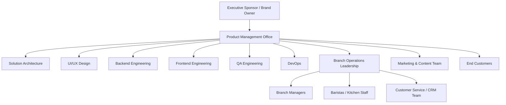

### 4.2 User Personas

| Persona | Role | Goals | Key Pain Points Addressed |
|---|---|---|---|
| **Amara** | Guest Customer | Discover the brand, browse menu, find nearest branch, read story/blog | Slow, generic websites that don't reflect product quality |
| **Raka** | Registered Member/Loyal Customer | Order ahead, reserve tables, track points, redeem rewards, manage payment methods | Loyalty programs disconnected from ordering |
| **Dewi** | Barista / Front-of-House Staff | Process POS transactions quickly, view live orders, manage table status | Slow POS, no visibility into online/QR orders |
| **Bimo** | Kitchen Staff | See incoming tickets in real time, mark items in-progress/ready, manage prep order | Paper tickets, miscommunication with front-of-house |
| **Sari** | Branch Manager | Monitor daily sales, manage local inventory/stock opname, schedule staff, view branch analytics | No real-time visibility into branch performance |
| **Yusuf** | Inventory / Warehouse Officer | Manage stock levels, create purchase orders, track batches/expirations, receive supplier deliveries | Manual spreadsheets, no batch/expiry tracking |
| **Nadia** | Marketing / Content Manager | Publish blog posts, manage promotions, update landing page content, manage gallery/media | Cannot update site content without developer involvement |
| **Fajar** | HR / Employee Manager | Manage employee records, roles, shift schedules across branches | No centralized multi-branch HR view |
| **Lestari** | CRM / Customer Support Officer | View unified customer profile (orders, loyalty, reservations, support history) | Data scattered across systems |
| **Adit** | Regional/Executive Analyst | View cross-branch KPIs, sales trends, inventory cost trends | No consolidated reporting layer |
| **System Administrator** | Platform Administrator | Manage roles/permissions, branches, system settings, integrations, audit logs | — |
| **Developer/Integration Partner** | Third-party integrator (future delivery aggregator, ERP) | Consume documented, versioned REST API | No stable API contract to build against |

---

## 5. Glossary & Definitions

| Term | Definition |
|---|---|
| Branch | A physical retail location (coffee shop) operating under the brand, with its own inventory, staff, and POS |
| Warehouse | A stock-holding location; may be branch-local or a central/regional distribution warehouse |
| SKU | Stock Keeping Unit — a unique identifier for an inventory item variant |
| Recipe | A bill-of-materials record defining the ingredients/quantities consumed to produce one unit of a menu item |
| Recipe Costing | Calculated cost-of-goods-sold (COGS) per menu item derived from recipe ingredient costs |
| Stock Opname | Physical stock count reconciliation process (aka cycle count / stocktake) |
| Batch | A tracked lot of inventory received together, sharing a receipt date and expiration date |
| KDS | Kitchen Display System — the digital ticket screen used by kitchen staff |
| POS | Point of Sale — in-store transaction terminal application |
| QR Ordering | Customer self-ordering via a table-specific QR code, without staff intervention |
| RBAC | Role-Based Access Control |
| CMS | Content Management System — the module through which non-technical staff manage site content |
| JWT | JSON Web Token, used for stateless API authentication |
| PII | Personally Identifiable Information |
| SLA | Service Level Agreement |
| SSR / SSG / ISR | Server-Side Rendering / Static Site Generation / Incremental Static Regeneration (Next.js rendering strategies) |
| Idempotency Key | A client-supplied unique key preventing duplicate processing of a repeated request (e.g., order submission) |
| Soft Delete | Marking a record as deleted (`deleted_at` timestamp) without physically removing it, preserving audit history |


---

## 6. System Architecture

### 6.1 Architectural Principles

1. **API-First**: The Laravel backend exposes a versioned REST API (`/api/v1/...`). Every frontend (marketing site, customer portal, admin dashboard, future mobile/kiosk apps) is an API consumer with zero direct database access and zero embedded business logic that duplicates server-side rules.
2. **Full Decoupling**: Frontend (Next.js) and backend (Laravel) are separate deployable applications, separate repositories (or a monorepo with clear package boundaries), independently versioned and independently deployable.
3. **Single Source of Truth**: PostgreSQL is the canonical system of record. Redis is a cache/queue layer only — never a source of truth for durable business data.
4. **Multi-Branch by Design**: Every operationally-scoped entity (orders, inventory, staff, tables, reservations) carries a `branch_id` foreign key from the schema's inception; there is no "single branch" special case.
5. **Modular Monolith → Service-Ready**: The Laravel application is organized into bounded-context modules (Catalog, Ordering, Inventory, CRM, HR, CMS, Analytics) with enforced module boundaries (no cross-module direct Eloquent relationship queries — communicate through internal service classes/events), so any module can be extracted into an independent service later without a rewrite.
6. **Event-Driven Side Effects**: State changes that affect multiple modules (e.g., an order being paid triggers inventory deduction, loyalty point accrual, and notification dispatch) are propagated via domain events + queued listeners, not synchronous cross-module calls, to preserve module boundaries and resilience.
7. **CMS-Driven Content**: No customer-facing copy, imagery, menu item, price, promotion, or branch data is hardcoded in the frontend. All such content is fetched from the API and is editable via CMS/Admin Dashboard.
8. **Idempotency & Auditability**: All state-mutating endpoints that could be retried (orders, payments, stock movements) accept idempotency keys; all such mutations are recorded in the Audit Log module.

### 6.2 Technology Stack

| Layer | Technology | Notes |
|---|---|---|
| Frontend Framework | Next.js 15 (App Router) | SSR for SEO-critical pages (landing, blog, menu), CSR for authenticated app views |
| UI Runtime | React 19 | Server Components for static/content pages, Client Components for interactive dashboards |
| Language | TypeScript (strict mode) | Enforced across all frontend packages |
| Styling | Tailwind CSS v4 | Design tokens defined in `tailwind.config` per §13 |
| Component Library | shadcn/ui | Headless, themeable; customized to design tokens, never used un-themed |
| Icons | Lucide React | Exclusive icon library; no mixed icon sets |
| Animation | Framer Motion | Page transitions, micro-interactions, scroll reveals |
| Server State | TanStack Query | All API data fetching/caching/mutation on the client side |
| Forms | React Hook Form + Zod | Zod schemas shared between form validation and API request typing |
| HTTP Client | Axios | Centralized instance with interceptors for auth refresh & error normalization |
| Backend Framework | Laravel 12 | PHP 8.3+ |
| API Style | REST (JSON:API-inspired conventions) | Versioned via URI (`/api/v1`) |
| Auth | JWT (access + refresh token pair) | `tymon/jwt-auth`-class implementation, custom claims for branch/role context |
| Database | PostgreSQL 16 | Row-level partitioning-ready by `branch_id`; JSONB used for flexible attributes (e.g., product variant metadata) |
| Cache/Queue/Session | Redis 7 | Cache, Laravel queue driver, session store for admin dashboard, rate limiting store |
| Object Storage | Cloudflare R2 | Media library, product images, documents, exports |
| Analytics | Google Analytics 4 + PostHog | GA4 for marketing/SEO analytics; PostHog for product analytics, funnels, feature flags, session replay (admin-side opt-in only) |
| Transactional Email | Resend | Order confirmations, reservation confirmations, password resets, notifications |
| Maps | Google Maps API | Branch locator, delivery radius visualization |
| Hosting (Frontend) | Vercel | Edge network, preview deployments per PR |
| Hosting (Backend) | Docker containers (orchestrated via e.g. ECS/Kubernetes-class runtime) | Backend, worker, and scheduler containers defined in §19 |
| CI/CD | GitHub Actions (or equivalent) | Lint → Test → Build → Deploy pipeline per §19 |

### 6.3 High-Level Architecture Diagram

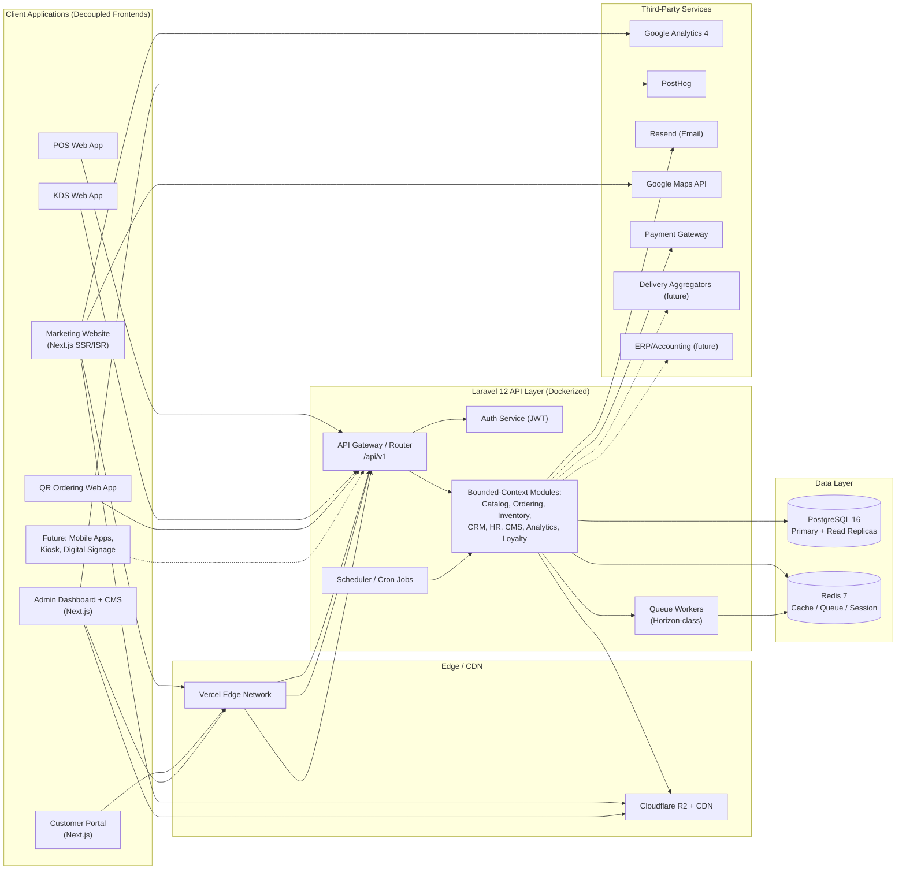

### 6.4 Backend Module Boundaries (Bounded Contexts)

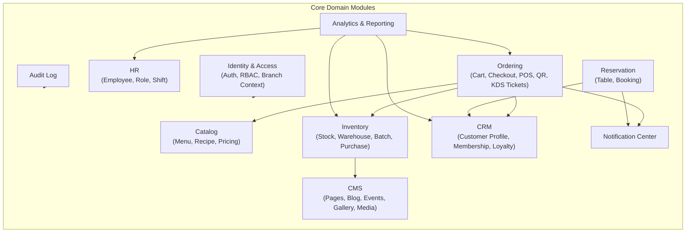

### 6.5 Request Lifecycle (API-First Contract)

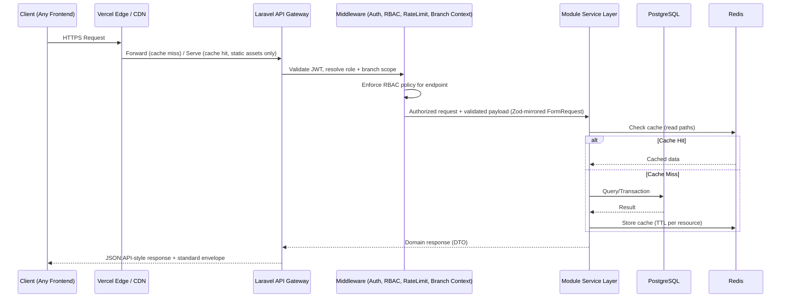

### 6.6 Environment Topology

| Environment | Purpose | Frontend | Backend | Database |
|---|---|---|---|---|
| Local | Developer machines | `next dev` | `laravel sail`/Docker Compose | Local Postgres container |
| Development | Shared integration testing | Vercel Preview | Dev Docker cluster | Dev Postgres (seeded, resettable) |
| Staging | Pre-production, QA sign-off, UAT | Vercel Staging | Staging Docker cluster (prod-parity) | Staging Postgres (prod-like anonymized data) |
| Production | Live | Vercel Production | Production Docker cluster (auto-scaled) | Production Postgres (Primary + read replicas) |

---

## 7. Information Architecture & Sitemap

### 7.1 Public Website Sitemap

```mermaid
flowchart TD
    HOME["/ (Home / Landing)"]
    HOME --> MENU["/menu"]
    HOME --> BRANCHES["/branches (Locator)"]
    HOME --> ABOUT["/about (Brand Story)"]
    HOME --> BLOG["/journal (Blog)"]
    HOME --> EVENTS["/events"]
    HOME --> GALLERY["/gallery"]
    HOME --> CAREERS["/careers"]
    HOME --> CONTACT["/contact"]
    HOME --> MEMBERSHIP_L["/membership (Program Landing)"]
    HOME --> LOGIN["/login"]
    HOME --> REGISTER["/register"]

    MENU --> MENU_ITEM["/menu/[category]/[item-slug]"]
    BLOG --> BLOG_POST["/journal/[slug]"]
    EVENTS --> EVENT_DETAIL["/events/[slug]"]
    CAREERS --> JOB_DETAIL["/careers/[slug]"]
    BRANCHES --> BRANCH_DETAIL["/branches/[slug]"]

    LOGIN --> PORTAL_ROOT
    REGISTER --> PORTAL_ROOT

    subgraph PORTAL["Customer Portal (Authenticated)"]
        PORTAL_ROOT["/account"]
        PORTAL_ROOT --> P_ORDERS["/account/orders"]
        PORTAL_ROOT --> P_RESERVE["/account/reservations"]
        PORTAL_ROOT --> P_LOYALTY["/account/loyalty"]
        PORTAL_ROOT --> P_PAYMENT["/account/payment-methods"]
        PORTAL_ROOT --> P_PROFILE["/account/profile"]
        PORTAL_ROOT --> P_ADDR["/account/addresses"]
    end

    HOME --> ORDER_FLOW["/order (Online Ordering)"]
    ORDER_FLOW --> CART["/order/cart"]
    CART --> CHECKOUT["/order/checkout"]
    CHECKOUT --> CONFIRM["/order/confirmation/[orderId]"]

    HOME --> RESERVE_FLOW["/reserve (Table Reservation)"]
    RESERVE_FLOW --> RESERVE_CONFIRM["/reserve/confirmation/[reservationId]"]

    QR_ENTRY["/qr/[tableCode] (QR Ordering Entry)"] --> ORDER_FLOW
```

### 7.2 Admin Dashboard & CMS Sitemap

```mermaid
flowchart TD
    DASH["/admin (Dashboard Home)"]
    DASH --> A_ANALYTICS["/admin/analytics"]
    DASH --> A_ORDERS["/admin/orders"]
    DASH --> A_POS["/admin/pos"]
    DASH --> A_KDS["/admin/kds"]
    DASH --> A_RESERVE["/admin/reservations"]
    DASH --> A_TABLES["/admin/tables"]
    DASH --> A_MENU["/admin/menu"]
    DASH --> A_RECIPE["/admin/recipes"]
    DASH --> A_INV["/admin/inventory"]
    DASH --> A_WAREHOUSE["/admin/warehouses"]
    DASH --> A_SUPPLIER["/admin/suppliers"]
    DASH --> A_PURCHASE["/admin/purchase-orders"]
    DASH --> A_PROMO["/admin/promotions"]
    DASH --> A_MEMBER["/admin/memberships"]
    DASH --> A_CRM["/admin/crm"]
    DASH --> A_BRANCH["/admin/branches"]
    DASH --> A_HR["/admin/employees"]
    DASH --> A_CMS["/admin/cms"]
    A_CMS --> A_PAGES["/admin/cms/pages"]
    A_CMS --> A_BLOG["/admin/cms/blog"]
    A_CMS --> A_EVENTS["/admin/cms/events"]
    A_CMS --> A_CAREERS["/admin/cms/careers"]
    A_CMS --> A_GALLERY["/admin/cms/gallery"]
    A_CMS --> A_MEDIA["/admin/cms/media-library"]
    DASH --> A_NOTIF["/admin/notifications"]
    DASH --> A_REPORTS["/admin/reports"]
    DASH --> A_AUDIT["/admin/audit-logs"]
    DASH --> A_SETTINGS["/admin/settings"]
    A_SETTINGS --> A_ROLES["/admin/settings/roles-permissions"]
    A_SETTINGS --> A_INTEG["/admin/settings/integrations"]
    A_SETTINGS --> A_BRANDING["/admin/settings/branding"]
    A_SETTINGS --> A_API["/admin/settings/api-keys"]
```

### 7.3 Information Architecture Principles

- **Progressive disclosure**: Customer-facing IA surfaces only what's relevant per step (browse → build order → checkout); admin IA groups by operational domain, not by database table.
- **Consistent breadcrumb model**: Every admin page renders a breadcrumb reflecting its position in §7.2, driven by route metadata, not hardcoded strings.
- **Branch-context switcher**: The Admin Dashboard header persists a Branch Switcher (or "All Branches" aggregate view for authorized roles) that scopes all subsequent queries — implemented as a global context, not a per-page filter, to guarantee consistency.
- **Deep-linkable state**: All list views (orders, inventory, reports) encode filters/sort/pagination in the URL query string so links are shareable and browser-back-safe.

### 7.4 Brand Configuration (No Hardcoding Mandate)

All of the following are stored as CMS-managed configuration, never hardcoded in frontend code: brand name, logo assets (light/dark variants), color theme tokens (within design-system-approved palette structure, §13.2), typography selection (from an approved font whitelist), footer content, social links, SEO metadata defaults, legal pages (privacy policy, terms), currency, timezone, and locale defaults per branch.


---

## 8. Roles, Permissions & RBAC

### 8.1 RBAC Model

Velvra implements attribute-aware RBAC: a **Role** grants a set of **Permissions**, each permission is scoped to a **Resource** and **Action**, and every authorization check additionally validates **Branch Scope** (a user's role may be global or restricted to one or more branches). Roles are stored as data (`roles`, `permissions`, `role_permissions`, `user_roles` tables — see §11), fully manageable via `/admin/settings/roles-permissions`, never hardcoded in application logic beyond the enforcement engine itself.

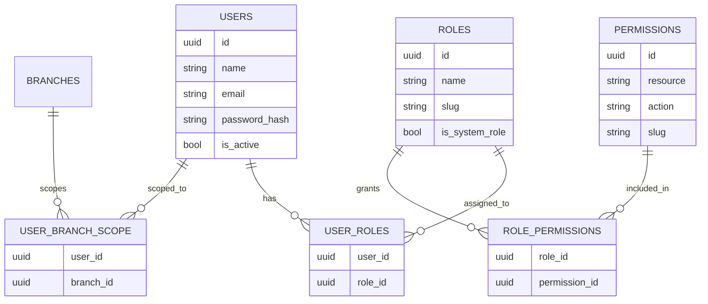

### 8.2 System Roles (Default Seed Data)

| Role | Scope | Description |
|---|---|---|
| Super Admin | Global | Full unrestricted access, including RBAC configuration itself |
| Regional/Executive Analyst | Global (read-only analytics) | Cross-branch dashboards and reports only |
| Branch Manager | Single/multiple branch | Full operational control within assigned branch(es) |
| Shift Supervisor | Single branch | POS, KDS, reservations, table management within a shift |
| Barista / Cashier | Single branch | POS operation, order handling only |
| Kitchen Staff | Single branch | KDS ticket management only |
| Inventory Officer | Single/multiple branch or warehouse | Inventory, purchase order, supplier management |
| HR Manager | Global or branch | Employee management, shift scheduling |
| Marketing/Content Manager | Global | CMS: pages, blog, events, gallery, promotions, media |
| CRM/Support Officer | Global or branch | Customer profile, membership, loyalty, support notes |
| Customer (Member) | Self only | Customer Portal access, scoped strictly to own data |
| Guest | Public | Unauthenticated browsing, ordering as guest checkout |
| API Integration Partner | Scoped via API key + OAuth-style client credentials | Programmatic access limited to granted scopes |

### 8.3 Permission Matrix (Representative — Full Matrix Managed in `/admin/settings/roles-permissions`)

| Resource | Super Admin | Branch Manager | Shift Supervisor | Barista/Cashier | Kitchen Staff | Inventory Officer | HR Manager | Marketing Mgr | CRM Officer | Member |
|---|---|---|---|---|---|---|---|---|---|---|
| Menu & Recipes | CRUD | Read | Read | Read | Read | Read | — | CRUD | — | Read |
| Orders (POS/Online/QR) | CRUD | CRUD (branch) | CRUD (branch) | Create/Read/Update | Read/Update (status) | — | — | — | Read | Own only |
| KDS Tickets | CRUD | Read/Update | Read/Update | Read | Read/Update | — | — | — | — | — |
| Inventory & Stock | CRUD | Read/Update (branch) | Read | — | — | CRUD | — | — | — | — |
| Purchase Orders | CRUD | Approve (branch) | — | — | — | CRUD | — | — | — | — |
| Suppliers | CRUD | Read | — | — | — | CRUD | — | — | — | — |
| Reservations & Tables | CRUD | CRUD (branch) | CRUD (branch) | Read/Update | — | — | — | — | Read | Own only |
| Promotions | CRUD | Read | — | — | — | — | — | CRUD | Read | Read (public) |
| Membership/Loyalty | CRUD | Read (branch) | — | — | — | — | — | — | CRUD | Own only |
| CRM / Customer Profiles | CRUD | Read (branch) | — | — | — | — | — | — | CRUD | Own only |
| Employees / HR | CRUD | Read/Update (branch) | Read (branch) | — | — | — | CRUD | — | — | — |
| Branches | CRUD | Read (own) | Read (own) | — | — | — | — | — | — | — |
| CMS (Blog/Events/Gallery/Careers/Pages) | CRUD | — | — | — | — | — | — | CRUD | — | Read (public) |
| Media Library | CRUD | — | — | — | — | — | — | CRUD | — | — |
| Analytics & Reports | CRUD (config) | Read (branch) | Read (branch, limited) | — | — | Read (inventory reports) | Read (HR reports) | Read (marketing reports) | Read (CRM reports) | — |
| Audit Logs | Read | Read (branch) | — | — | — | — | — | — | — | — |
| Settings / RBAC / Integrations | CRUD | — | — | — | — | — | — | — | — | — |
| Notification Center | CRUD | Read/Send (branch) | — | — | — | — | — | Send (marketing) | Send (support) | Receive |

**Legend:** CRUD = Create, Read, Update, Delete; "—" = no access; "(branch)" = scoped to assigned branch(es) only; "Own only" = scoped strictly to records owned by the authenticated user.

### 8.4 Authorization Enforcement Rules

1. Every API endpoint declares a required `permission slug` (e.g., `inventory.stock.update`) enforced by Laravel policy/gate middleware — no endpoint is "authenticated-only" without an explicit permission check.
2. Branch scope is resolved from the JWT's active branch claim (for staff switching between assigned branches) and cross-checked against `user_branch_scope`; requests outside scope return `403 Forbidden` with a standard error envelope (§12.4).
3. Row-level enforcement: list/read queries automatically apply a `branch_id IN (:scoped_branches)` predicate at the query-builder layer via a global Eloquent scope — this is centralized, not re-implemented per controller, to avoid data-leak regressions.
4. Permission changes take effect on next token refresh (access tokens are short-lived, §16.2) to bound the staleness window.
5. All permission grant/revoke actions are themselves audit-logged (actor, target, before/after state).


---

## 9. Core Modules — Functional Specifications

Each module below follows a consistent specification format: **Purpose**, **Key Features**, **Functional Requirements** (with unique IDs for traceability into QA test plans), and **Business Rules**. Requirement IDs follow the pattern `MOD-###` where `MOD` is a short module code.

### 9.1 Premium Landing Website (`WEB`)

**Purpose:** The primary public-facing brand surface; must convert visitors into orders, reservations, or membership sign-ups while conveying a premium brand identity.

**Key Features:** Hero storytelling section, signature menu highlights, branch locator teaser, brand story/about teaser, testimonials/press mentions, blog/journal teaser, newsletter capture, membership program callout, footer with full navigation and legal links — all sections independently toggleable and reorderable via CMS page builder.

| ID | Requirement | Priority |
|---|---|---|
| WEB-001 | Landing page must be composed of CMS-managed, reorderable content blocks (hero, featured items, story, locator, testimonials, blog teaser, CTA banner, footer) | Must |
| WEB-002 | All imagery served via Cloudflare R2 with responsive `srcset` and modern formats (AVIF/WebP with fallback) | Must |
| WEB-003 | Page must render via SSR/ISR (Next.js) with revalidation on CMS publish webhook, not full rebuild | Must |
| WEB-004 | Branch locator teaser must query nearest branches via Google Maps Geolocation, linking to full `/branches` page | Should |
| WEB-005 | Newsletter capture must validate email client-side (Zod) and server-side, deduped against existing subscribers | Must |
| WEB-006 | All CTAs (Order Now, Reserve a Table, Join Membership) must deep-link into the respective flow, pre-filling known context (nearest branch, logged-in state) | Should |
| WEB-007 | SEO metadata (title, description, OG image, structured data for LocalBusiness/Organization/Product) fully CMS-editable per page | Must |

**Business Rules:** No content block may reference a hardcoded branch, price, or promotion — all dynamic via API. Page must remain fully functional and legible with JavaScript disabled for critical content (progressive enhancement) except for interactive widgets (map, cart).

### 9.2 Customer Portal (`PORT`)

**Purpose:** Authenticated self-service space for members to manage orders, reservations, loyalty, payment methods, and profile.

**Key Features:** Order history & reorder, reservation management, loyalty points & tier status, saved payment methods (tokenized, never raw PAN), saved addresses, profile & preferences (dietary flags, marketing consent), account security (password, 2FA, active sessions).

| ID | Requirement | Priority |
|---|---|---|
| PORT-001 | Member can view paginated order history with status, receipt, and "reorder" action that repopulates cart | Must |
| PORT-002 | Member can view/cancel/reschedule upcoming reservations within cancellation policy window (§9.6) | Must |
| PORT-003 | Member can view current loyalty tier, points balance, points expiry, and redeemable rewards | Must |
| PORT-004 | Member can manage tokenized payment methods via payment-gateway-hosted fields (PCI SAQ-A scope only) | Must |
| PORT-005 | Member can enable 2FA (TOTP) and view/revoke active sessions/devices | Should |
| PORT-006 | Member can manage marketing consent and dietary/allergen preferences, which propagate to order recommendations | Should |
| PORT-007 | Account deletion request triggers a data-retention-compliant soft-delete + anonymization workflow (§16.7) | Must |

### 9.3 CMS (`CMS`)

**Purpose:** Central content authoring system powering the landing site, blog, events, careers, gallery, and static/legal pages, with roles-gated publishing workflow.

**Key Features:** Block-based page builder, draft/preview/publish workflow, versioning & rollback, scheduled publishing, media picker (integrated with Media Library, §9.27), SEO fields per content type, multi-locale content (future-ready field structure).

| ID | Requirement | Priority |
|---|---|---|
| CMS-001 | All content types (Page, Blog Post, Event, Job Posting, Gallery Item) support Draft → In Review → Published → Archived states | Must |
| CMS-002 | Content editors can preview unpublished content via a signed preview URL before publishing | Must |
| CMS-003 | Every publish action creates an immutable version snapshot; authorized roles can view diff and roll back | Should |
| CMS-004 | Scheduled publishing: content can be set to auto-publish/unpublish at a specified datetime (queued job) | Should |
| CMS-005 | Rich text editor supports structured blocks (heading, paragraph, image, gallery, quote, CTA button, embed) validated against an allowed-block schema (no arbitrary HTML injection) | Must |
| CMS-006 | Content list views are filterable by status, author, content type, and date range | Must |

**Business Rules:** Publishing a Page/Blog/Event is a permissioned action distinct from editing (supports a maker-checker workflow where Content Managers draft and a senior role publishes, if configured).

### 9.4 Admin Dashboard (`ADM`)

**Purpose:** The operational home for all internal roles; a shell application providing navigation, branch context switching, global search, and role-scoped widget summaries.

| ID | Requirement | Priority |
|---|---|---|
| ADM-001 | Dashboard home renders role-appropriate summary widgets (e.g., Branch Manager sees today's sales/orders/low-stock alerts; HR Manager sees pending shift approvals) | Must |
| ADM-002 | Global branch switcher persists selection in session and scopes all subsequent module views | Must |
| ADM-003 | Global search (orders, customers, products, employees) with permission-filtered results | Should |
| ADM-004 | Notification bell surfaces real-time alerts (low stock, new reservation, failed payment) via WebSocket/polling | Should |
| ADM-005 | Dashboard must be fully responsive down to tablet width for in-store manager use (§14) | Must |

### 9.5 Analytics Dashboard (`ANL`)

**Purpose:** Data-driven decision support across sales, inventory, CRM, and HR domains, at both single-branch and cross-branch aggregate levels.

**Key Features:** Sales trends (daily/weekly/monthly, by branch/category/item), inventory cost & shrinkage trends, customer cohort & retention (via loyalty data), staff productivity indicators, exportable reports (CSV/PDF via §9.29), configurable dashboards (drag-and-drop widgets, PostHog-powered product analytics for internal tool usage).

| ID | Requirement | Priority |
|---|---|---|
| ANL-001 | Executive/Regional Analyst role can view cross-branch comparison dashboards | Must |
| ANL-002 | Branch Manager sees branch-scoped sales, inventory, and staffing KPIs only | Must |
| ANL-003 | All charts support date-range filtering with sensible presets (Today, WTD, MTD, QTD, YTD, Custom) | Must |
| ANL-004 | Dashboards must load with skeleton states and progressive data hydration, not full-page blocking spinners | Should |
| ANL-005 | Underlying metrics are computed via scheduled aggregation jobs into materialized summary tables (not live full-table scans) for performance (§17) | Must |

### 9.6 Reservation System (`RES`)

**Purpose:** Enable customers to book tables in advance and staff to manage the booking calendar and no-show/cancellation policy.

| ID | Requirement | Priority |
|---|---|---|
| RES-001 | Customer can search table availability by branch, date, time, and party size | Must |
| RES-002 | System prevents double-booking via a table-hold mechanism with a configurable hold expiry (e.g., 10 minutes pending confirmation) | Must |
| RES-003 | Reservation confirmation triggers email (Resend) and in-app notification | Must |
| RES-004 | Cancellation policy (minimum notice window, no-show fee if configured) is CMS/Admin-configurable per branch | Should |
| RES-005 | Staff can view a daily reservation timeline/floor view and manually seat/no-show/cancel bookings | Must |
| RES-006 | Waitlist mode: if fully booked, customer can join a waitlist and is notified on availability | Could |

### 9.7 Table Management (`TBL`)

**Purpose:** Represent the physical floor plan and real-time table status for both reservation and walk-in/POS workflows.

| ID | Requirement | Priority |
|---|---|---|
| TBL-001 | Admin can define a visual floor plan per branch (tables with position, capacity, zone) | Must |
| TBL-002 | Each table has a real-time status: Available, Reserved, Occupied, Needs Cleaning, Out of Service | Must |
| TBL-003 | QR codes are generated per table, encoding a signed table-code URL for QR Ordering (§9.9) | Must |
| TBL-004 | Table status updates propagate live to POS and Admin floor views (WebSocket/short-poll) | Should |

### 9.8 Online Ordering (`ORD`)

**Purpose:** Web-based ordering for pickup/dine-in-ahead, decoupled from any single branch's POS terminal.

| ID | Requirement | Priority |
|---|---|---|
| ORD-001 | Customer selects a branch (or is defaulted to nearest/last-used) before menu items can be added to cart, since availability/pricing may be branch-specific | Must |
| ORD-002 | Cart persists across sessions for authenticated members (server-side cart) and locally for guests | Must |
| ORD-003 | Checkout supports guest checkout and authenticated checkout with saved details | Must |
| ORD-004 | Order submission is idempotent via client-generated idempotency key to prevent duplicate charges on retry/double-click | Must |
| ORD-005 | On payment confirmation, an order event triggers: KDS ticket creation, inventory deduction, loyalty point accrual, confirmation email | Must |
| ORD-006 | Real-time order status tracking (Received → Preparing → Ready → Completed) visible to the customer | Must |
| ORD-007 | Item customization (size, milk type, extra shots, notes) modeled as structured modifier groups, not free text, to support accurate inventory deduction and KDS clarity | Must |

### 9.9 QR Ordering (`QRO`)

**Purpose:** At-table self-ordering without staff intervention, scoped to a specific table/branch context.

| ID | Requirement | Priority |
|---|---|---|
| QRO-001 | Scanning a table QR resolves a signed table-code to branch + table context automatically, with no manual branch selection | Must |
| QRO-002 | QR ordering flow reuses the Online Ordering cart/checkout engine (§9.8) with `order_channel = qr` and `table_id` attached | Must |
| QRO-003 | QR order payment can be configured per branch as pay-now or pay-at-counter/tab | Should |
| QRO-004 | Multiple guests at the same table can each scan and add to a shared table order (split-cart) or order individually, per branch configuration | Could |

### 9.10 POS (`POS`)

**Purpose:** In-store staff-operated transaction terminal for walk-in and counter orders, integrated with the same order/inventory/loyalty engine as digital channels.

| ID | Requirement | Priority |
|---|---|---|
| POS-001 | POS UI is optimized for rapid, large-touch-target item entry with category tabs and modifier quick-select | Must |
| POS-002 | POS must function offline for a bounded window (local IndexedDB queue) and sync transactions on reconnect, reconciling against server state | Must |
| POS-003 | POS supports split payment (multiple tender types on one order) and split-bill (one order, multiple payers) | Should |
| POS-004 | Cashier can look up a member by phone/QR to apply loyalty points/tier discounts at checkout | Must |
| POS-005 | POS transactions post to the same Orders table as online/QR orders, tagged `order_channel = pos`, ensuring unified reporting and inventory deduction | Must |
| POS-006 | End-of-shift cash reconciliation report (expected vs. counted cash) | Must |

### 9.11 Kitchen Display System — KDS (`KDS`)

**Purpose:** Real-time digital ticket screen replacing paper dockets, driving kitchen prep sequencing.

| ID | Requirement | Priority |
|---|---|---|
| KDS-001 | New paid orders (from POS, Online, QR) generate a KDS ticket in real time (WebSocket push, polling fallback) | Must |
| KDS-002 | Tickets display item, modifiers, special notes, order channel, and elapsed time since submission, with color-coded aging thresholds | Must |
| KDS-003 | Kitchen staff can mark items/tickets In Progress, Ready, Recalled (bumped back) | Must |
| KDS-004 | Multi-station routing: tickets/items can be routed to specific prep stations (espresso bar, kitchen, pastry) based on menu item configuration | Should |
| KDS-005 | KDS must operate on an in-store local network with graceful degradation (local buffering) if the internet connection drops briefly | Must |
| KDS-006 | Completed ticket data feeds prep-time analytics (§9.5) | Should |


### 9.12 Menu Management (`MNU`)

**Purpose:** Central catalog of sellable items, categories, modifiers, pricing, and channel/branch availability.

| ID | Requirement | Priority |
|---|---|---|
| MNU-001 | Menu items are organized into Categories > Items > Modifier Groups > Modifiers, all admin-managed | Must |
| MNU-002 | Item availability and pricing can be overridden per branch and per channel (e.g., dine-in vs. delivery pricing) | Must |
| MNU-003 | Item can be flagged unavailable/86'd in real time at a specific branch (e.g., ran out of an ingredient), immediately hiding it from that branch's ordering channels | Must |
| MNU-004 | Items support rich metadata: allergens, dietary tags (vegan, dairy-free), nutritional info, imagery gallery | Must |
| MNU-005 | Each item links to exactly one active Recipe (§9.13) for costing and inventory deduction | Must |
| MNU-006 | Menu supports scheduled availability (e.g., breakfast menu 6–11am) via time-window rules | Should |
| MNU-007 | Bulk price update tool with change preview before applying, logged to Audit Log | Should |

### 9.13 Recipe Management (`RCP`)

**Purpose:** Define the bill-of-materials for each menu item to drive automatic inventory deduction and accurate costing.

| ID | Requirement | Priority |
|---|---|---|
| RCP-001 | A Recipe defines ordered ingredient lines: inventory item (SKU), quantity, unit of measure, and optional per-modifier variations (e.g., "Large" adds +50% milk) | Must |
| RCP-002 | Recipe changes are versioned; historical orders reference the recipe version active at time of sale for accurate historical costing | Must |
| RCP-003 | Recipe Costing engine computes COGS per item = Σ(ingredient qty × current weighted-average ingredient cost), refreshed on ingredient cost change | Must |
| RCP-004 | Margin report per item (price − COGS) surfaces in Analytics (§9.5) and Menu Management | Should |
| RCP-005 | Recipes support sub-recipes/prep components (e.g., "House Cold Brew Concentrate" as an intermediate recipe consumed by multiple finished items) | Should |

### 9.14 Inventory Management (`INV`)

**Purpose:** Real-time, multi-branch, multi-category stock tracking with automatic deduction and full traceability.

**Item Categories Supported:** Raw Materials, Coffee Beans, Milk, Syrup, Tea, Kitchen Ingredients, Packaging, Equipment.

| ID | Requirement | Priority |
|---|---|---|
| INV-001 | Every inventory item is a SKU with category, unit of measure, reorder point, reorder quantity, and default supplier | Must |
| INV-002 | Stock levels are tracked per branch/warehouse location, never as a single global number | Must |
| INV-003 | Paid orders trigger automatic stock deduction per the item's active Recipe (§9.13), executed within the same DB transaction as order finalization to prevent drift | Must |
| INV-004 | Manual Stock Adjustment (with mandatory reason code: waste, spillage, staff drink, correction) is logged with actor and timestamp | Must |
| INV-005 | Stock Opname (cycle count) workflow: generate count sheet → staff enters counted qty → system computes variance → approved variance posts adjustment | Must |
| INV-006 | Batch Tracking: received stock is recorded as a Batch with receipt date, supplier, cost, and expiration date; deduction follows FEFO (First-Expired-First-Out) by default | Must |
| INV-007 | Expiration Tracking: dashboard/alert surfaces items nearing expiry (configurable threshold, e.g., 7 days) | Must |
| INV-008 | Barcode/QR code scanning (camera-based, using device camera via web) supported for receiving and stock counts | Should |
| INV-009 | Low-stock alert triggers Notification Center event to Inventory Officer/Branch Manager when stock falls below reorder point | Must |
| INV-010 | Full Stock Movement ledger (immutable append-only log: receipt, deduction, adjustment, transfer) is the audit source for all stock reports | Must |
| INV-011 | Inter-branch/warehouse Stock Transfer workflow (request → approve → dispatch → receive) | Should |

### 9.15 Warehouse Management (`WHS`)

**Purpose:** Support central/regional distribution warehouses supplying multiple branches, distinct from branch-local storage.

| ID | Requirement | Priority |
|---|---|---|
| WHS-001 | A Warehouse is a location entity that can hold stock and be a source for Stock Transfers to branches | Must |
| WHS-002 | Warehouse-to-branch replenishment can be manual (ad hoc transfer) or rule-based (auto-suggest transfer when branch stock < reorder point and warehouse stock available) | Should |
| WHS-003 | Warehouse receiving workflow reconciles against open Purchase Orders (§9.17) | Must |
| WHS-004 | Warehouse stock reporting rolls up into the same Inventory Analytics as branch stock, with a location dimension | Must |

### 9.16 Supplier Management (`SUP`)

**Purpose:** Maintain supplier records, contract terms, and performance history for procurement decisions.

| ID | Requirement | Priority |
|---|---|---|
| SUP-001 | Supplier record includes contact info, payment terms, lead time, and supplied SKUs with negotiated unit costs | Must |
| SUP-002 | Supplier performance metrics (on-time delivery rate, quality rejection rate) computed from Purchase Order/Receiving history | Should |
| SUP-003 | Multiple suppliers can be linked to one SKU with a preferred/backup ranking | Should |

### 9.17 Purchase Management (`PUR`)

**Purpose:** End-to-end procurement workflow from requisition to receipt and cost reconciliation.

| ID | Requirement | Priority |
|---|---|---|
| PUR-001 | Purchase Order (PO) workflow: Draft → Submitted → Approved → Sent to Supplier → Partially Received → Fully Received → Closed | Must |
| PUR-002 | PO approval requires role-based sign-off above a configurable value threshold (maker-checker) | Must |
| PUR-003 | Receiving against a PO creates Inventory Batches (§9.14 INV-006) and reconciles quantity/cost variance against the PO | Must |
| PUR-004 | System can auto-generate a suggested PO from low-stock alerts, pre-filled with preferred supplier and last cost | Should |
| PUR-005 | PO history and cost trends per SKU/supplier feed into Analytics | Should |

### 9.18 Promotion Management (`PRO`)

**Purpose:** Configure and schedule discounts, bundles, and campaigns across channels.

| ID | Requirement | Priority |
|---|---|---|
| PRO-001 | Promotion types: percentage discount, fixed-amount discount, BOGO, bundle price, free item with threshold spend | Must |
| PRO-002 | Promotions can be scoped by branch, channel (POS/Online/QR), date/time window, and customer segment (e.g., members only, specific tier) | Must |
| PRO-003 | Promo code entry supported at checkout (online/QR); staff-applied discount supported at POS with reason logging | Must |
| PRO-004 | Promotions are validated server-side at order finalization (never trust client-calculated discount) to prevent tampering | Must |
| PRO-005 | Promotion usage analytics (redemption count, revenue impact) surfaces in Analytics | Should |

### 9.19 Membership & Loyalty (`LOY`)

**Purpose:** Reward repeat customers and unify the customer identity across channels.

| ID | Requirement | Priority |
|---|---|---|
| LOY-001 | Members earn points per qualifying spend (configurable ratio), across POS, Online, and QR channels uniformly | Must |
| LOY-002 | Tiered membership (e.g., Silver/Gold/Platinum) with configurable thresholds and tier-exclusive perks | Should |
| LOY-003 | Points redemption at checkout (POS and digital) with server-side validation of available balance | Must |
| LOY-004 | Points expiry policy (e.g., 12 months rolling) configurable, with expiry-warning notifications | Should |
| LOY-005 | Referral program: member referral code tracked to reward both parties on referred member's first purchase | Could |

### 9.20 CRM (`CRM`)

**Purpose:** Single unified view of every customer across orders, reservations, loyalty, and support interactions.

| ID | Requirement | Priority |
|---|---|---|
| CRM-001 | Customer 360 profile view aggregates order history, reservation history, loyalty status, and support notes on one screen | Must |
| CRM-002 | Support staff can log interaction notes/tickets against a customer profile | Must |
| CRM-003 | Customer segmentation builder (by spend, frequency, tier, location) for targeted promotions/notifications | Should |
| CRM-004 | Duplicate customer profile detection/merge tool (by email/phone) | Should |
| CRM-005 | Data export/erasure workflow supports privacy-regulation subject access and deletion requests (§16.7) | Must |

### 9.21 Multi-Branch Management (`BRN`)

**Purpose:** Administer the network of physical locations as first-class entities governing operational scoping.

| ID | Requirement | Priority |
|---|---|---|
| BRN-001 | Branch record includes address/geo-coordinates, operating hours, timezone, currency, contact info, and status (Active/Coming Soon/Closed) | Must |
| BRN-002 | Branch-level configuration overrides for menu availability, pricing, promotions, and reservation policy (§9.6, §9.12) | Must |
| BRN-003 | Branch onboarding checklist workflow (create branch → assign staff → configure menu → configure tables → go live) to hit the < 1 business day KPI (§2.3) | Should |
| BRN-004 | Branch status change (e.g., temporary closure) immediately reflects across landing site locator, ordering channel selection, and reservation availability | Must |

### 9.22 Employee Management (`HR`)

**Purpose:** Core workforce administration: identity, role assignment, and shift scheduling across branches.

| ID | Requirement | Priority |
|---|---|---|
| HR-001 | Employee record includes personal info, employment status, assigned branch(es), and assigned Role(s) (§8) | Must |
| HR-002 | Shift scheduling calendar per branch with drag-and-drop assignment and conflict detection (overlapping shifts) | Should |
| HR-003 | Basic attendance clock-in/out (time-stamped, branch-located) feeding a placeholder export for future payroll/ERP integration (§21) | Should |
| HR-004 | Employee offboarding deactivates system access and reassigns/archives their audit-trail references without deleting historical records | Must |


### 9.23 Blog / Journal (`BLG`)

**Purpose:** Editorial content surface for brand storytelling, coffee education, and SEO.

| ID | Requirement | Priority |
|---|---|---|
| BLG-001 | Blog posts support category/tag taxonomy, featured image, author attribution, and related-posts suggestion | Must |
| BLG-002 | Full CMS workflow (§9.3) applies: Draft/Review/Publish/Archive with scheduling | Must |
| BLG-003 | Public blog index supports pagination, category filter, and search | Should |
| BLG-004 | Structured data (Article schema) auto-generated for SEO | Should |

### 9.24 Events (`EVT`)

**Purpose:** Promote and manage brand events (cupping sessions, brand launches, in-store activations).

| ID | Requirement | Priority |
|---|---|---|
| EVT-001 | Event record includes date/time, venue/branch, capacity, cover image, and description | Must |
| EVT-002 | Optional RSVP/registration capture (name, email, party size) with capacity enforcement | Should |
| EVT-003 | Past events archive automatically based on end datetime | Should |

### 9.25 Career Portal (`CAR`)

**Purpose:** Publish job openings and capture applications.

| ID | Requirement | Priority |
|---|---|---|
| CAR-001 | Job posting includes title, branch/location, employment type, description, and requirements, managed via CMS | Must |
| CAR-002 | Candidate application form captures resume upload (stored in R2), contact info, and cover note | Must |
| CAR-003 | Internal recruiter view lists applications per posting with status pipeline (New/Reviewed/Interview/Offer/Rejected) | Should |

### 9.26 Gallery (`GAL`)

**Purpose:** Curated visual showcase of branches, products, and brand moments.

| ID | Requirement | Priority |
|---|---|---|
| GAL-001 | Gallery items organized into albums (e.g., "Interiors," "Seasonal Menu," "Events") | Must |
| GAL-002 | Lightbox viewing experience with keyboard navigation and touch-swipe on mobile | Must |
| GAL-003 | Images sourced from Media Library (§9.27), never uploaded ad hoc outside the managed library | Must |

### 9.27 Media Library (`MED`)

**Purpose:** Centralized digital asset management for all imagery/documents used across CMS modules.

| ID | Requirement | Priority |
|---|---|---|
| MED-001 | All uploads stored in Cloudflare R2 with automatic responsive variant generation (thumbnail, medium, large, WebP/AVIF) | Must |
| MED-002 | Assets tagged with metadata (alt text — mandatory for accessibility, §15; tags; usage locations) | Must |
| MED-003 | Asset picker component reused across Menu, Blog, Events, Careers, Gallery modules (single implementation, not duplicated per module) | Must |
| MED-004 | Storage usage dashboard and orphaned-asset detection (assets not referenced by any content) | Could |

### 9.28 Notification Center (`NOT`)

**Purpose:** Unified dispatch and in-app inbox for transactional and operational notifications across email and in-app channels (push-ready for future mobile apps).

| ID | Requirement | Priority |
|---|---|---|
| NOT-001 | Notification templates (order confirmation, reservation confirmation, low-stock alert, PO approval request, promotional broadcast) are admin-editable with merge-field variables | Must |
| NOT-002 | Every notification is dispatched through a queued job (not synchronous within the request cycle) to avoid blocking user-facing responses | Must |
| NOT-003 | In-app notification inbox with read/unread state per user | Should |
| NOT-004 | Notification delivery status (sent/failed/bounced) tracked for email via Resend webhooks | Should |
| NOT-005 | User-level and admin-level notification preference controls (which categories to receive, per channel) | Should |

### 9.29 Reports (`REP`)

**Purpose:** Structured, exportable operational and financial reporting beyond the interactive Analytics Dashboard.

| ID | Requirement | Priority |
|---|---|---|
| REP-001 | Standard report library: Sales Summary, Inventory Valuation, Stock Movement, Purchase Order History, Employee Shift Summary, Loyalty Redemption, Promotion Performance | Must |
| REP-002 | Reports exportable as CSV and PDF, generated as an async queued job for large datasets with a download-when-ready notification | Must |
| REP-003 | Report parameters (branch, date range, category) saved as reusable presets per user | Could |
| REP-004 | Scheduled report delivery via email (e.g., daily sales summary to Branch Manager each morning) | Should |

### 9.30 Audit Logs (`AUD`)

**Purpose:** Immutable record of security-relevant and business-critical actions for compliance and troubleshooting.

| ID | Requirement | Priority |
|---|---|---|
| AUD-001 | Every create/update/delete on sensitive resources (orders, inventory adjustments, pricing, roles/permissions, employee records) is logged with actor, timestamp, IP, before/after diff | Must |
| AUD-002 | Audit log is append-only at the application layer (no update/delete endpoints exposed) | Must |
| AUD-003 | Audit log viewer supports filtering by actor, resource type, date range, and branch | Must |
| AUD-004 | Audit records retained per configured data-retention policy (§16.7), archived rather than purged where legally required | Must |

### 9.31 Settings (`SET`)

**Purpose:** Platform-wide and branch-level configuration surface for administrators.

| ID | Requirement | Priority |
|---|---|---|
| SET-001 | Roles & Permissions management UI (§8) with the ability to create custom roles beyond system defaults | Must |
| SET-002 | Integrations settings: manage API keys/credentials for Google Maps, Resend, Payment Gateway, GA4/PostHog, future ERP/delivery adapters | Must |
| SET-003 | Branding settings: theme tokens within design-system constraints, logo assets, default SEO metadata (§7.4) | Must |
| SET-004 | API Keys management for third-party integration partners, with scope assignment and revocation | Must |
| SET-005 | System-level configuration: default currency, supported locales, tax rules per branch/region | Must |

### 9.32 API (`API`)

**Purpose:** The versioned, documented REST contract underlying every module above and every current/future client (see §12 for full design).

| ID | Requirement | Priority |
|---|---|---|
| API-001 | All API endpoints are documented via an OpenAPI 3.x specification, kept in sync with implementation via contract tests | Must |
| API-002 | API is versioned at the URI level (`/api/v1`); breaking changes require a new version, not in-place mutation | Must |
| API-003 | Rate limiting applied per authenticated client/IP, configurable per endpoint class (public read vs. authenticated write) | Must |
| API-004 | Third-party integration partners authenticate via scoped API keys/OAuth2 client-credentials, distinct from end-user JWT auth | Must |
| API-005 | Webhook framework for outbound events (order.paid, reservation.confirmed, stock.low) to support future delivery/ERP integrations | Should |


---

## 10. Key User & System Flows

### 10.1 Customer Online Ordering Flow

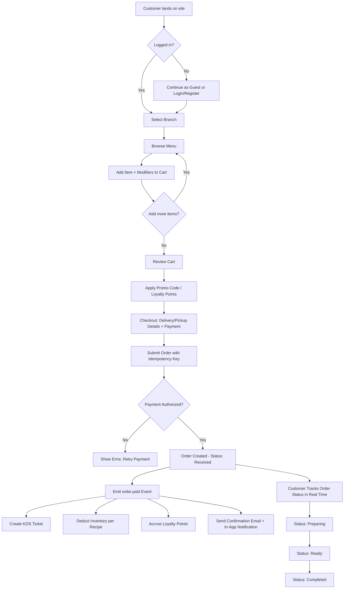

### 10.2 QR At-Table Ordering Flow

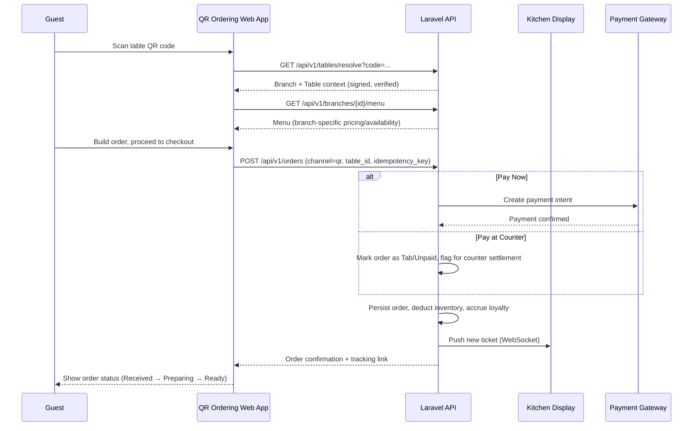

### 10.3 Table Reservation Flow

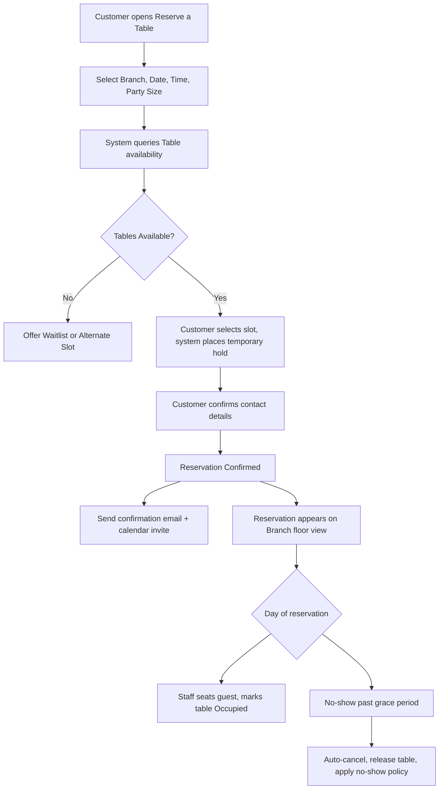

### 10.4 POS Transaction with Automatic Inventory Deduction

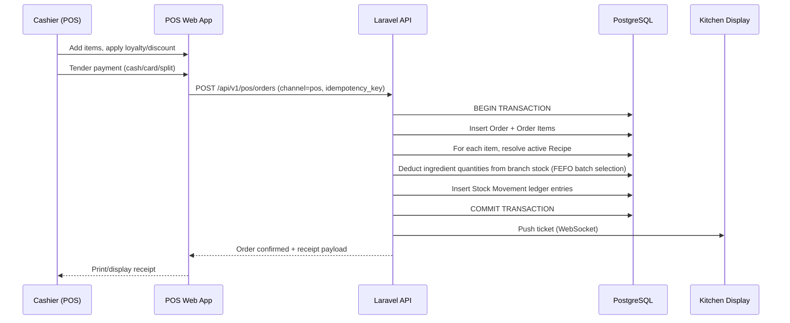

### 10.5 Purchase Order & Receiving Flow

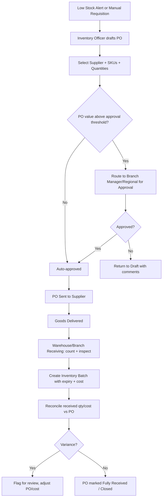

### 10.6 Stock Opname (Cycle Count) Flow

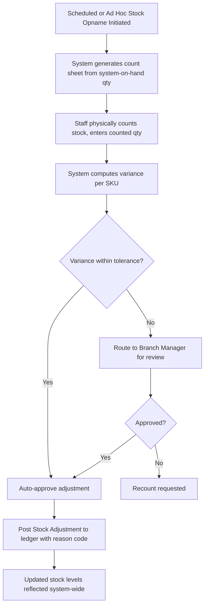

### 10.7 Branch Onboarding Flow

```mermaid
flowchart LR
    A[Create Branch Record] --> B[Assign Branch Manager + Staff Roles]
    B --> C[Configure Operating Hours, Currency, Timezone]
    C --> D[Configure Menu Availability + Branch Pricing]
    D --> E[Configure Floor Plan + Tables + QR Codes]
    E --> F[Configure Initial Inventory + Opening Stock Receipt]
    F --> G[Configure Reservation Policy]
    G --> H[Branch Status: Go Live]
    H --> I[Branch appears on public locator + ordering channels]
```

### 10.8 Membership Sign-Up & First Order (CRM Unification)

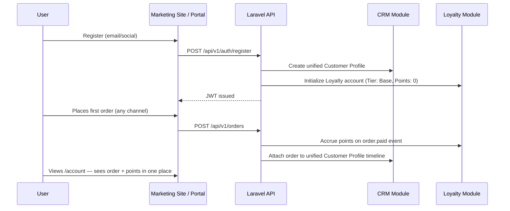


---

## 11. Database Design

### 11.1 Design Conventions

- Primary keys: UUID (v4) for all tables, to support merge-safe multi-branch/offline-capable clients (POS/KDS) without ID collision.
- Soft deletes (`deleted_at`) on all business entities; hard deletes are never exposed via the API.
- Every table includes `created_at`, `updated_at`; mutable business entities additionally include `created_by`, `updated_by` (nullable FK to `users`).
- Monetary values stored as integer minor units (e.g., cents) to avoid floating-point rounding errors; currency code stored alongside.
- Multi-branch scoping: every operationally-scoped table carries `branch_id` (nullable only for genuinely global entities like `roles` or `suppliers` that may span branches).
- JSONB columns used sparingly for genuinely variable, non-relational attributes (e.g., product modifier metadata, CMS block content) — never as a substitute for proper relational modeling of core business data.

### 11.2 Entity Relationship Diagram — Core Commerce & Inventory

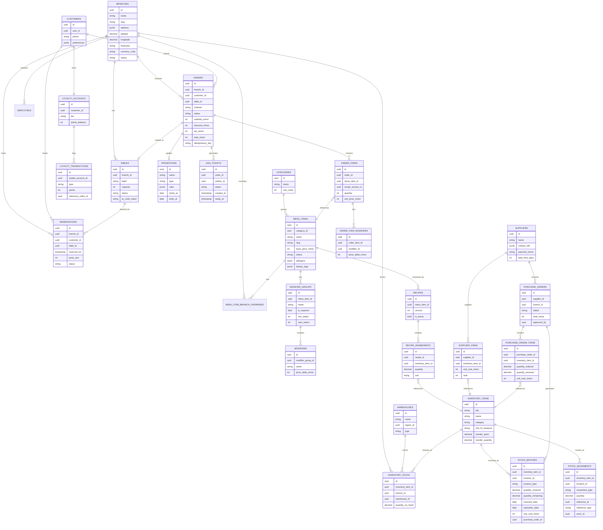

### 11.3 Entity Relationship Diagram — Identity, HR, CMS & Platform

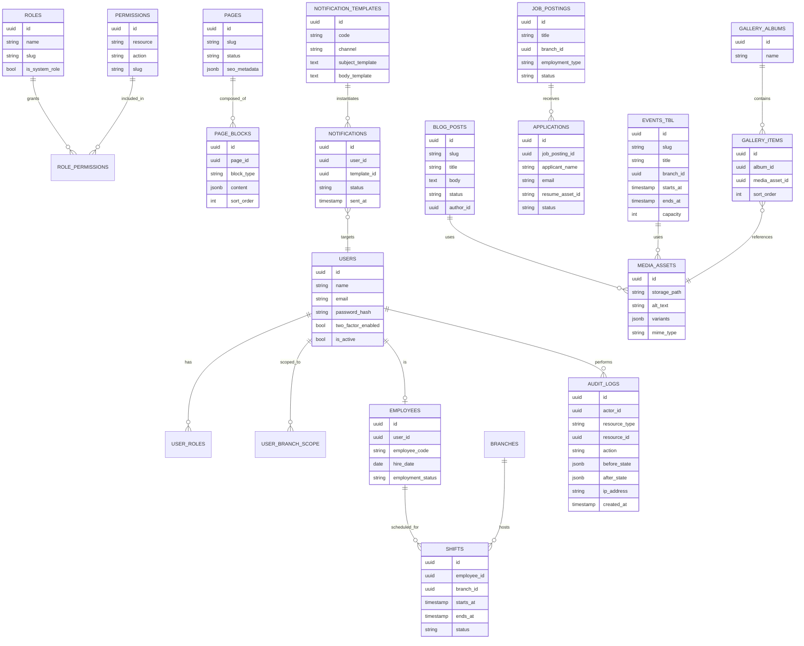

### 11.4 Indexing & Performance Notes

| Table | Index | Rationale |
|---|---|---|
| `orders` | `(branch_id, created_at DESC)` | Branch-scoped order history/reporting pagination |
| `orders` | Unique `(idempotency_key)` | Enforce idempotent order submission |
| `inventory_stock` | Unique `(inventory_item_id, branch_id, warehouse_id)` | One stock row per item per location |
| `stock_batches` | `(inventory_item_id, location_id, expiration_date)` | FEFO deduction lookup |
| `stock_movements` | `(inventory_item_id, location_id, created_at)` | Ledger reconstruction/reporting |
| `reservations` | `(branch_id, reserved_for)` | Availability lookups |
| `audit_logs` | `(resource_type, resource_id, created_at)` | Entity history lookups |
| `menu_items` | `(category_id, status)` | Menu rendering |
| `loyalty_transactions` | `(loyalty_account_id, created_at)` | Points history/expiry computation |

### 11.5 Data Retention & Partitioning Strategy

- `orders`, `stock_movements`, and `audit_logs` are high-growth append-heavy tables; these are candidates for PostgreSQL native table partitioning by month once volume thresholds are reached (defined in §17.6), transparent to the application layer via the ORM.
- Read replicas serve Analytics/Reports queries exclusively, isolating heavy aggregate workloads from the transactional primary (§17.4).


---

## 12. API Design

### 12.1 Conventions

- Base URL: `https://api.velvra.example/api/v1`
- Format: JSON request/response bodies; `Content-Type: application/json`.
- Resource naming: plural nouns, kebab-case for multi-word resources (e.g., `/purchase-orders`).
- Standard response envelope for all endpoints:

```json
{
  "data": { },
  "meta": { "request_id": "uuid" },
  "errors": []
}
```

- Paginated list responses use cursor or page-based pagination consistently:

```json
{
  "data": [ ],
  "meta": {
    "pagination": {
      "current_page": 1,
      "per_page": 25,
      "total": 340,
      "total_pages": 14
    }
  }
}
```

- All timestamps are ISO 8601 UTC; clients convert to branch/local timezone for display.
- All monetary amounts are returned as integer minor units plus an explicit `currency` field.

### 12.2 Authentication & Authorization

| Concern | Approach |
|---|---|
| End-user auth | JWT access token (15 min TTL) + refresh token (7 day TTL, rotated on use, stored HttpOnly/Secure cookie for web) |
| Staff branch context | JWT custom claim `active_branch_id`, switchable via `POST /api/v1/auth/switch-branch` (re-issues token) |
| Third-party integration auth | OAuth2 client-credentials grant issuing scoped access tokens tied to an API Key record (§9.32) |
| Public endpoints | Unauthenticated, rate-limited by IP (menu browsing, branch locator, blog) |
| MFA | TOTP-based 2FA optional for members, enforceable per role for staff (e.g., mandatory for Super Admin) |

### 12.3 Versioning & Deprecation

- URI versioning (`/api/v1`, `/api/v2`) for breaking changes; additive/non-breaking changes (new optional fields, new endpoints) ship within the current version.
- Deprecated endpoints return a `Deprecation` and `Sunset` HTTP header for a minimum 6-month notice period before removal.

### 12.4 Standard Error Envelope

```json
{
  "data": null,
  "meta": { "request_id": "uuid" },
  "errors": [
    {
      "code": "VALIDATION_ERROR",
      "message": "The quantity field must be greater than zero.",
      "field": "quantity"
    }
  ]
}
```

| HTTP Status | Usage |
|---|---|
| 200 | Successful read/update |
| 201 | Successful creation |
| 204 | Successful deletion / no content |
| 400 | Malformed request |
| 401 | Missing/invalid authentication |
| 403 | Authenticated but not authorized (RBAC/branch scope) |
| 404 | Resource not found (or not visible within scope) |
| 409 | Conflict (e.g., duplicate idempotency key with different payload, double-booking) |
| 422 | Validation error |
| 429 | Rate limit exceeded |
| 500 | Unhandled server error (logged, alerted) |

### 12.5 Representative Endpoint Catalog

**Auth & Identity**

| Method | Endpoint | Description |
|---|---|---|
| POST | `/auth/register` | Register a new customer account |
| POST | `/auth/login` | Authenticate, issue JWT pair |
| POST | `/auth/refresh` | Rotate refresh token, issue new access token |
| POST | `/auth/logout` | Revoke refresh token |
| POST | `/auth/switch-branch` | Re-issue token scoped to a different assigned branch (staff) |
| GET | `/me` | Current authenticated identity + roles + permissions |

**Catalog**

| Method | Endpoint | Description |
|---|---|---|
| GET | `/branches/{branchId}/menu` | Branch-scoped menu with pricing/availability |
| GET | `/menu-items/{slug}` | Menu item detail |
| POST | `/admin/menu-items` | Create menu item (permission: `menu.create`) |
| PATCH | `/admin/menu-items/{id}` | Update menu item |
| PATCH | `/admin/menu-items/{id}/availability` | Toggle 86'd status at a branch |
| GET | `/admin/recipes/{menuItemId}` | Active recipe + versions |
| POST | `/admin/recipes` | Create new recipe version |

**Ordering**

| Method | Endpoint | Description |
|---|---|---|
| POST | `/orders` | Submit an order (channel: online/qr), requires `Idempotency-Key` header |
| GET | `/orders/{id}` | Order detail + live status |
| GET | `/account/orders` | Authenticated member's order history |
| POST | `/pos/orders` | Submit a POS transaction |
| PATCH | `/orders/{id}/status` | Update order status (staff/KDS) |
| GET | `/tables/resolve` | Resolve a signed QR table code to branch + table |

**Reservations & Tables**

| Method | Endpoint | Description |
|---|---|---|
| GET | `/branches/{branchId}/availability` | Table availability search |
| POST | `/reservations` | Create reservation (with temporary hold) |
| PATCH | `/reservations/{id}` | Reschedule/cancel |
| GET | `/admin/branches/{branchId}/floor` | Real-time floor/table status |

**Inventory & Procurement**

| Method | Endpoint | Description |
|---|---|---|
| GET | `/admin/inventory-items` | List SKUs with stock levels (scoped) |
| POST | `/admin/inventory/stock-adjustments` | Manual adjustment with reason code |
| POST | `/admin/inventory/stock-opname` | Initiate cycle count session |
| POST | `/admin/inventory/stock-opname/{id}/submit` | Submit counted quantities |
| POST | `/admin/purchase-orders` | Create PO |
| POST | `/admin/purchase-orders/{id}/approve` | Approve PO |
| POST | `/admin/purchase-orders/{id}/receive` | Record receiving, generate batch |
| GET | `/admin/suppliers` | List suppliers |

**CRM, Membership & Promotions**

| Method | Endpoint | Description |
|---|---|---|
| GET | `/admin/customers/{id}` | Customer 360 profile |
| GET | `/account/loyalty` | Member's loyalty status |
| POST | `/admin/promotions` | Create promotion |
| POST | `/orders/{id}/apply-promo` | Validate + apply promo code server-side |

**CMS**

| Method | Endpoint | Description |
|---|---|---|
| GET | `/pages/{slug}` | Public published page content |
| POST | `/admin/cms/pages` | Create/edit page (draft) |
| POST | `/admin/cms/pages/{id}/publish` | Publish page, create version snapshot |
| GET | `/blog-posts` | Public blog list |
| GET | `/events` | Public events list |
| GET | `/careers` | Public job postings |
| POST | `/careers/{id}/apply` | Submit application |

**Analytics & Reports**

| Method | Endpoint | Description |
|---|---|---|
| GET | `/admin/analytics/sales` | Sales analytics (branch/date scoped) |
| GET | `/admin/reports` | List generated reports |
| POST | `/admin/reports/generate` | Queue a report generation job |
| GET | `/admin/audit-logs` | Audit log query |

### 12.6 Webhooks (Outbound Events)

| Event | Payload Summary | Consumers |
|---|---|---|
| `order.paid` | Order ID, branch, items, total | Delivery aggregator adapters, ERP (future) |
| `order.status_changed` | Order ID, previous/new status | Customer notification, future mobile push |
| `reservation.confirmed` | Reservation ID, branch, datetime | Notification Center |
| `stock.low` | Inventory item, branch, current qty, reorder point | Notification Center, auto-PO suggestion |
| `employee.offboarded` | Employee ID, branch | Future ERP/payroll integration |

### 12.7 Rate Limiting

| Client Class | Limit |
|---|---|
| Public/unauthenticated | 60 requests/minute/IP |
| Authenticated customer | 120 requests/minute/user |
| Staff (POS/KDS/Admin) | 300 requests/minute/user |
| Third-party API partner | Per-contract, configurable per API key (default 600 requests/minute) |


---

## 13. Design System

### 13.1 Design Philosophy

The visual language communicates premium, understated luxury — closer to a high-end hospitality brand than a fast-casual chain. Every design decision favors restraint over decoration: generous white space, a disciplined type scale, a narrow, warm color palette, and purposeful motion. The Behance reference (Velvet Brew) is used strictly as a mood/quality benchmark for typographic confidence and photographic richness — no layout, component, or asset is copied; Velvra's identity is expressed through its own token set below.

### 13.2 Color Tokens

| Token | Role | Example Value (Light Mode) |
|---|---|---|
| `--color-background` | Page background | `#FAF7F2` (warm off-white) |
| `--color-surface` | Card/panel surface | `#FFFFFF` |
| `--color-foreground` | Primary text | `#1C1512` (near-black espresso) |
| `--color-muted-foreground` | Secondary text | `#6B5D54` |
| `--color-primary` | Brand accent (CTAs, active states) | `#4A2E1F` (deep roast brown) |
| `--color-primary-foreground` | Text on primary | `#FAF7F2` |
| `--color-accent` | Secondary highlight (badges, links) | `#B8935F` (warm gold) |
| `--color-border` | Dividers, input borders | `#E4DCD1` |
| `--color-success` | Positive state | `#2F6B3A` |
| `--color-warning` | Caution state | `#B8802B` |
| `--color-destructive` | Error/destructive state | `#9B2C2C` |
| Dark mode equivalents | Admin dashboard dark theme (optional) | Derived via CSS variable overrides, never separate hardcoded components |

All colors are defined exclusively as CSS variables consumed by Tailwind's theme configuration; no component may reference a raw hex value directly. This is the enforcement mechanism behind "never use random colors."

### 13.3 Typography

| Role | Typeface Category | Weight Usage |
|---|---|---|
| Display / Hero Headlines | Premium serif (e.g., an editorial serif such as "Fraunces"-class) | 500–600 |
| Headings (H1–H3) | Same serif family as Display | 500 |
| Body Text | Clean humanist sans-serif (e.g., "Inter"-class) | 400–500 |
| UI Labels / Admin Interface | Humanist sans-serif | 400–600 |
| Numerals (prices, dashboards) | Tabular-figure variant of the sans-serif | 500 |

| Scale Token | Size (rem) | Usage |
|---|---|---|
| `--text-display` | 4.5 | Hero headline (desktop) |
| `--text-h1` | 3 | Page titles |
| `--text-h2` | 2.25 | Section headings |
| `--text-h3` | 1.5 | Subsection headings |
| `--text-body-lg` | 1.125 | Lead paragraphs |
| `--text-body` | 1 | Default body |
| `--text-sm` | 0.875 | Captions, metadata |
| `--text-xs` | 0.75 | Fine print |

### 13.4 Spacing System (8px Base Unit)

| Token | Value | Usage |
|---|---|---|
| `space-1` | 4px | Icon-to-label gaps |
| `space-2` | 8px | Base unit |
| `space-3` | 16px | Compact component padding |
| `space-4` | 24px | Standard component padding |
| `space-5` | 32px | Section internal spacing |
| `space-6` | 48px | Component-to-component gap |
| `space-7` | 64px | Section-to-section gap (mobile) |
| `space-8` | 96px | Section-to-section gap (desktop) |
| `space-9` | 128px | Hero/major section vertical rhythm (desktop) |

All margin/padding/gap values in code must resolve to one of the above tokens; no arbitrary pixel values are permitted in component styles.

### 13.5 Elevation & Shadow

| Token | Usage |
|---|---|
| `shadow-xs` | Subtle card lift (menu item cards) |
| `shadow-sm` | Dropdowns, popovers |
| `shadow-md` | Modals, dialogs |
| `shadow-glass` | Reserved for the glass-morphism header-on-scroll and select overlay panels only — not used as a general-purpose effect |

Glass effects (backdrop blur + translucent surface) are restricted to: sticky navigation on scroll, and the QR-ordering table-context banner. They are never applied to body content cards, forms, or dashboard panels, to avoid visual noise contradicting the "minimal" principle.

### 13.6 Iconography

Lucide React is the exclusive icon set across every surface (marketing site, portal, admin, POS, KDS). Icon sizing is tokenized (`16px`, `20px`, `24px`, `32px`) and stroke width fixed at `1.5` for visual consistency; icons never mix with any other icon library or custom SVG glyphs outside the illustration system (§13.7).

### 13.7 Imagery & Illustration

- Photography-first: all marketing surfaces prioritize high-quality photography (product, interiors, people) over illustration.
- No cartoon illustrations, no stock-emoji-style graphics anywhere in the product.
- Where abstract graphics are needed (e.g., empty states), use minimal line-art in the brand's accent color, consistent stroke weight matching the icon set.

### 13.8 Component Library Conventions

- Built on shadcn/ui primitives, restyled entirely through the token set above — components are never used with default shadcn theme values in production.
- Every interactive component (button, input, select, dialog) must implement documented `default`, `hover`, `focus-visible`, `active`, `disabled`, and `loading` states.
- Motion: Framer Motion transitions use a shared easing curve (`cubic-bezier(0.22, 1, 0.36, 1)`) and duration scale (`150ms` micro-interactions, `300ms` panel transitions, `500ms` page-level reveals) — no ad hoc durations/easings per component.


---

## 14. Responsive Design Rules

### 14.1 Breakpoint System (Mobile-First)

| Breakpoint Token | Min Width | Target Devices |
|---|---|---|
| `base` (default) | 0px | Mobile phones (portrait) |
| `sm` | 480px | Mobile phones (landscape), small phablets |
| `md` | 768px | Tablets (portrait) |
| `lg` | 1024px | Tablets (landscape), small laptops |
| `xl` | 1280px | Laptops, standard desktops |
| `2xl` | 1536px | Large desktops |
| `3xl` | 1920px | Ultra-wide monitors |

All styles are authored mobile-first: base styles target the smallest viewport, with `min-width` media queries progressively enhancing layout at larger breakpoints. No component may be designed desktop-first and retrofitted downward.

### 14.2 Layout Rules Per Surface

| Surface | Mobile (base–sm) | Tablet (md–lg) | Desktop (xl+) |
|---|---|---|---|
| Marketing Landing | Single column, stacked sections, hamburger nav | Two-column hero, condensed nav | Full-width hero with side imagery, full horizontal nav |
| Menu Browsing | Single-column item cards, sticky category chips | 2-column grid | 3–4 column grid with sticky sidebar category nav |
| Cart/Checkout | Full-screen step-by-step flow | Two-panel (form + summary) | Two-panel with sticky order summary |
| Admin Dashboard | Collapsed sidebar (drawer), stacked KPI cards | Icon-only sidebar, 2-column KPI grid | Full sidebar, multi-column KPI + chart grid |
| POS | Not primary target, but must remain usable (single-column category → item drill-down) | Primary target: split-pane (menu grid + order ticket) | Split-pane with expanded ticket detail |
| KDS | N/A (not a mobile use case) | Card-per-order grid, 2–3 columns | Card grid, 4+ columns for high-throughput branches |

### 14.3 Touch & Input Targets

- Minimum touch target size: 44×44px (WCAG 2.2 AA / platform HIG alignment), enforced for POS and customer-facing mobile interactions especially.
- POS and KDS interfaces prioritize large touch targets and high-contrast states given kitchen/counter environmental conditions (glare, gloved hands, urgency).

### 14.4 Ultra-Wide Monitor Handling

- Content max-width is capped (e.g., `1920px` container) with centered layout and increased horizontal breathing room, not naive full-bleed stretching of grid columns, to preserve reading-line-length and visual hierarchy on ultra-wide displays.
- Admin dashboards may utilize additional width at `3xl` for side-by-side multi-panel views (e.g., order list + detail pane simultaneously) rather than simply enlarging existing components.

### 14.5 Testing Matrix

Responsive QA is performed against, at minimum: iPhone SE (375px), iPhone 14/15 (390–430px), iPad Mini/Air (768–820px), iPad Pro (1024–1194px), laptop (1366–1440px), desktop (1920px), and ultra-wide (2560px+), across both portrait/landscape where applicable.

---

## 15. Accessibility (WCAG 2.2 AA)

### 15.1 Compliance Target

All customer-facing and administrative surfaces must conform to **WCAG 2.2 Level AA** at minimum. This is a release-blocking requirement, verified via automated (axe-core in CI) and manual audits before each major release.

### 15.2 Key Requirements

| Area | Requirement |
|---|---|
| Color Contrast | Minimum 4.5:1 for body text, 3:1 for large text/UI components against background, verified against the token palette (§13.2) at design time, not left to chance |
| Keyboard Navigation | Every interactive element (menu, cart, forms, admin tables, modals) fully operable via keyboard alone, with visible focus states (`focus-visible` styling, never `outline: none` without a replacement) |
| Screen Reader Support | Semantic HTML landmarks (`header`, `nav`, `main`, `footer`), ARIA roles/labels for custom components (custom selects, modals, tabs), descriptive link/button text (no bare "Click Here") |
| Images | Mandatory alt text field enforced at the Media Library upload step (§9.27 MED-002); decorative images marked `alt=""` explicitly, never omitted |
| Forms | Every input has an associated, visible label (not placeholder-only); validation errors are announced via `aria-live` and associated to the field via `aria-describedby` |
| Motion | Respect `prefers-reduced-motion`; all Framer Motion animations provide a reduced-motion variant (opacity/instant transitions replacing movement) |
| Modals/Dialogs | Focus trap on open, focus restoration on close, `Escape` to dismiss, labelled via `aria-labelledby` |
| Data Tables (Admin) | Proper `<th scope>` usage, sortable columns announce sort state via `aria-sort` |
| Time-Sensitive Content (KDS ticket aging) | Color is never the sole indicator (e.g., aging tickets use color + icon + text label, for color-blind kitchen staff) |
| Skip Navigation | "Skip to main content" link present on all pages with persistent navigation |

### 15.3 Testing & Governance

- Automated accessibility linting (`eslint-plugin-jsx-a11y`) enforced in CI; PRs failing critical a11y lint rules are blocked from merge.
- Automated axe-core scans run against key pages/flows in the E2E test suite (§18.4).
- Manual screen reader testing (VoiceOver + NVDA at minimum) performed each release cycle on: landing page, menu browsing, checkout, account portal, and the top 5 admin workflows.
- Accessibility regressions are treated as release-blocking defects, not backlog items.


---

## 16. Security Architecture

### 16.1 Security Principles

Defense in depth, least privilege by default (RBAC, §8), zero trust between frontend and backend (all authorization enforced server-side, never trusted from client state), and secure-by-default configuration (deny-by-default CORS, strict CSP, encrypted secrets).

### 16.2 Authentication Security

| Control | Detail |
|---|---|
| Password storage | Bcrypt/Argon2id hashing, never reversible encryption |
| JWT access token TTL | 15 minutes |
| JWT refresh token | 7 days, single-use with rotation; reuse of a revoked refresh token invalidates the entire token family (breach detection) |
| 2FA | TOTP-based, mandatory for Super Admin and configurable per role |
| Brute-force protection | Progressive rate limiting + temporary lockout on repeated failed login attempts, per account and per IP |
| Session/device management | Members and staff can view and revoke active sessions from account settings |

### 16.3 Transport & Infrastructure Security

- TLS 1.2+ enforced everywhere; HTTP requests redirected to HTTPS.
- HSTS enabled with `includeSubDomains`.
- Strict Content-Security-Policy restricting script/style/img sources to approved domains (self, Cloudflare R2, Google Maps, Resend, analytics providers).
- CORS restricted to known frontend origins per environment; no wildcard `*` in production.
- Secrets (DB credentials, JWT signing keys, third-party API keys) stored in a managed secrets store (e.g., environment-injected via the container orchestrator's secret manager), never committed to source control.

### 16.4 Application Security

| Control | Detail |
|---|---|
| Input validation | Server-side validation (Laravel FormRequests) mirrored by client-side Zod schemas; server validation is authoritative, client validation is UX-only |
| SQL Injection | Prevented via Eloquent ORM parameter binding; raw queries reviewed in code review, never string-concatenated |
| XSS | React's default escaping + CMS rich-text restricted to an allow-listed block schema (§9.3 CMS-005), no arbitrary HTML rendering from user/CMS input |
| CSRF | Not applicable to token-based API auth for cross-origin SPA calls; cookie-based refresh token flow uses `SameSite=Strict`/`Lax` plus double-submit protection |
| Mass assignment | Explicit allow-listed fields per model (Laravel `$fillable`), never blanket-assignable |
| File upload | Type/size validation, virus scanning hook for Career Portal resume uploads, storage isolated from executable contexts (R2 object storage, not local disk serving) |
| Dependency security | Automated dependency vulnerability scanning (e.g., Dependabot-class tooling) in CI |

### 16.5 API Security

- All write endpoints require authentication; public read endpoints (menu, blog) are explicitly allow-listed, not the default.
- Rate limiting per §12.7.
- Idempotency keys required on payment-adjacent mutating endpoints (§10.1, §10.4) to prevent duplicate-charge attacks/retries.
- Webhook endpoints (inbound from payment gateway) verify cryptographic signatures before processing.

### 16.6 Payment Security

Velvra never stores raw payment card data. All card capture occurs via the payment gateway's hosted fields/tokenization (PCI DSS SAQ-A scope). Only tokenized payment method references are stored in Velvra's database.

### 16.7 Data Privacy & Retention

| Control | Detail |
|---|---|
| PII minimization | Only fields necessary for operation are collected; optional fields clearly marked |
| Right to access/erasure | CRM module supports data export and anonymization workflows (§9.20 CRM-005) in line with applicable privacy regulation (e.g., GDPR/CCPA-class obligations relevant to brand's operating regions) |
| Data retention | Audit logs and financial records retained per legal/tax requirement; PII beyond that window is anonymized, not deleted outright, where retention of transactional aggregates is still required for reporting |
| Data residency | Database region selection configurable to align with applicable regional data residency requirements as the brand expands internationally |

### 16.8 Threat Modeling Focus Areas

| Threat | Mitigation |
|---|---|
| Discount/promo tampering via client manipulation | Server-side promo validation only (§9.18 PRO-004) |
| Duplicate order/payment on network retry | Idempotency keys (§10.1, §12.5) |
| Privilege escalation via role misconfiguration | Centralized policy/gate enforcement + audit logging of all role/permission changes (§8.4) |
| Cross-branch data leakage | Global Eloquent branch-scope query constraint (§8.4) |
| QR table-code spoofing/tampering | Signed, server-verified table tokens (§9.9 QRO-001) |

---

## 17. Performance Engineering

### 17.1 Frontend Performance

| Technique | Application |
|---|---|
| Rendering Strategy | SSR/ISR for SEO-critical, low-personalization pages (landing, menu, blog); CSR with TanStack Query caching for authenticated/dynamic views (account, admin, POS, KDS) |
| Image Optimization | Next.js Image component, Cloudflare R2 + CDN-served responsive variants, AVIF/WebP with fallback, lazy-loading below the fold |
| Code Splitting | Route-based automatic splitting (Next.js App Router) + dynamic imports for heavy admin-only components (charts, rich-text editor) |
| Font Loading | Self-hosted or `next/font` with `font-display: swap`, subset to required glyphs |
| Bundle Budgets | JS bundle size budgets enforced per route in CI (fails build if exceeded) |
| Caching | TanStack Query stale-while-revalidate for read-heavy admin views; HTTP cache headers for public static content |

### 17.2 Backend Performance

| Technique | Application |
|---|---|
| Query Optimization | Eager-loading (no N+1 queries), indexed columns per §11.4, query analysis in code review for hot-path endpoints |
| Caching | Redis caching for menu/catalog reads (short TTL + cache-bust on publish), computed analytics aggregates cached with scheduled refresh |
| Queue Offloading | Non-critical-path work (emails, report generation, webhook dispatch, loyalty point accrual) processed via queued jobs, never inline in the request/response cycle |
| Read Replicas | Analytics/Reports queries routed to PostgreSQL read replicas, isolating transactional write performance |
| Connection Pooling | PgBouncer-class connection pooling between Laravel workers and PostgreSQL |

### 17.3 Real-Time Requirements (KDS/POS/Table Status)

Real-time propagation (new KDS tickets, table status changes) is implemented via WebSocket (or managed pub/sub broadcasting, e.g., a Laravel Reverb/Pusher-class broadcaster) with an automatic polling fallback if the WebSocket connection cannot be established, ensuring the < 2s order-to-KDS latency target (§2.3) is met even under imperfect in-store network conditions.

### 17.4 Scalability Model

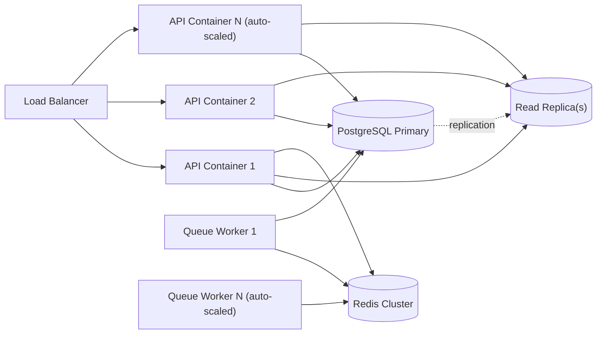

### 17.5 Offline Resilience (POS & KDS)

POS and KDS clients maintain a local write-ahead queue (IndexedDB) for order entry and ticket status updates during connectivity loss. On reconnect, queued operations replay against the API in original order, with server-side conflict resolution favoring the authoritative inventory/order state and surfacing any conflicts (e.g., item unavailable since queued) to staff for manual resolution.

### 17.6 Capacity Planning Thresholds

| Metric | Threshold Triggering Scaling Action |
|---|---|
| API container CPU | Sustained > 70% over 5 min → auto-scale out |
| PostgreSQL primary connections | > 80% of pool → add read replica capacity / review query load |
| `orders` table row count | > 10M rows → activate monthly partitioning |
| Redis memory | > 75% → evaluate eviction policy / cluster resize |

---

## 18. Testing Strategy

### 18.1 Testing Pyramid

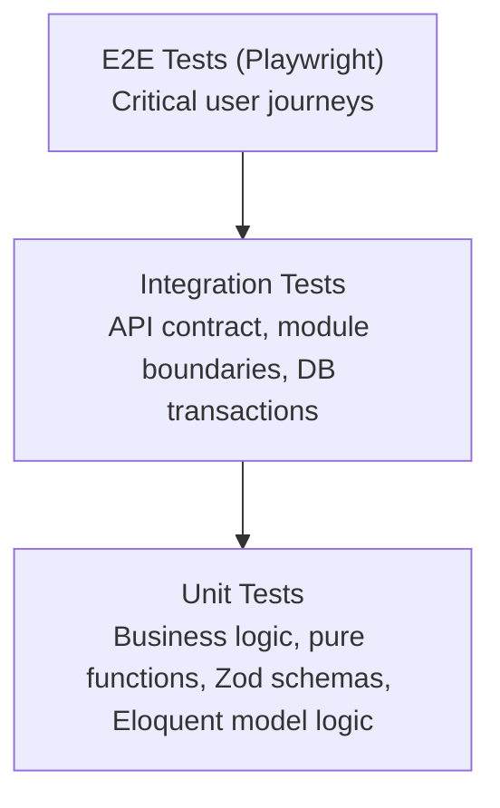

### 18.2 Backend Testing

| Test Type | Tooling | Coverage Focus |
|---|---|---|
| Unit | PHPUnit/Pest | Recipe costing calculations, promo validation logic, RBAC policy resolution, loyalty accrual math |
| Feature/Integration | PHPUnit/Pest + Laravel testing helpers | Full HTTP request/response cycles per endpoint, including auth/RBAC branch scoping |
| Contract | OpenAPI schema validation in CI | Ensures implementation matches published API spec (§12) |
| Database | Migration/rollback tests, seeders for deterministic test data | Schema integrity |

### 18.3 Frontend Testing

| Test Type | Tooling | Coverage Focus |
|---|---|---|
| Unit | Vitest/Jest + React Testing Library | Component logic, form validation (Zod), utility functions |
| Component/Visual | Storybook + visual regression snapshotting | Design system component fidelity across breakpoints |
| Accessibility | axe-core automated checks in CI | WCAG 2.2 AA conformance (§15) |

### 18.4 End-to-End Testing

| Journey | Priority |
|---|---|
| Guest browses menu → places online order → receives confirmation | Critical |
| Member logs in → reorders from history | Critical |
| Customer scans QR → orders at table → tracks status | Critical |
| Cashier processes a POS transaction with modifiers + loyalty redemption | Critical |
| Kitchen staff receives ticket, marks ready, order status updates for customer | Critical |
| Inventory Officer creates PO → receives goods → stock batch created | High |
| Branch Manager approves PO above threshold | High |
| Customer books a reservation, receives confirmation, is seated | High |
| Content Manager publishes a blog post with scheduled publish time | Medium |
| Admin adjusts stock with reason code, variance reflected in reports | High |

### 18.5 Non-Functional Testing

| Type | Approach |
|---|---|
| Performance/Load | Load testing (e.g., k6-class tooling) simulating peak-hour concurrent ordering across multiple branches against staging, validated against §2.3 latency KPIs |
| Security | Automated SAST/dependency scanning in CI; periodic manual penetration testing before major releases |
| Accessibility | Automated + manual per §15.3 |
| Resilience/Chaos | POS/KDS offline-sync scenarios tested explicitly (network partition simulation) |

### 18.6 QA Sign-off Gate

No release is promoted from Staging to Production without: all Critical E2E journeys passing, zero open Critical/High severity defects, Lighthouse thresholds met (§2.3), and accessibility automated scan passing with zero critical violations.


---

## 19. Deployment Architecture & DevOps

### 19.1 Deployment Topology

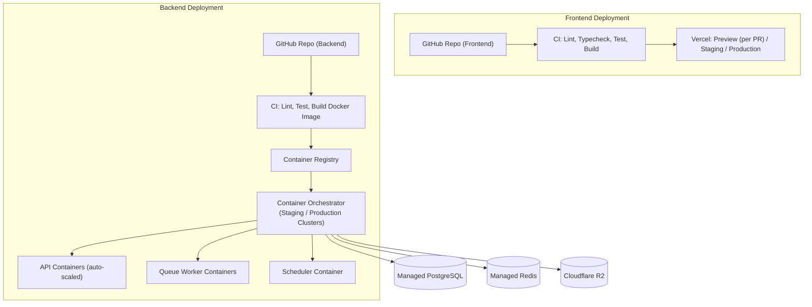

### 19.2 CI/CD Pipeline Stages

| Stage | Frontend | Backend |
|---|---|---|
| 1. Lint & Typecheck | ESLint, TypeScript strict | PHPStan/Larastan, PHP-CS-Fixer |
| 2. Unit/Component Tests | Vitest/Jest | PHPUnit/Pest |
| 3. Build | `next build` | Docker image build |
| 4. Integration/Contract Tests | — | API feature tests + OpenAPI contract validation |
| 5. Security Scan | Dependency audit | Dependency audit + SAST |
| 6. Deploy to Preview/Staging | Vercel Preview URL per PR | Deploy to Staging cluster |
| 7. E2E Tests (Playwright) | Against Preview/Staging | Against Staging |
| 8. Manual QA/UAT Gate | — | — |
| 9. Deploy to Production | Vercel Production promote | Rolling deploy to Production cluster |
| 10. Post-Deploy Verification | Lighthouse CI, smoke tests | Health check endpoints, smoke tests |

### 19.3 Containerization

- Backend ships as three container roles from a shared image: `api` (HTTP serving), `worker` (queue processing, horizontally scalable independent of API containers), and `scheduler` (single-instance cron dispatcher).
- Environment-specific configuration injected via environment variables/secret manager — no environment-specific code branches.
- Health check endpoints (`/health`, `/health/queue`, `/health/db`) exposed for orchestrator liveness/readiness probes.

### 19.4 Rollback Strategy

- Frontend: Vercel instant rollback to previous deployment.
- Backend: Previous container image redeployed; database migrations are written to be backward-compatible for at least one prior release (expand-contract pattern) so a backend rollback never requires a destructive migration rollback.

### 19.5 Observability

| Concern | Approach |
|---|---|
| Logging | Structured JSON logs, centralized log aggregation |
| Metrics | Application + infrastructure metrics (latency, error rate, queue depth, DB connections) to a metrics platform with alerting thresholds tied to §2.3 KPIs |
| Tracing | Distributed tracing across API → queue → external service calls for the order/payment critical path |
| Alerting | Paging on: production error rate spike, queue backlog growth, failed payment webhook processing, uptime SLA breach (§2.3) |

---

## 20. Non-Functional Requirements Summary

| Category | Requirement |
|---|---|
| Availability | 99.9% monthly uptime for core transactional path (ordering, POS, KDS) |
| Performance | Lighthouse > 95 across all four categories; API p95 < 200ms (read) / < 400ms (write) |
| Scalability | Support growth from 1 to 500+ branches without architectural rewrite; horizontal auto-scaling of API/worker tiers |
| Security | WCAG-aligned secure defaults, PCI SAQ-A payment scope, encrypted secrets, RBAC-enforced least privilege |
| Accessibility | WCAG 2.2 AA across all surfaces |
| Maintainability | Modular monolith with enforced bounded-context boundaries; OpenAPI contract kept in sync via CI |
| Auditability | Immutable audit log for all sensitive state changes |
| Internationalization Readiness | Multi-currency, multi-timezone, i18n-ready content model from day one |
| Data Integrity | Idempotent mutation endpoints; transactional inventory deduction; append-only stock/audit ledgers |
| Disaster Recovery | Automated PostgreSQL backups with point-in-time recovery; documented RTO/RPO targets defined at infrastructure setup |

---

## 21. Future Scalability & Roadmap

### 21.1 Extensibility Principles Baked Into v1.0

Because the platform is API-first with clean bounded-context module boundaries (§6.4) and a webhook/event framework (§12.6), every item below is additive — a new client or integration consuming the existing API — rather than requiring backend re-architecture.

| Future Capability | Enablement Already Present in v1.0 |
|---|---|
| Android App | REST API + JWT auth are client-agnostic; a native app is simply a new API consumer |
| iOS App | Same as above |
| Self-Ordering Kiosk | Reuses the Online/QR Ordering engine (§9.8/§9.9) with a kiosk-specific frontend |
| Digital Menu Board | Reuses Menu Management read API; a display-only client subscribing to menu/availability changes |
| Customer-Facing Display (POS companion screen) | Reuses Order/Ticket real-time channel (§17.3) |
| Third-Party Delivery Aggregators | Webhook framework (§12.6) + dedicated adapter layer per aggregator, isolated from core Ordering module |
| ERP Integration | `order.paid`, `employee.offboarded` and future accounting-relevant webhooks; HR/Inventory modules expose read APIs for financial reconciliation |
| Accounting Integration | Recipe Costing (§9.13) and Purchase Order (§9.17) modules already produce the COGS/AP data an accounting sync would require |

### 21.2 Indicative Roadmap (Post-v1.0 Phasing — Subject to PMO Prioritization)

```mermaid
gantt
    title Indicative Post-v1.0 Roadmap
    dateFormat  YYYY-MM-DD
    axisFormat  %b %Y
    section Phase 1 - Foundation (this PRD)
    Core Platform (Web + Admin + API) :done, p1, 2026-08-01, 180d
    section Phase 2 - Channel Expansion
    Self-Ordering Kiosk App        :p2a, after p1, 60d
    Digital Menu Board App         :p2b, after p1, 45d
    section Phase 3 - Native Apps
    iOS App                        :p3a, after p2a, 90d
    Android App                    :p3b, after p2a, 90d
    section Phase 4 - Integrations
    Delivery Aggregator Adapters    :p4a, after p2b, 60d
    ERP/Accounting Integration      :p4b, after p3a, 75d
```

---

## 22. Implementation Notes & Engineering Handoff

### 22.1 Suggested Delivery Sequencing (Sprint 0 Onward)

1. **Foundation**: Repo scaffolding (frontend + backend), CI/CD pipelines, design token implementation, auth/RBAC/branch-scope middleware, base data model migrations.
2. **Catalog & CMS Core**: Menu Management, Recipe Management, Media Library, Page/Blog CMS — these unblock content population needed for realistic QA of downstream modules.
3. **Ordering Core**: Online Ordering, Cart/Checkout, Payment integration, Order status engine.
4. **Operations Core**: POS, KDS, Table Management, QR Ordering (all depend on Ordering Core).
5. **Inventory & Procurement**: Inventory Management, Warehouse, Supplier, Purchase Management (depends on Recipe Management for deduction logic).
6. **Customer Engagement**: Membership & Loyalty, Promotions, CRM, Reservation System.
7. **Back Office**: Multi-Branch Management, Employee Management, Notification Center, Analytics Dashboard, Reports, Audit Logs, Settings.
8. **Hardening**: Full accessibility audit, performance/load testing, security penetration test, documentation finalization.

### 22.2 Definition of Ready (per feature/story)

A story is ready for development only when: it references the relevant Functional Requirement ID(s) from §9, its acceptance criteria are derivable from this PRD without additional verbal clarification, its API contract (request/response shape) is defined per §12 conventions, and its design has been reviewed against the token system in §13.

### 22.3 Definition of Done

A story is done only when: code is merged behind passing CI (lint, unit, integration, contract tests per §18), the corresponding OpenAPI spec is updated if the API surface changed, accessibility automated checks pass, the feature is verified against its source Functional Requirement in a staging environment, and any new sensitive-action endpoint is verified to emit an Audit Log entry (§9.30).

### 22.4 Open Items Requiring Stakeholder Decision Before Sprint 0

| Item | Decision Needed From |
|---|---|
| Payment gateway provider selection | Executive Sponsor + Finance |
| Initial supported currencies/locales | Executive Sponsor |
| Container orchestration platform (managed Kubernetes vs. simpler container hosting) | Solution Architecture + DevOps |
| Specific data residency requirements for planned international markets | Legal/Compliance + Executive Sponsor |
| Loyalty program point-earning ratio and tier thresholds | Marketing + Executive Sponsor |

---

## 23. Appendices

### Appendix A — Requirement Priority Legend

| Label | Meaning |
|---|---|
| Must | Required for v1.0 launch; release-blocking if missing |
| Should | Strongly expected in v1.0; may slip one sprint with PMO sign-off |
| Could | Desirable, scheduled opportunistically if capacity allows within v1.0 |

### Appendix B — Requirement ID Prefix Reference

| Prefix | Module |
|---|---|
| WEB | Premium Landing Website |
| PORT | Customer Portal |
| CMS | Content Management System |
| ADM | Admin Dashboard |
| ANL | Analytics Dashboard |
| RES | Reservation System |
| TBL | Table Management |
| ORD | Online Ordering |
| QRO | QR Ordering |
| POS | Point of Sale |
| KDS | Kitchen Display System |
| MNU | Menu Management |
| RCP | Recipe Management |
| INV | Inventory Management |
| WHS | Warehouse Management |
| SUP | Supplier Management |
| PUR | Purchase Management |
| PRO | Promotion Management |
| LOY | Membership & Loyalty |
| CRM | Customer Relationship Management |
| BRN | Multi-Branch Management |
| HR | Employee Management |
| BLG | Blog / Journal |
| EVT | Events |
| CAR | Career Portal |
| GAL | Gallery |
| MED | Media Library |
| NOT | Notification Center |
| REP | Reports |
| AUD | Audit Logs |
| SET | Settings |
| API | Public API |

### Appendix C — Referenced External Design Inspiration

Behance: "Velvet Brew — Modern Coffee Shop Landing Page UI" (used strictly as a quality/mood benchmark per §13.1; no direct visual or content reproduction).

### Appendix D — Document Governance

This PRD is version-controlled alongside the codebase (e.g., stored as `/docs/PRD.md` in the repository) so that specification changes are reviewed via the same pull-request process as code, keeping specification and implementation in permanent sync.

**— End of Document —**